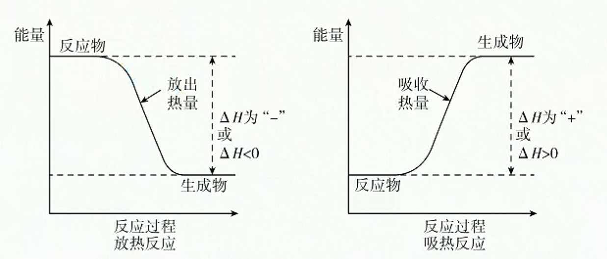
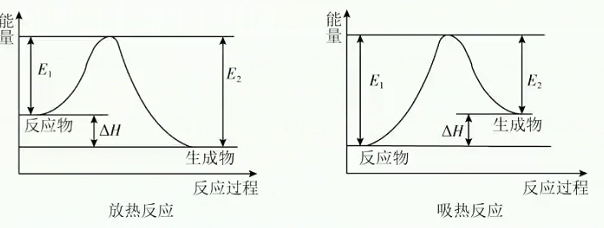
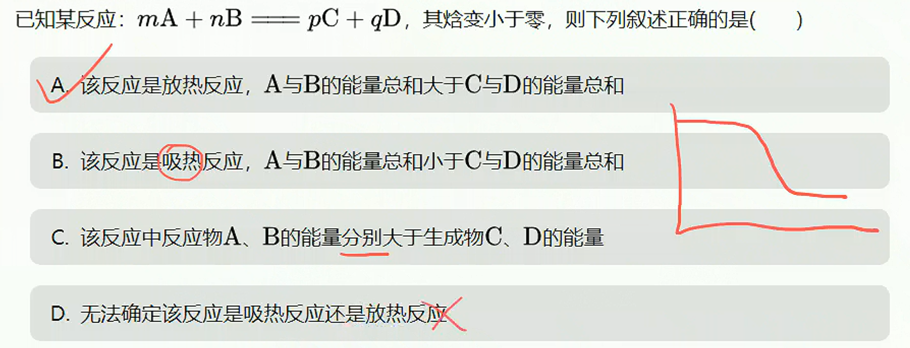
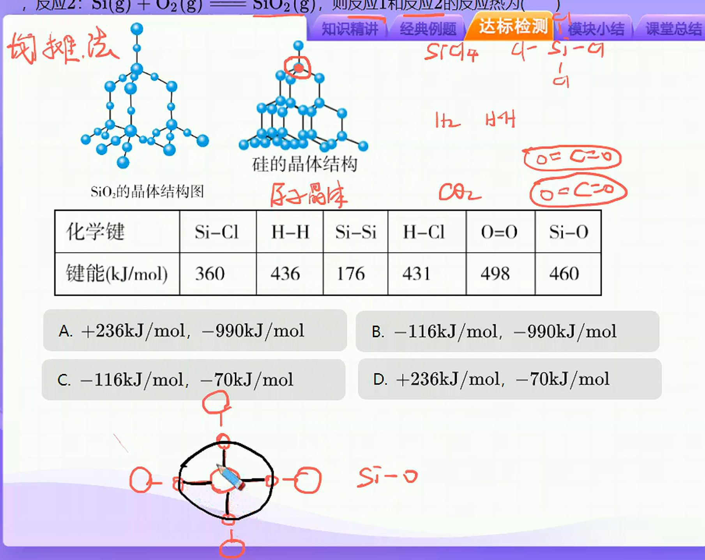
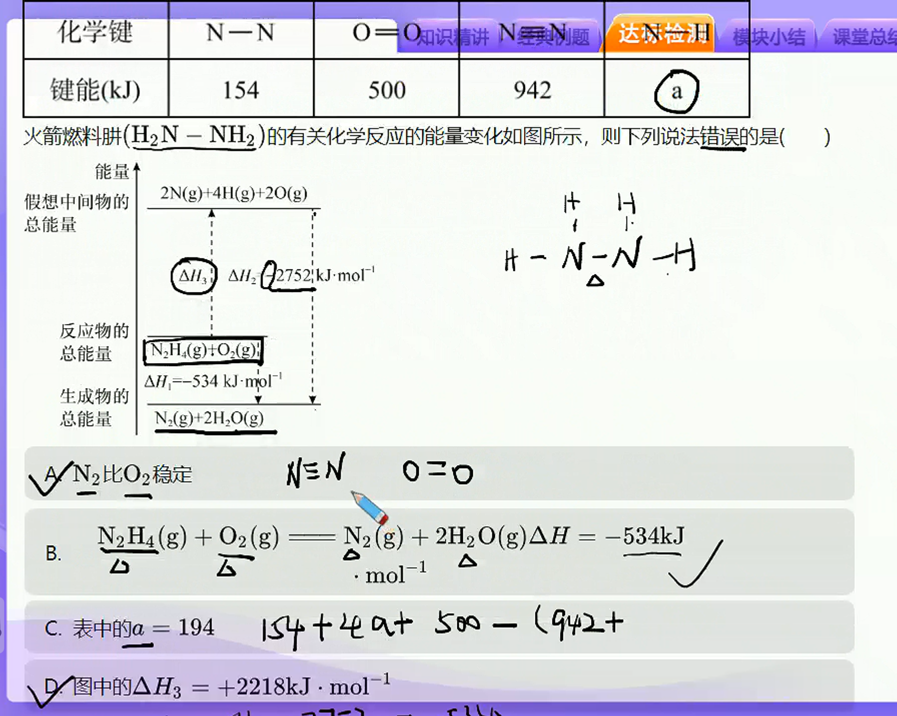
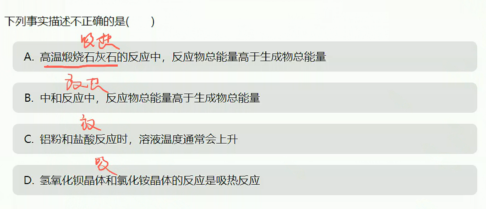
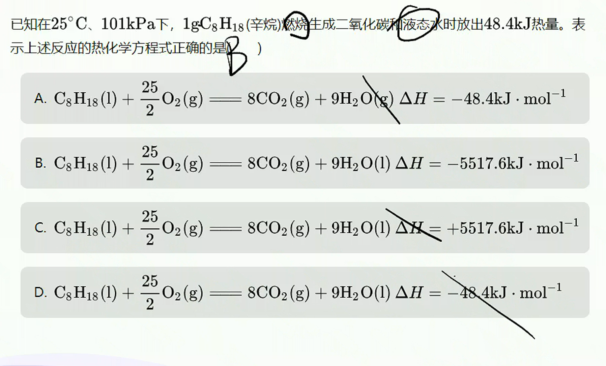
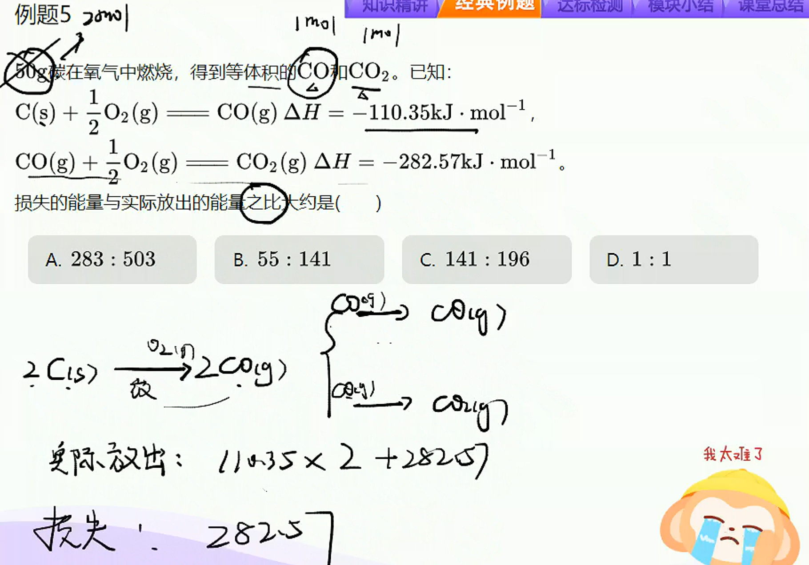

# 第一讲-焓变与热化学方程式

> **基础知识**
> 
> 1. 焓变与反应热
> 
> 2. 热化学反应方程式
> 
> **核心考点**
> 
> 1. 焓变的计算方法
> 
> 2. 常见的吸放热反应及图像
> 
> 3. 热化学反应方程式的书写方法
> 
> **技巧把握**
> 
> 1. 宏微观法求反应热
> 
> 2. “三步法”满分热化学方程式的书写

## 焓变、反应热

1. 定义：
   
   反应热：化学反应过程中伴随的热量变化叫做反应热
   
   焓变：恒压下的反应热称为焓变，用符号$\Delta{H}$表示，常用单位为$kJ/mol$或$kJ·mol^{-1}$
   
   焓：焓是一个与内能有关的物理量，焓越大，能量越大

2. 焓变与吸放热反应的关系
   
   $\Delta{H}>0$：吸热反应；
   
   $\Delta{H}<0$：放热反应。

3. 焓变的计算和吸放热反应的图像
   
   1. 宏观物质能量角度：$\Delta{H}=E_{总(生)}-E_{总(放)}$
      
      
   
   2. 微观化学键角度：$\Delta{H}=E_{总(吸)}-E_{总(放)}$
      
      

## 常见的吸放热反应

1. 常见的放热反应
   
   1. 大多数化合反应
   
   2. 所有的燃烧反应
   
   3. 酸碱中和反应
   
   4. 金属与酸（水）的反应
   
   5. 铝热反应

2. 常见的吸热反应
   
   1. 大多数分解反应
   
   2. 以$C$为还原剂的某些反应
   
   3. 铵盐与强碱晶体间的反应

## 热化学方程式的概述

1. 定义：能表示参加反应物质的量和反应热的关系的化学方程式，叫做热化学方程式。

2. 意义：热化学反应方程式既表明了化学反应中物质的变化，也表明了化学反应中的能量变化。
   
   如：$H_{2_{(g)}}+\dfrac{1}{2}O_{2_{(g)}}=\!=\!=H_2O_{_{(g)}}$ $\Delta{H}=-285.8kJ/mol$

> **『总结』**
> 
> 1. 一必须：必须注明物质状态
> 
> 2. 两不用：不用写反应条件、不用写沉淀气体符号
> 
> 3. 温度压强看情况，常温常压可省略
> 
> 4. 系数可整也可分，焓变系数成正比。

3. 注意事项
   
   1. 要注明反应的温度、压强，不用写反应条件：如果是在 $25℃、101kPa$下测定的，可不注明温度和压强。
   
   2. 要注明反应物和生成物的状态，不用写沉淀、气体符号：
      
      1. 固态：$s$；液态：$l$;气态：$g$, 稀溶液中的溶质：$aq$
      
      2. 同素异形或同分异构体不仅需要注明状态，还要注明名称、类型。
   
   3. (3)$\Delta{H}$的“$+、-$“和单位不可省略，$\Delta{h}$只能写在化学方程式的右边，表明正反应的焓
   
   4. $\Delta{H}$单位$kJ·mol^{-1}$是指每摩尔该反应，系数表示的物质的量，可以是整数也可以是分数。
   
   5. 若化学方程式中各物质的系数加倍或减倍，则$\Delta{H}$的数值也加倍或减倍；若反应逆向进行，则$\Delta{H}$改变符号，但绝对值不变。

## 热化学方程式的书写

书写“三”步骤

1. 一写：写出正确的配平化学反应方程式；

2. 二注：在方程式中注明每种物质的聚集状态；

3. 三算：算出$\Delta{H}$的相应数值，写上符号及单位。

## 两种特殊反应热的热化学方程式

1. **中和热**
   
   酸与碱发生中和反应生成$1mol$ $H_2O$所释放出热量叫中和热
   
   如：稀盐酸和一溶液反应生成$1mol$ $H_2O$时的热化学方程式为：
   
   $H^+_{_{(aq)}}+OH^-_{_{(aq)}}=\!=\!=H_20_{_{(l)}}$ $\Delta{H} = —57.3kJ/mol$
   
   **只有稀的强酸、强碱反应生成$1 mol$ $H_2O$且无沉淀生成时可以这么写**

2. **燃烧热**
   
   在$101kPa$时$1mol$纯物质完全燃烧生成稳定的氧化物时所放出的热量，叫做该物质的燃烧热。
   
   如：表示氢气燃烧热的热化学方程式为：
   
   $H_{2_{(g)}}+\dfrac{1}{2}O_{2_{(g)}}=\!=\!=H_2O_{_{(g)}}$
   
   **完全燃烧产物：$C☞CO_2{_{_{(g)}}}$ $H☞H_2O_{_{(l)}}$ $S☞SO_2{_{_{(g)}}}$**

