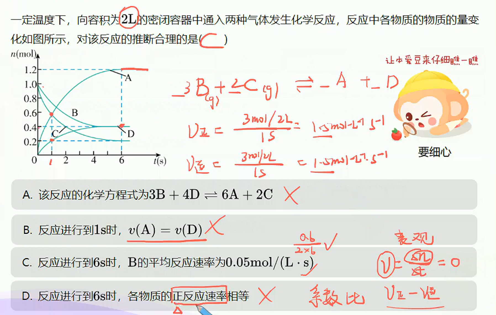
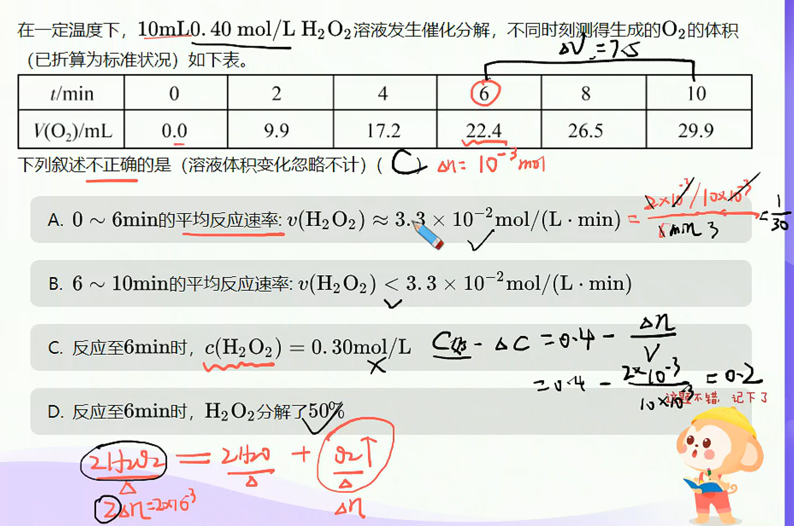
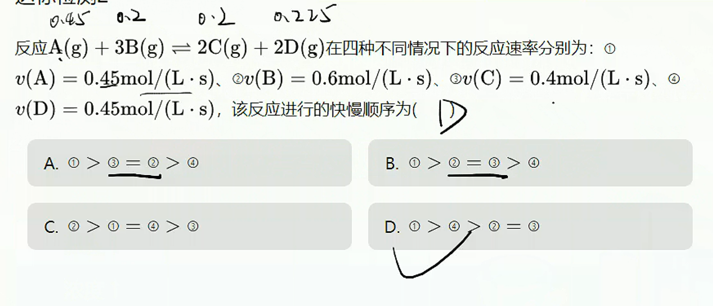
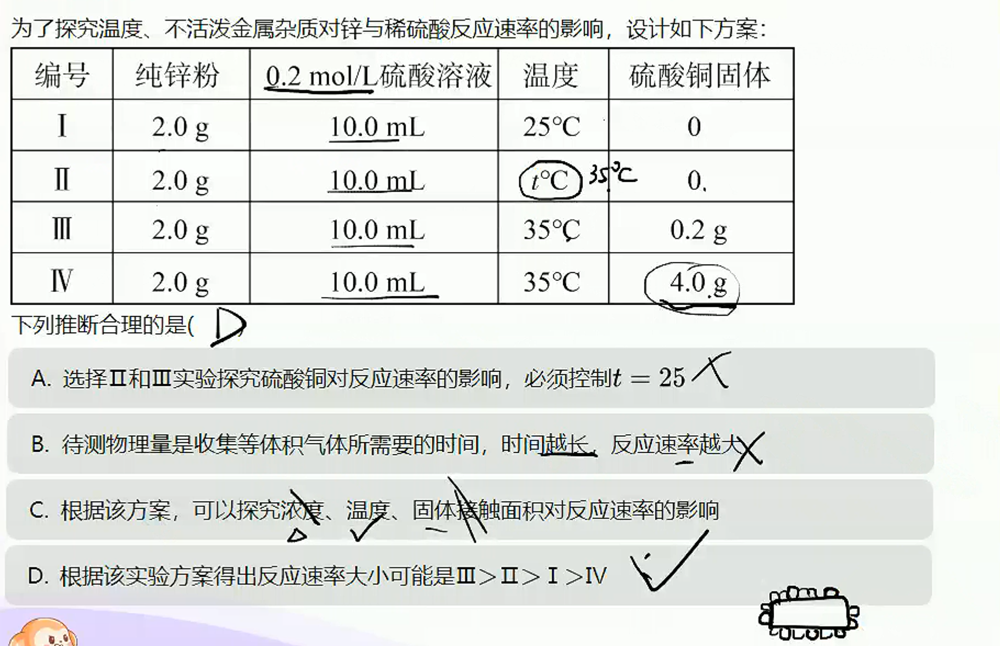
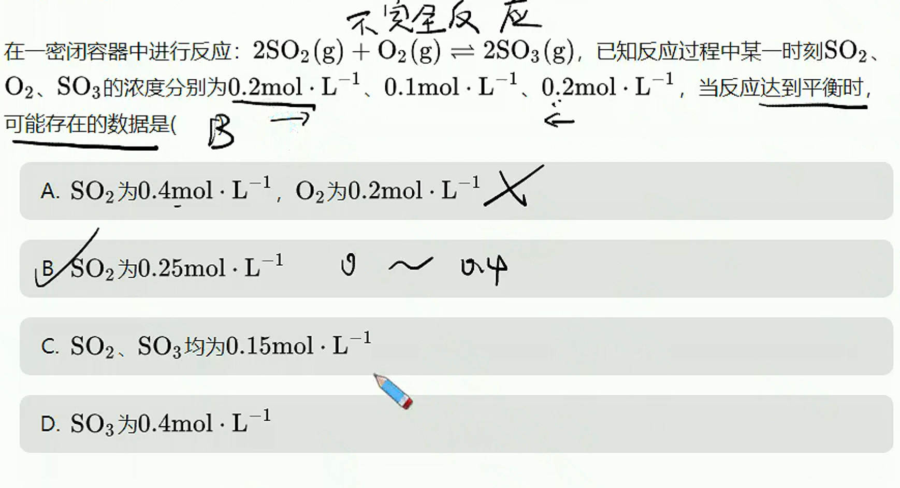
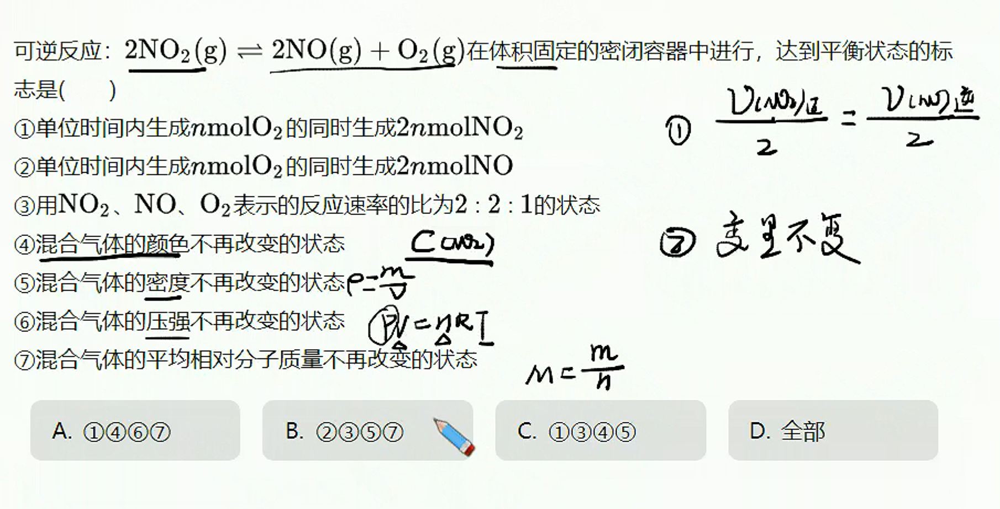
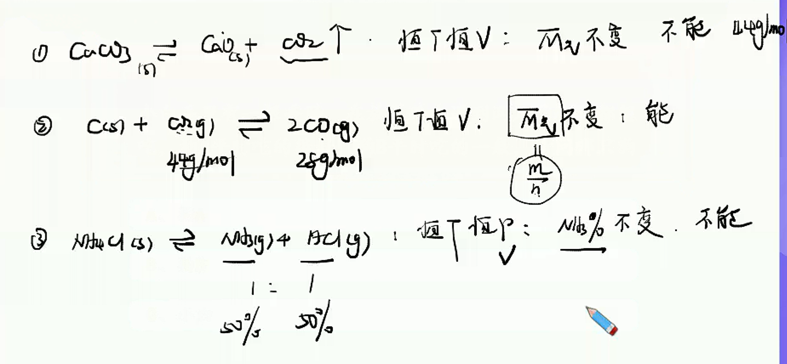

# 化学反应速率与化学平衡

> **基础知识**
>
> 1. 化学反应速率
> 2. 碰撞理论
> 3. 可逆反应和化学平衡状态
>
> **核心考点**
>
> 1. 化学反应速率的计算和比较
> 2. 影响化学反应速率的因素和碰撞理论
> 3. 化学平衡状态的判定
>
> **技巧把握**
>
> 1. 比值法快速比较速率大小
> 2. 用有效碰撞理论理解速率的影响因素
> 3. 变量不变法准确判断平衡状态

## 化学反应速率

1. 定义

   化学反应速率用来衡量化学反应过程进行的快慢程度的物理量。

2. 表示

   通常用单位时间内反应物或生成物浓度的变化来表示。

3. 表达式及其单位

   1. 表达式：$V_{(B)}=\frac{\Delta c_{(B)}}{\Delta t}$

   2. 单位：$\dfrac{mol}{L·s}$或$\dfrac{mol}{L·min}$

   > **注意**
   >
   > 1. 化学反应速率通常指平均速率而不是瞬时速率
   >
   > 2. 用各物质表示$v$的均取正值。
   >
   > 3. 固体和纯液体不能用于表示化学反应速率。
   >
   > 4. 对于同一反应，各物质表示的化学反应速率之比等于系数之比。

****

