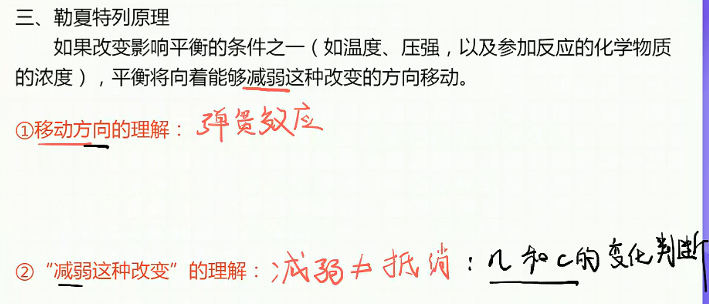
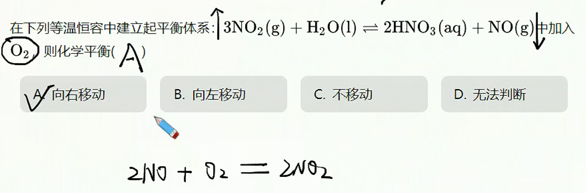
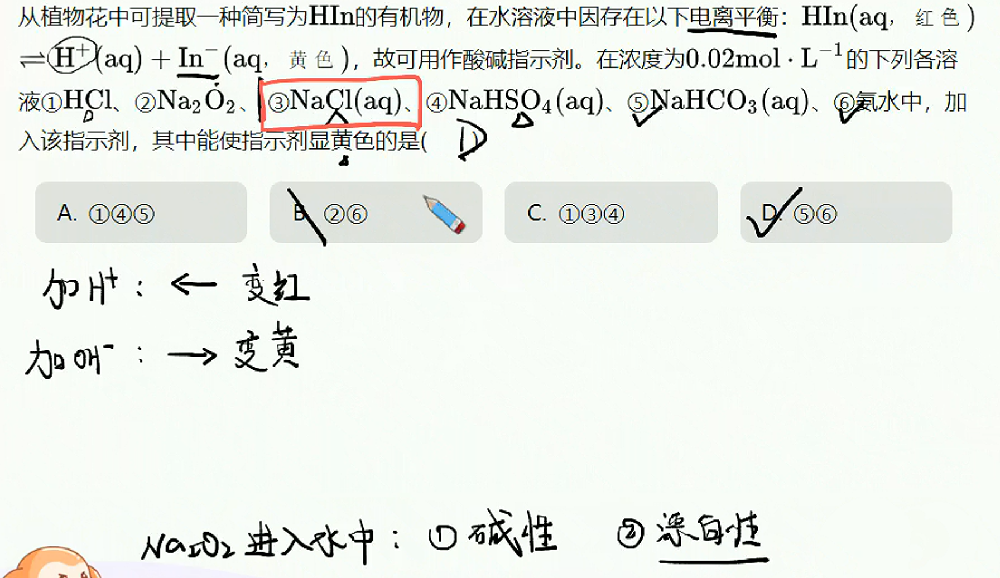
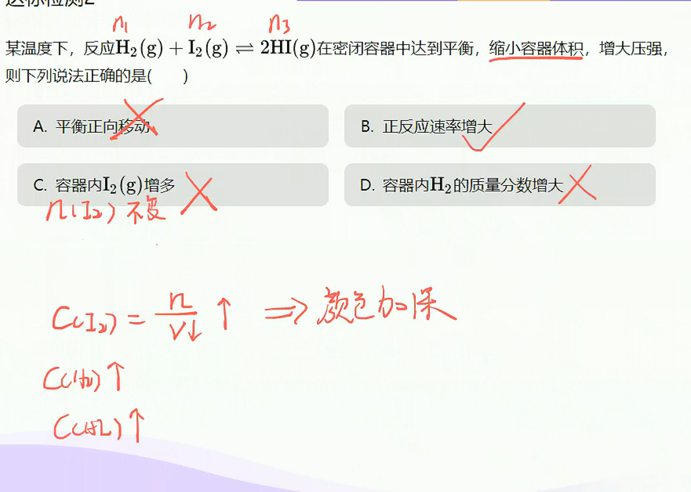
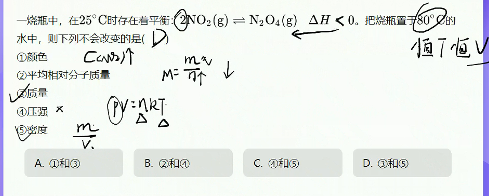
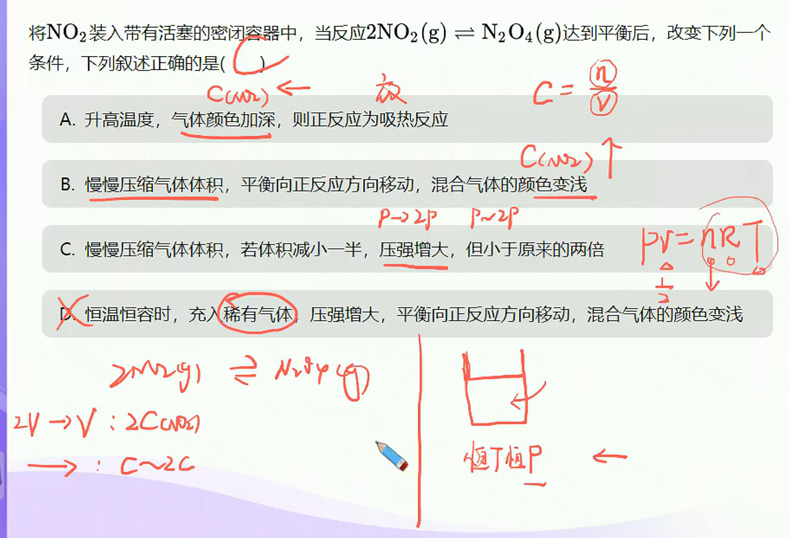
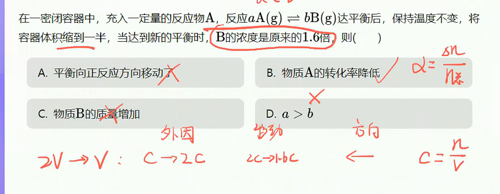
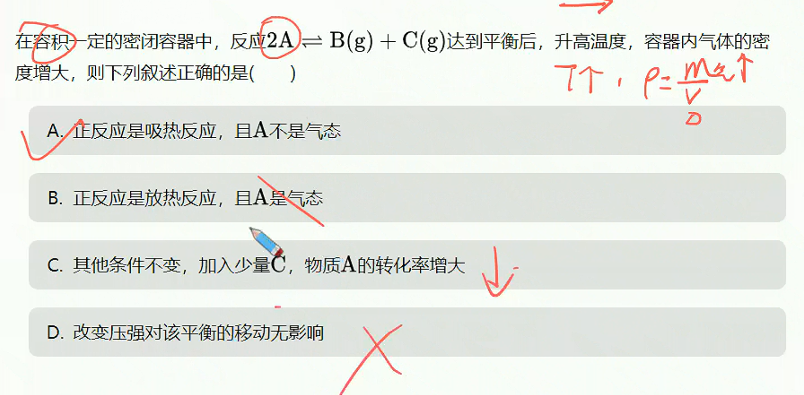
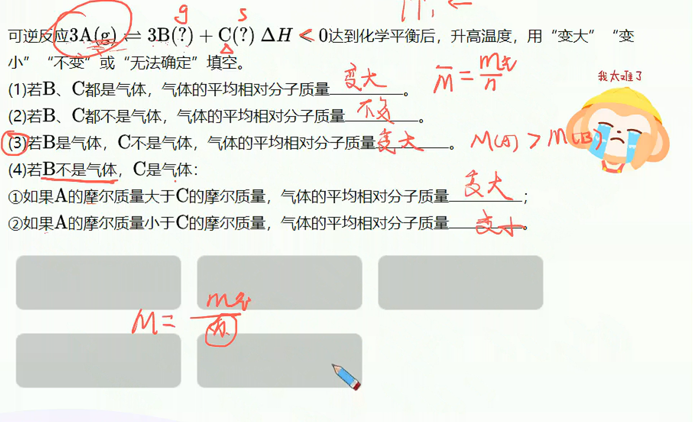

# 平衡移动分析

> **基础知识**
>
> 1. 化学平衡的移动
> 2. 勒夏特列原理及其应用
>
> **核心考点**
>
> 1. 移动的影响因素
> 2. 平衡移动过程中的速率——时间图像
> 3. 勒夏特列原理及其应用
>
> **技巧把握**
>
> 1. 弹簧效应理解平衡移动的方向
> 2. 果不抵因理解平衡移动后浓度的变化

## 化学平衡移动

1. 概念

   当一个可逆反应达到平衡状态后，如果改变浓度，温度，压强等反应条件，原来的平衡被破坏后，化学平衡会发生移动。平衡混合物中各组分物质的量及质量分数也会随之改变，从而在一段时间后达到新的平衡。这种由原平衡状态向新平衡状态变化的过程叫平衡移动。
2. 本质

   正逆反应速率不同

> 分析：从速率一时间图像理解平衡移动
>
> 1. 其他条件不变时，增加反应物浓度，平衡正向移动。
> 2. 其他条件不变时，减少反应物浓度，平衡反向移动。
> 3. 其他条件不变时，增加生成物浓度，平衡反向移动。
> 4. 其他条件不变时，减少生成物浓度，平衡正向移动。

## 压强对化学反应的影响

**结论：对于有气体参加的可逆反应，其他条件不变时，增大压强（压缩体积），平衡向气体分子数减小的方向移动；减小压强（扩大体积），平衡向气体分子数增加的方向移动。**

## 温度对化学反应的影响

**实验结论：其他条件不变时，升高温度，平衡向吸热方向移动，降低温度，平衡向放热方向移动。**

## 催化剂

催化剂能够同等程度地改变正反应速率和逆反应速率，**因此，使用催化剂平衡不移动**。虽然催化剂不能改变达到化学平衡状态的反应混合物的组成，但是使用催化剂，能改变反应到达平衡所需的时间。

## 勒夏特列原理及应用

**勒夏特列原理：当化学平衡状态受到外界影响时，化学平衡会向使这种影响减弱的方向移动。**

> **局限性：**
>
> 1. 勒夏特列原理只适用于平衡状态受到外界影响时，平衡移动的方向。
> 2. 仅适用于单一影响平衡状态的变量。
> 3. 仅适用于$n$、$c$改变，不适用于转化率。

****

