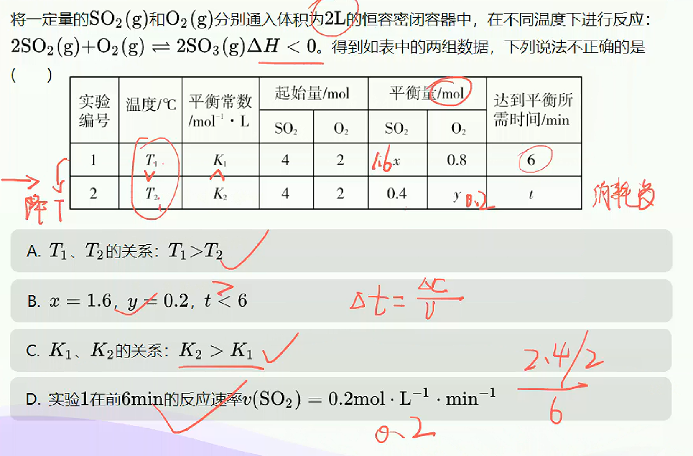

# 化学平衡的计算

> **基础知识**
>
> 1. 转化率
> 2. 化学平衡常数
>
> **核心考点**
>
> 1. 平衡常数及应用
> 2. 转化率的分析和计算
> 3. 三段式的运用
>
> **技巧把握**
>
> 三段式的妙用

## 转化率

平衡转化率是指平衡时某一反应物转化为产物的物质的量（或浓度）与起始时该物质的物质的量（或浓度）的比值。

即：$\alpha_{(B)}=\dfrac{\Delta n_{(B)}}{n_{(B)_{始}}}\times100\%$

## 化学平衡常数

1. 定义
   在一定温度下，当一个可逆反应达到化学平衡时，生成物浓度幂之积与反应物浓度幂之积的比值是一个常数，这个常数就是该反应的化学平衡常数（简称平衡常数），用$K$表示。
2. 表达式：对于可逆反应：
   $$
   aA_{(g)}+bB_{(g)}\rightleftharpoons cC_{(g)}+dD_{(g)}
   $$
   平衡常数表达式为：
   $$
   K=\dfrac{C_{(c)} C_{(d)}}{C_{(a)} C_{(b)}}\\
   =\dfrac{cd}{ab}
   $$

   > 『总结』
   >
   > 1. 平衡常数只与反应温度有关，与反应物和生成物的浓度无关。
   > 2. 固体和纯液体存在时，不参加平衡常数计算。
   > 3. 同一反应，系数变化，平衡常数也变化，但变化后的平衡常数与原平衡常数之比是一个常数。

****

