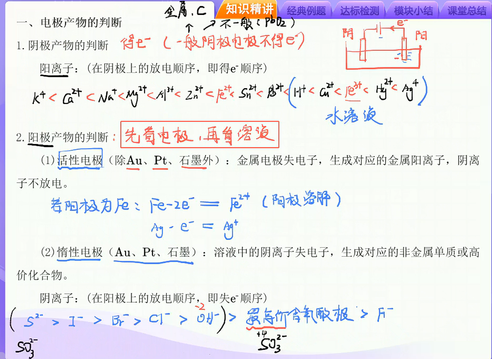
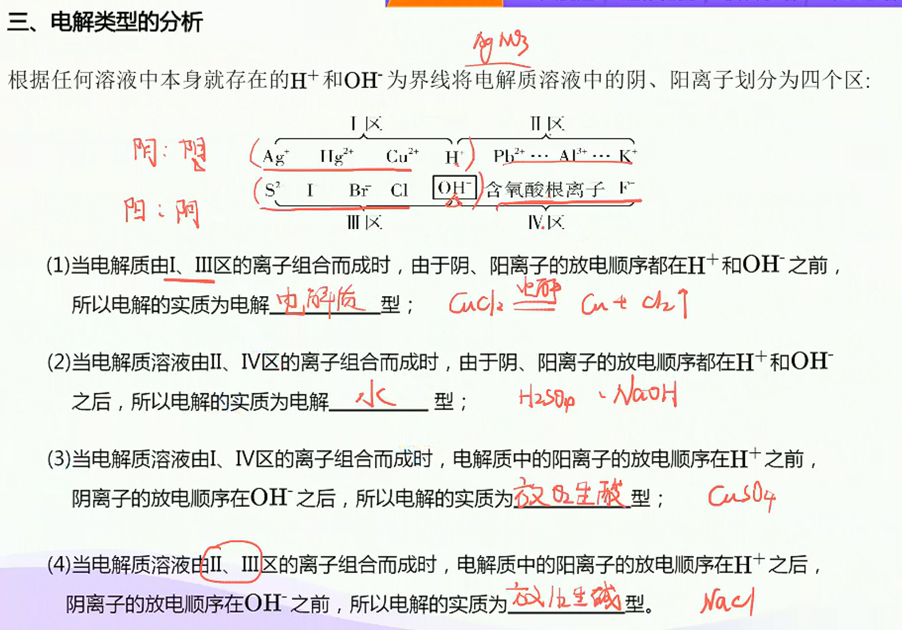
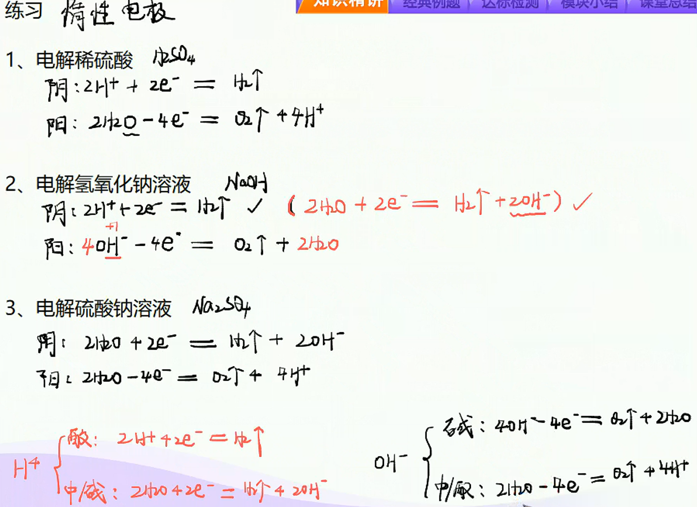
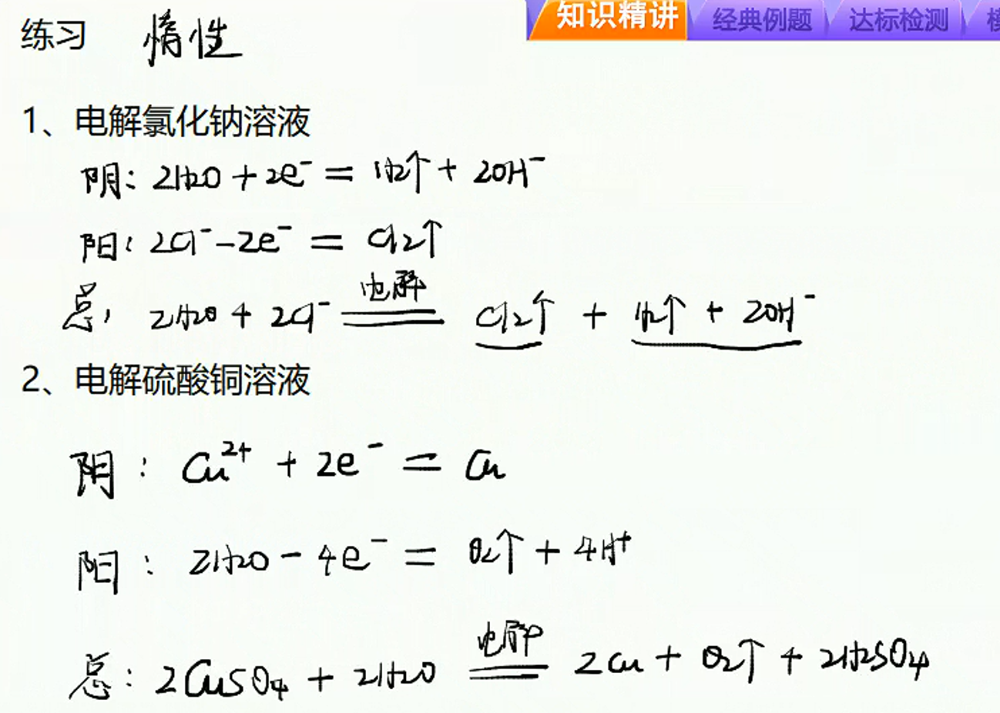

# 电解池原理和电解的类型

> **基础知识**
>
> 1. 电解池原理；
> 2. 电解类型及电极产物的判断。
>
> **核心考点**
>
> 1. 电解池的工作原理；
> 2. 离子的放电顺序和电极反应式的书写；
> 3. 电解装置的分析。
>
> **技巧把握**
>
> 牢记氧还顺序，速判放电顺序

## 电解池工作原理

1. **定义：**能将电转化为化学能的装置
2. **电解池的构成条件：**
   1. 直流电源
   2. 两个导电电极
   3. 电解质溶液/熔融电解质
   4. 闭合回路
3. 电极名称与电极反应
   1. 阴极：与电源负极相连的电极，得电子发生还原反应
   2. 阳极：与电源正极相连的电机，失电子发生氧化反应
   3. 总反应：阴阳极反应之和
   > 阳失阴得
4. 电子、电流和离子移动方向
   1. 电子：电源负极→电解池的阴极，电解池的阳极→电源
   2. 电流：电源正极→电解池的阳极→电解池的阴极→电源负极。
   3. 离子：阳离子→电解池的阴极；阴离子→电解池的阳极。

## 电极反应式的书写

1. 书写原则：先分后总。
2. 书写步骤
   1. 阴极：判断溶液中的阳离子种类→排出放电顺序→根据氧化还原书写电极反应式
   2. 阳极：先判断是惰性电极还是活性电极→活性电极自身失电子→惰性电极排出阴离子放电顺序→根据氧化还原书写电极反应式
   3. 总反应：阴阳极得失电子总数抵消，相加得总反应。

****

