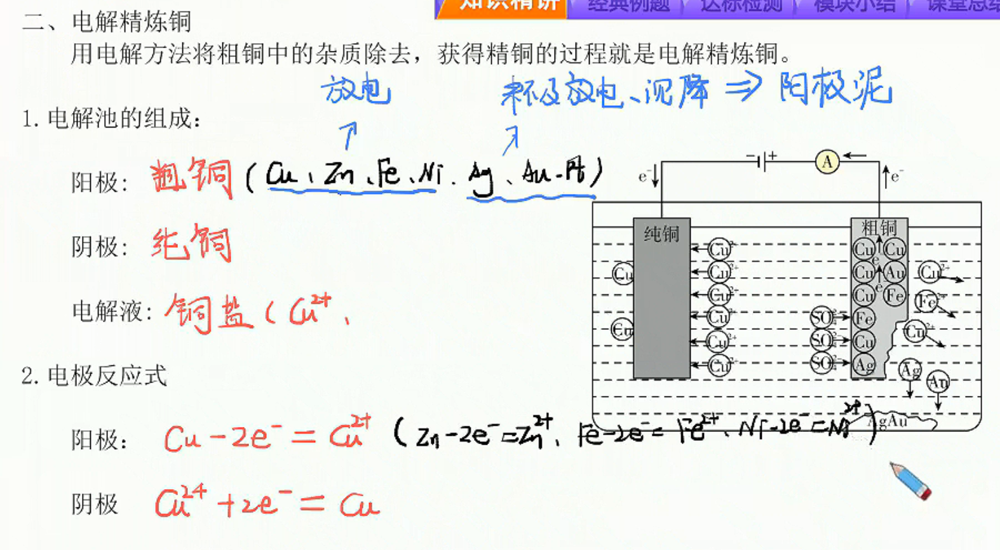

# 12

## 金属的腐蚀与防护

### 金属的腐蚀

1. 金属腐蚀的定义
   金属腐蚀是指金属或合金与周围接触到的气体或液体物质发生氧化还原反应而引起的损耗的现象。
2. 金属腐蚀的本质
   金属腐蚀的本质是金属失去电子，发生氧化反应变为金属阳离子，即$M-e→M^+$。
3. 金属腐蚀的分类

| 类型   | 化学腐蚀                            | 电化学腐蚀            |
|:------:|:---------------------------------:|:------------------:|
| 条件   | 金属与干燥的气体或非电解质液体等直接接触            | 不纯的金属或合金与电解质溶液接触 |
| 现象   | 无电流产生                           | 有微弱电流产生          |
| 本质   | 金属被氧化的过程                        | 相对较活泼的金属被氧化的过程   |
| 相互关系 | 化学腐蚀与电化学腐蚀往往同时发生，但电化学腐蚀更普遍，危害更大 | |

