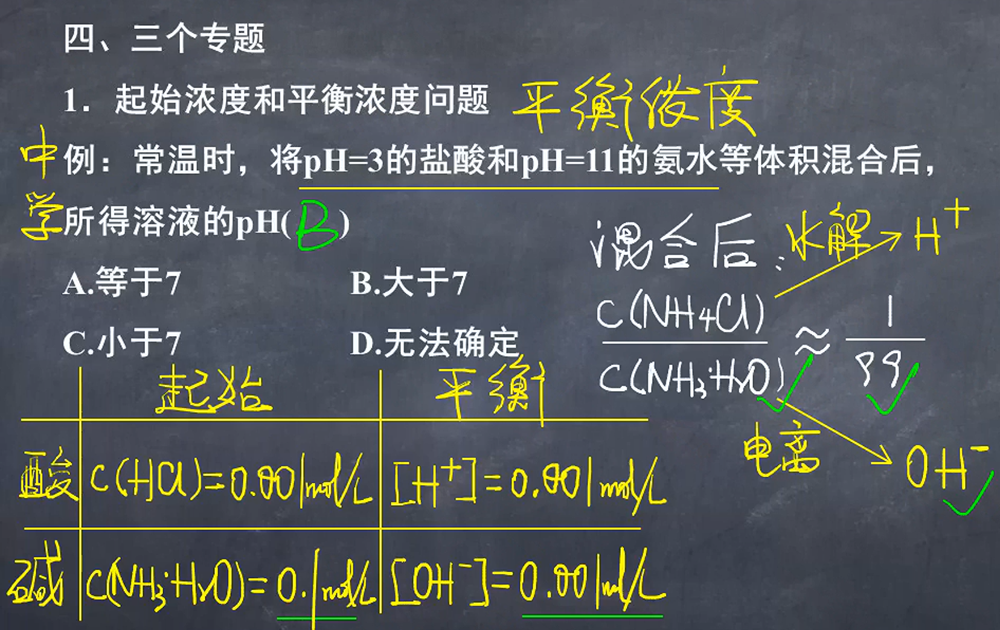
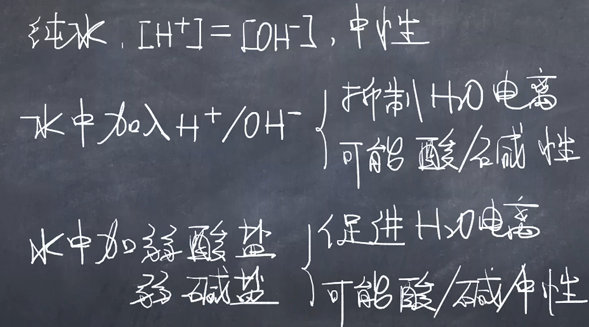

# 弱电解质电离平衡

## 弱电解质电离平衡的形成

$HAc_{(aq)} \rightleftharpoons H^{+}_{(aq)} + Ac^{-}_{(aq)}$

## 弱电解质电离平衡的影响因素

1. 升温促电离
2. 稀释促电离
3. 具体组分$c$变化，具体分析

## 电离平衡常数和电离度

1. 万能公式——定量的核心逻程
   $[产物]=x \cdot c_{(反应物)} \cdot \alpha$
   > $\alpha$为电离度。
   > $=$，$\alpha = 100\%$
   > $\rightleftharpoons$，$\alpha \leq 1\%$
2. 常见酸电离平衡常数与电离度
   

## 专题

1. 起始浓度和平衡浓度问题

   

   

2. 水电离产生的H和OH问题
   1. 酸溶液
      1. $pH=2$的$HCl_{(aq)}$
         
      2. $0.01mol/L$的$HCl_{(aq)}$
         
   2. 盐溶液
      

## 水电离产生的$H^+$和$OH^-$问题小结

