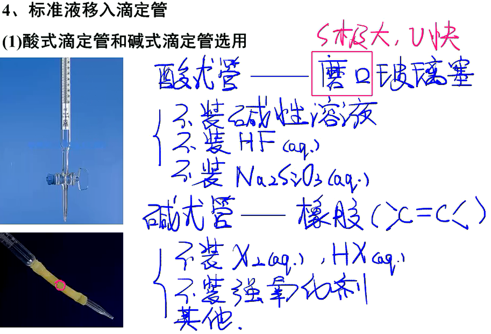

# 第10讲——酸碱中和滴定

## 酸碱中和滴定的基本逻辑

1. 关系式

   $$
   n_{(H^+)}=n_{(OH^-)}\\
   c_{(H^+)} \cdot V_{H^+}=c_{(OH^-)} \cdot V_{OH^-}\\
   \underset{配制}{c_{标准}} \cdot \underset{滴定前后}{V_{标准}}=\underset{?}{c_{待测}} \cdot \underset{移液}{V_{待测}}
   $$
2. 酸碱中和滴定曲线
   1. 滴定突跃：对数表示数量级变化
   2. 滴定终点：
      1. 只有盐/酸碱恰好反应
      2. $pH$未必为$7$
   3. 终点：
      1. 计量终点\~理论\~突越几何中心
      2. 滴定终点\~指示剂变色贴近突越

## 酸碱中和滴定操作过程中的注意事项

1. 关于数据精确度问题
   1. 精确测量：
      1. 称质量：分析天平/电子天平（小数点后4位）

