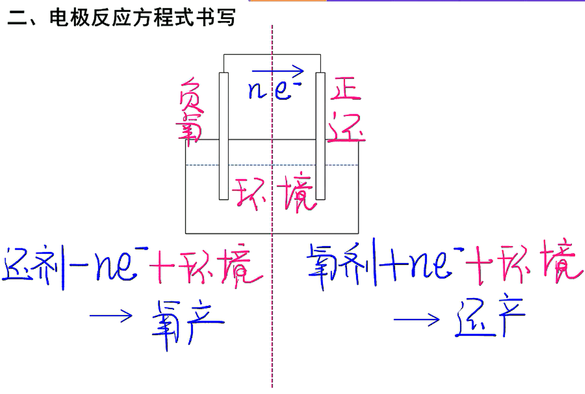
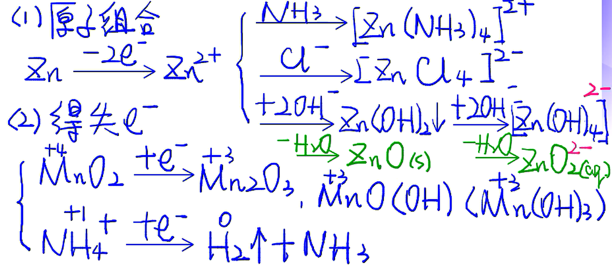
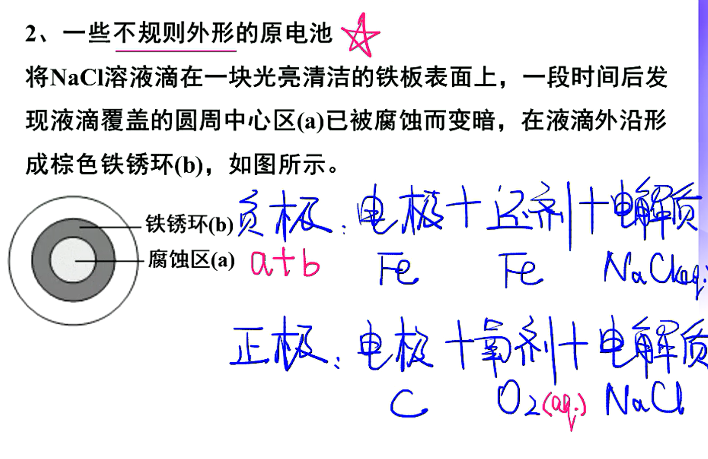
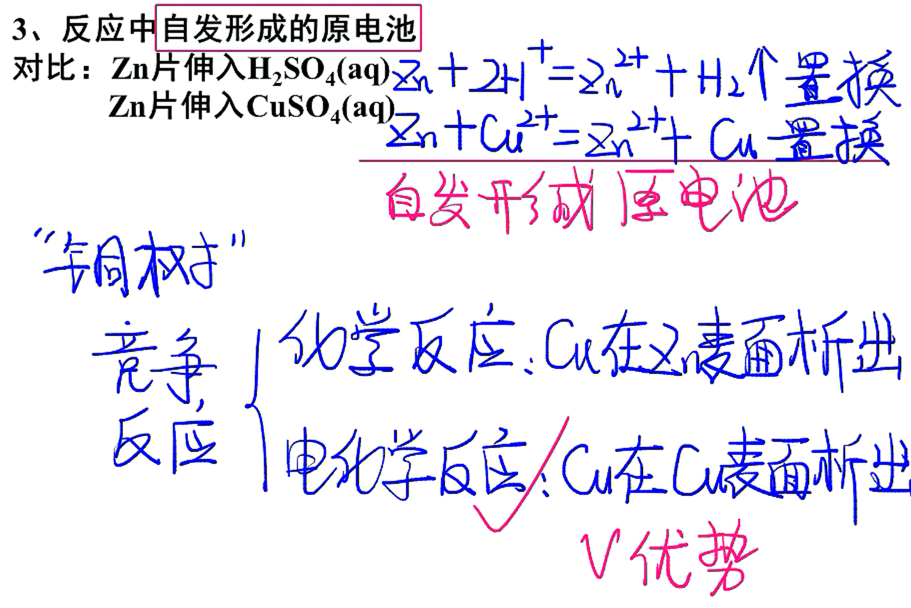

# 14

## 常见原电池

1. 锌锰电池一干电池
   负极材料是锌，正极材料是碳棒，电解质是$MnO_2$、$NH_4Cl$、$ZnCl_2$,组成的糊状物
   负极（$Zn$）:$Zn-2e^-=\!=\!=Zn^{2+}$(氧化反应)
   正极（碳棒）：$2MnO_2+2NH_4+2e^-=\!=\!=Mn_2O_3+2NH_3↑+H_2O$
   
   总反应：
   $2\stackrel{0}{Zn}+4\stackrel{+4}{Mn}O_2+4NH_4Cl=\!=\!=[\stackrel{+2}{Zn}(NH_3)_4]Cl_2+ZnCl_2+2\stackrel{+3}{Mn}_2O_3+2H_2O$
   或$\stackrel{0}{Zn}+2\stackrel{+4}{Mn}O_2+2NH_4Cl=\!=\!=\stackrel{+2}{Zn}(NH_3)_2CI_2+2\stackrel{+3}{Mn}O(OH)$
2. 银锌电池一钮扣电池
   该电池使用寿命较长，广泛用于电子表和电子计算机。其电极分别为$Ag_2O$和$Zn$，电解质为$KOH$溶液
   其电极反应式为：
   负极：$Zn+2OH^--2e=ZnO+H_2O$
   正极：$Ag_20+H_2O+2e-=2Ag+2OH^-$
3. 海水铝电池
   该电池是1991年我国首创以“铝一空气一海水”电池为能源的新型航海标志灯。这种灯以海水为电解质溶液，靠空气中氧气使铝不断氧化而产生电流，只要把灯放入海水中就能发出耀眼的闪光，其能量比干电池高20一50倍。这种灯以海水为电解质溶液，靠空气中氧气使铝不断氧化而产生电流。
   其电极反应式为：
   负极：$4Al-12e^-=4Al^{3+}$
   正极：$3O_2+6H_2O+12e^-=12OH^-$
   总反应式为：$4Al+3O_2+6H_20=4Al(OH)_3$
4. 铅蓄电池
   该电池以$Pb$和$PbO_2$作电极材料，$H_2SO_4$作电解质溶液。
   其电极反应式为：·
   负极：$Pb+SO_4^{2-}-2e^-=\!=\!=PbSO_4$
   正极：$PbO_2+4H^++SO_4^{2-}+2e^-=\!=\!=PbSO_4+2H_2O$
5. 碱性镍一镉电池
   该电池以$Cd$和$NiO(OH)$作电极材料，$NaOH$作电解质溶液
   其电极反应式为：
   负极：$Cd+2OH^--2e^-=\!=\!=Cd(OH)_2$
   正极：$2NiO(OH)+2H_2O+2e^-=\!=\!=2Ni(OH)_2+2OH^-$
6. 氢镍可充电池
   该电池是近年来开发出来的一种新型可充电电池，可连续充、放电$500$次，可以取代会产生镉污染的镍一镉电池。
   其电极反应式为：
   负极：$H_2+2OH^--2e^-=\!=\!=2H_2O$
   正极：$2NiO(OH)+2H_2O+2e^-=\!=\!=2Ni(OH)_2+2OH^-$
7. 氢氧燃料电池
   主要用于航天领域，是一种高效低污染的新型电池，一般用金属铂（是一种惰性电极，并具有催化活性）或活性炭作电极，用$40\%$的$KOH$溶液作电解质溶液。其电极反应式为：
   负极：$2H_2+4OH^--4e^-=\!=\!=4H_2O$
   正极：$O_2+2H_2O+4e^-=\!=\!=4OH^-$
   总反应式为：$2H_2+O_2=\!=\!=2H_2O$
8. 甲烷燃料电池
   用金属铂作电极，用$KOH$溶液作电解质溶液
   其电极反应式为：
   负极：$CH_4+10OH^--8e^-=\!=\!=CO_3^{2-}-+7H_2O$
   正极：$2O_2+4H_2O+8e^-=\!=\!=8OH^-$
   总反应式为：$CH_4+2O_2+2KOH=K_2CO_3+3H_2O$
9. 甲醇燃料电池
   发明的一种由甲醇和氧气以及强碱作为电解质溶液的新型手机电池，电量是现有镍氢电池或锂电池的$10$倍。
   其电极反应式为：
   负极：$2CH_4O+16OH^--12e^-=2CO_3^{2-}+12H_2O$
   正极：$3O_2+6H_2O+12e^-=12OH^-$
   总反应式为：$2CH_4O+3O_2+4OH^-=2CO_3^{2-}+6H_2O$
10. 固体氧化物$H_2-O_2$燃料电池
    该电池是美国西屋公司研制开发的，它以固体氧化锆一氧化钇为电解质，这种固体电解质允许$O^{2-}$在其间通过。
    其电极反应式为：
    负极：$2H_2+2O^{2-}-4e^-=\!=\!=2H_2O$
    正极：$O_2+4e^-=\!=\!=2O^{2-}$
    总反应式为：$2H_2+O_2=\!=\!=2H_2O$
11. 熔融盐燃料电池
    该电池用$Li_2CO_3$和$Na_2CO_3$熔融盐混合物作电解质，$CO$为阳极燃气，空气与$CO_2$的混合气为阴极助燃气，制得在$650℃$下工作的燃料电池。熔融盐燃料电池具有高的发电效率，因而受到重视。
    其电极反应式为：
    负极：$2CO+2CO_3^{2-}-4e^-=\!=\!=4CO_2$
    正极：$O_2+2CO_2+4e^-=\!=\!=2CO_3^{2-}$
    总反应式为：$2CO+O_2=2CO_2$

