# 第6讲——直线与图形方程的位置关系

## 直线与椭圆的位置关系

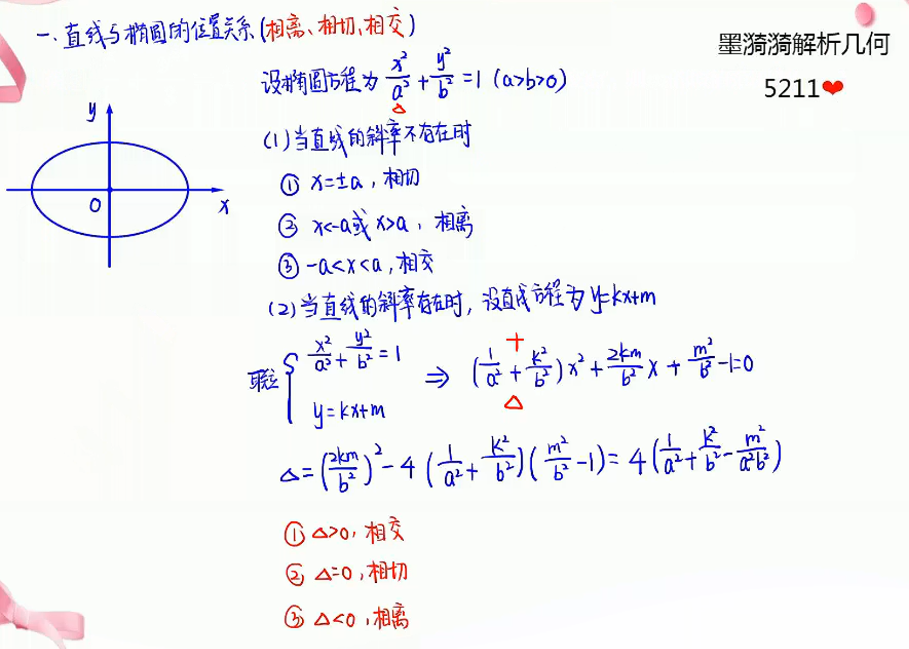

> 先看竖直线：
>
> 1. 点在椭圆内为相交
> 2. 点在椭圆上/外，进行联立

## 直线与双曲线的位置关系

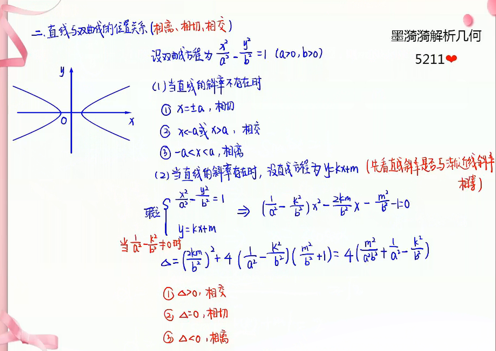

> 1. 看直线斜率和双曲线渐近线斜率是否相等
> 2. 不相等，和椭圆一样

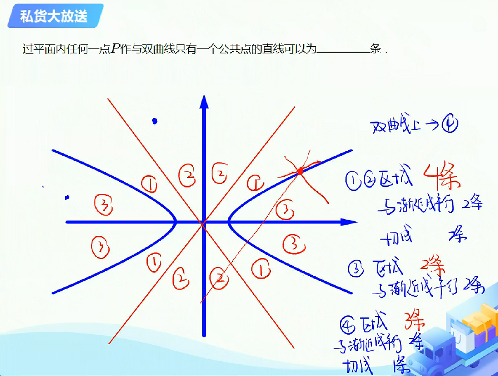

## 直线与抛物线的位置关系

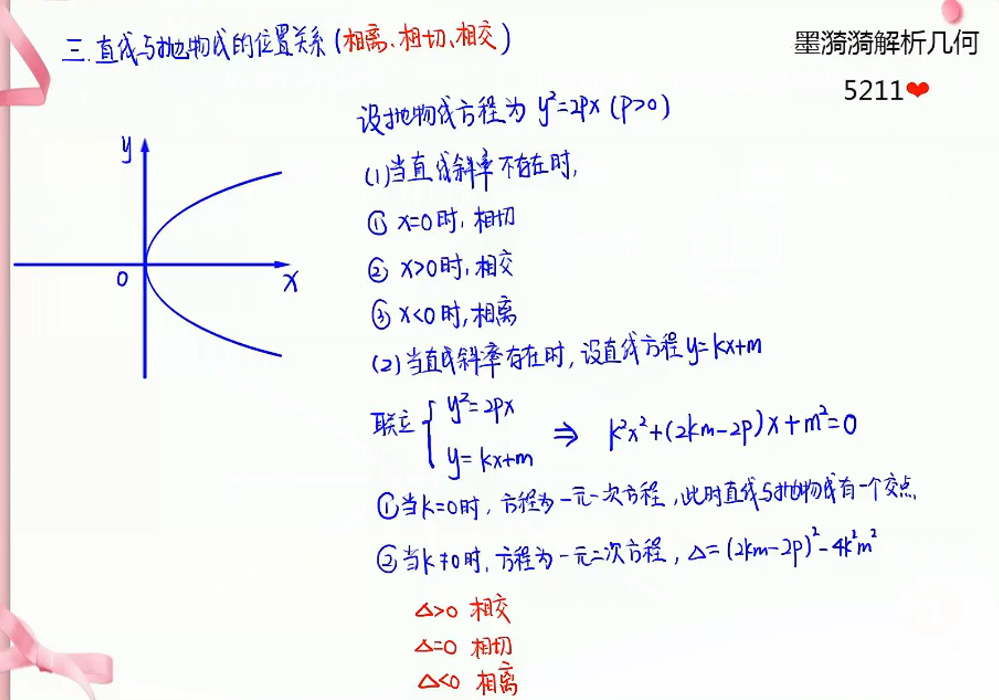

> 1. 先考虑$k=0$，相交并只有一个交点
> 2. 如果$k\neq 0$，和椭圆一样

****

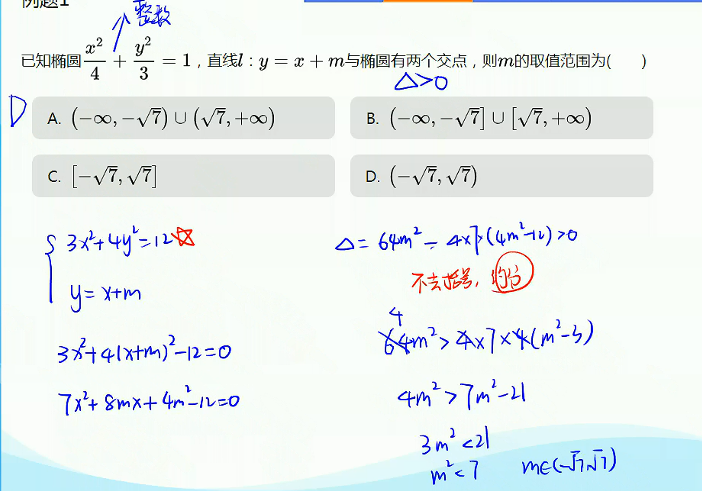

> 1. 系数先化整数
> 2. 不去括号先约分

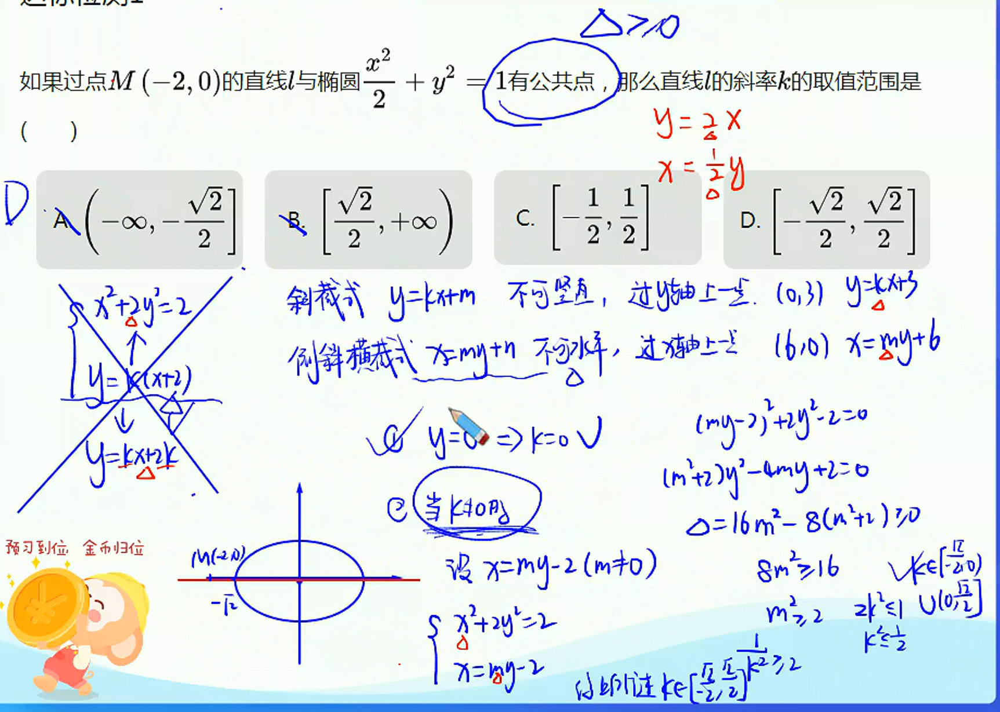

> 斜截式：$y=kx+m$ 不可竖直，过$y$轴上一点
>
> 倒斜横截式：$x=my+n$ 不可水平，过$x$轴上一点
>
> $y=kx+m$的$k$和$x=my+n$的$m$互为倒数

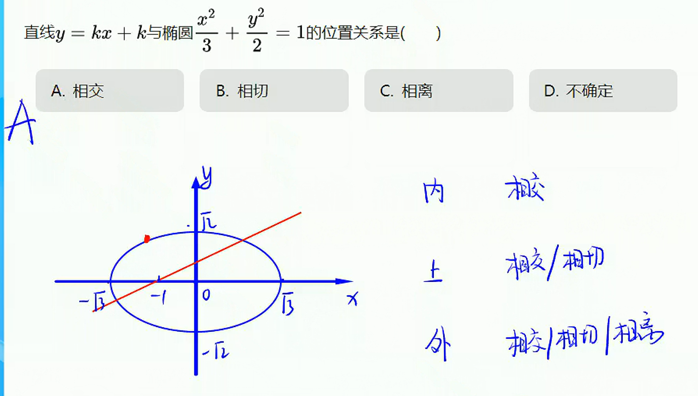

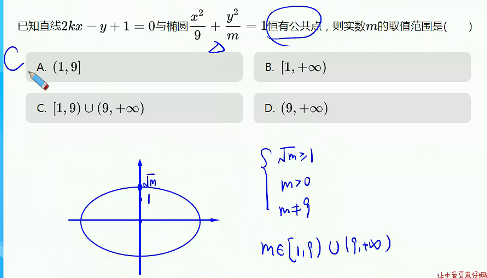

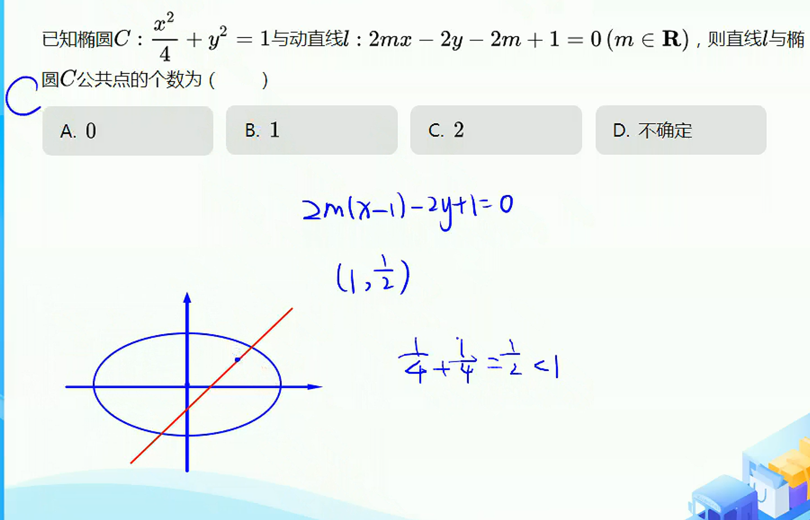

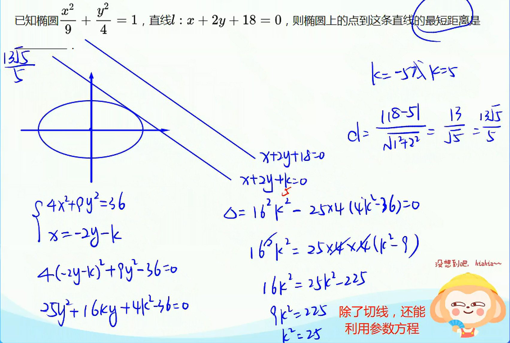

> 三角换元：$\cos ^2 \alpha + \sin ^2 \alpha = 1$

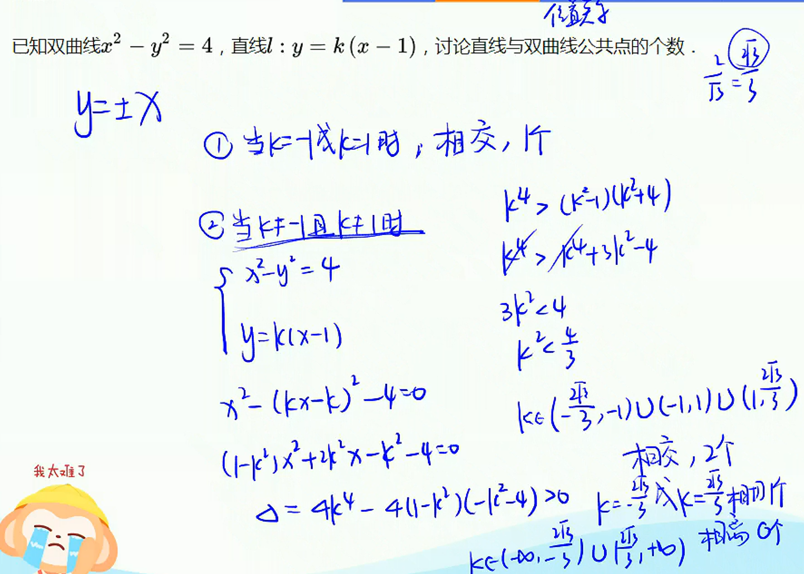

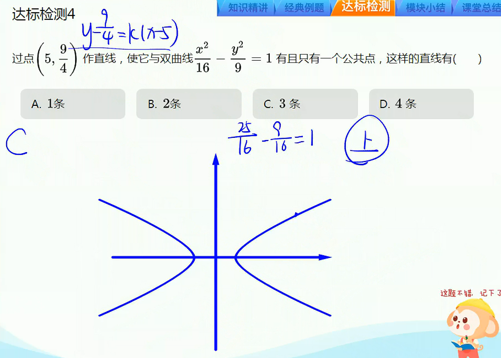

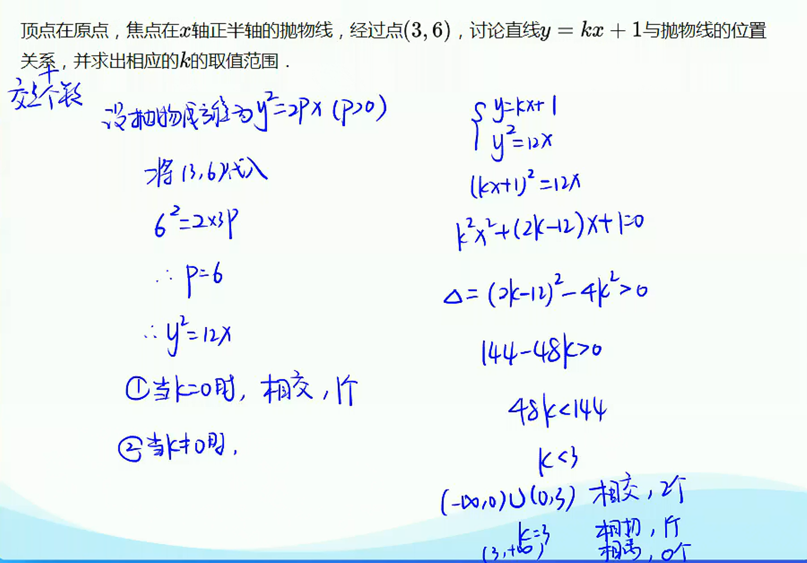

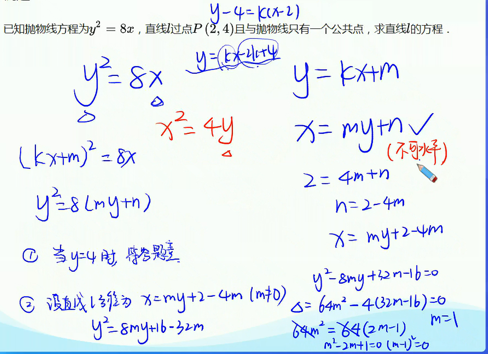

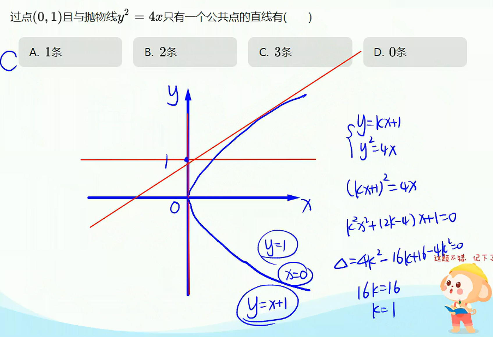
