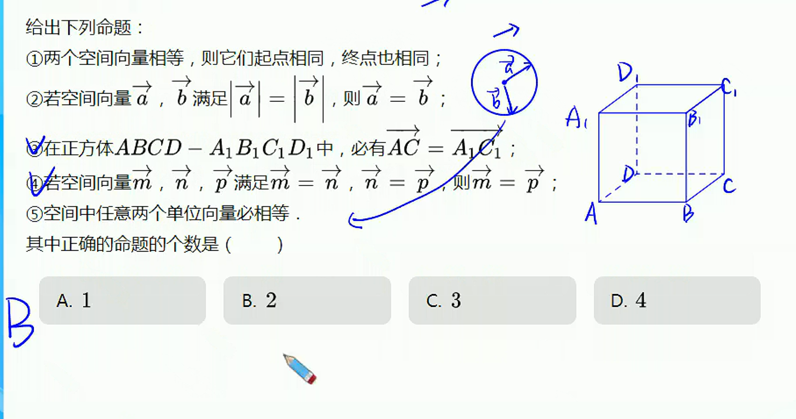

# 空间向量初步

## 空间向量的线性运算

### 基本概念

1. 空间向量：有大小，**有方向**
2. 向量的模表示：$|\overrightarrow{a}|$、$|\overrightarrow{AB}|$、$|\overrightarrow{BA}|$
3. 零向量：模为0，**方向任意**
   单位向量：模为1，**方向确定**
4. 相等向量：模相等，方向相同
   相反向量：模相等，方向相反
5. 向量平行（共线）：空间中某些向量的基线平行或重合

### 向量的线性运算

### 向量的加法

1. 三角形法则
2. 平行四边形法则

### 向量的减法

**共起点**，再相减

### 向量的数乘

1. 数乘向量的模：$k|\overrightarrow{a}|$
2. 数乘向量的方向：$k>0$，方向与原向量相同；$k<0$，方向与原向量相反；$k=0$，方向任意

## 空间向量的基本定理

### 向量的位置关系

1. $\overrightarrow{a}$与$\overrightarrow{b}$一定共线，若$\overrightarrow{a}$与$\overrightarrow{b}$共面
   $\overrightarrow{a} = \lambda \overrightarrow{b}$ （$\overrightarrow{b} \neq \overrightarrow{0}$）
2. $\overrightarrow{a}$、$\overrightarrow{b}$、$\overrightarrow{c}$不一定共面，若$\overrightarrow{a}$、$\overrightarrow{b}$、$\overrightarrow{c}$共面
   $\overrightarrow{c} = \lambda \overrightarrow{a} + \mu \overrightarrow{b}$（$\overrightarrow{a}、\overrightarrow{b}$不共线）

### 向量的分解

同平面向量

## 空间向量数量积

## 坐标表示

****

