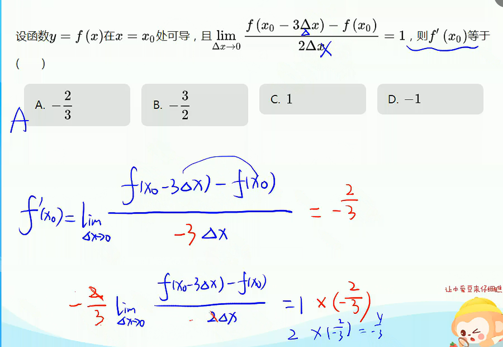
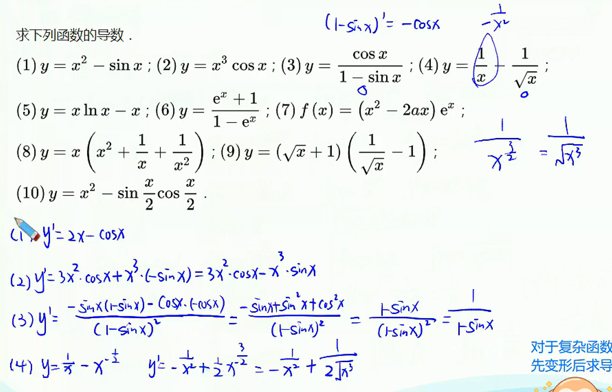

# 导数概念与运算

## 平均变换率

$f(x)$在区间$[x_0,x_0+\Delta x]$上的平均变换率定义为

$$
\frac{\Delta y}{\Delta x}=\frac{f(x_0+\Delta x)-f(x_0)}{\Delta x}
$$

> **注意**
> $\Delta x \neq 0$，$\Delta x$有正负
> 几何意义：$k_{AB}$割线斜率

## 瞬时变化率（导数）

$\Delta x \rightarrow 0$ “趋近于” $\Delta x$可正可负

$\frac{\Delta y}{\Delta x} \rightarrow l$常数

$$
\lim_{\Delta x \rightarrow 0}\frac{\Delta y}{\Delta x}=l
$$

$$
f'(x_0)=\lim_{\Delta x \rightarrow 0}\frac{f(x_0+\Delta x)-f(x_0)}{\Delta x}
$$

$f(x)$在点$x_0$处可导

> **注意**
> 可导 $\Rightarrow$ 连续
> 连续 $\nRightarrow$ 可导
> 不连续 $\Rightarrow$ 不可导
> 可导需要：连续 + 左右导数相等
> 连续需要：有定义 + 左右极限相等

## 导函数

写法：$f'(x)$、$y'$、$y'_x$
区分：$f'(x)$表示整体，$f'(x_0)$表示在点$x_0$处的导数

****

