# 利用导数研究极值最值

## 极值

> 奇偶性——整体概念
> 单调性——局部概念

1. 最值：整体
2. 极值：全部

定义：函数$f(x)$，在点$x_0$附近的所有$x$

- 若$f(x) < f(x_0)$，则$f(x_0)$为极**大**值，$x_0$为极**大**值点（不是点，是数值）
- 若$f(x) > f(x_0)$，则$f(x_0)$为极**小**值，$x_0$为极**小**值点

> 1. 极大值 $\leqslant$ 最大值
> 2. 极小值 $\geqslant$ 最小值
> 3. 极值点左右单调性相反
> 4. $[a,b]$，极大值和极小值不能发生在端点
> 5. 极大值不一定大于极小值
>
> **极值重点**
>
> 1. $f(x)$单调性发生变化，导函数正负交替时，会产生极值
> 2. 若$f(x)$在$x_0$处可导，则$f'(x_0)=0$
> 3. 极值点处不一定可导
> 4. 导函数为$0$的点不一定是极值点

## 最值

1. 极值不一定是最值，最值不一定是极值
2. 求$f(x)$在$[a,b]$上的最值
   1. 先求$f(x)$在$[a,b]$上的极值
   2. 端点函数值$f(a)$和$f(b)$与各个极值比较，最大的是最大值，最小的是最小值

****

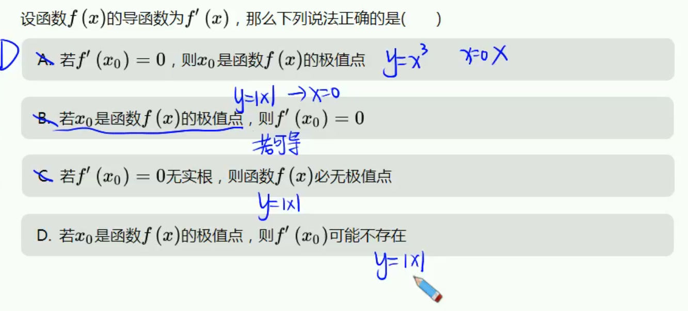

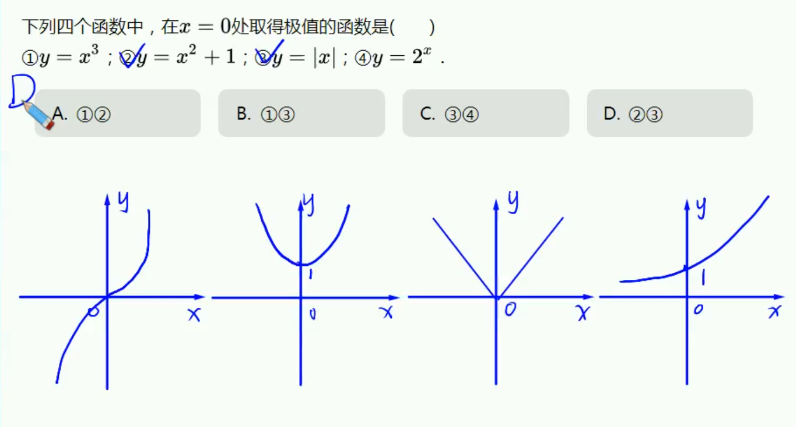

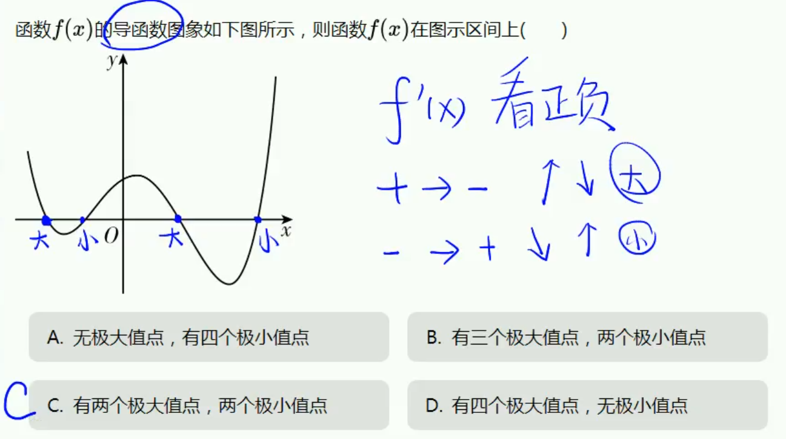

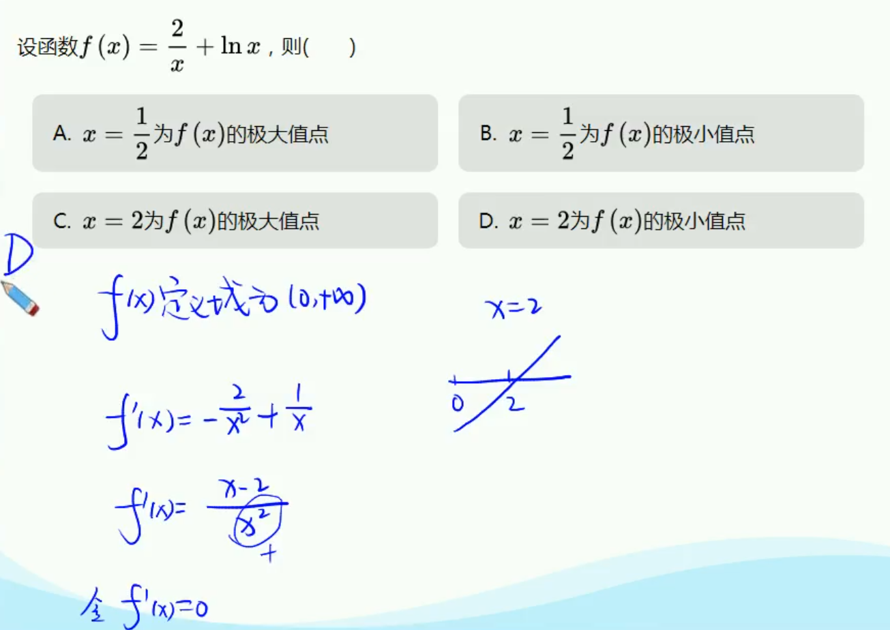

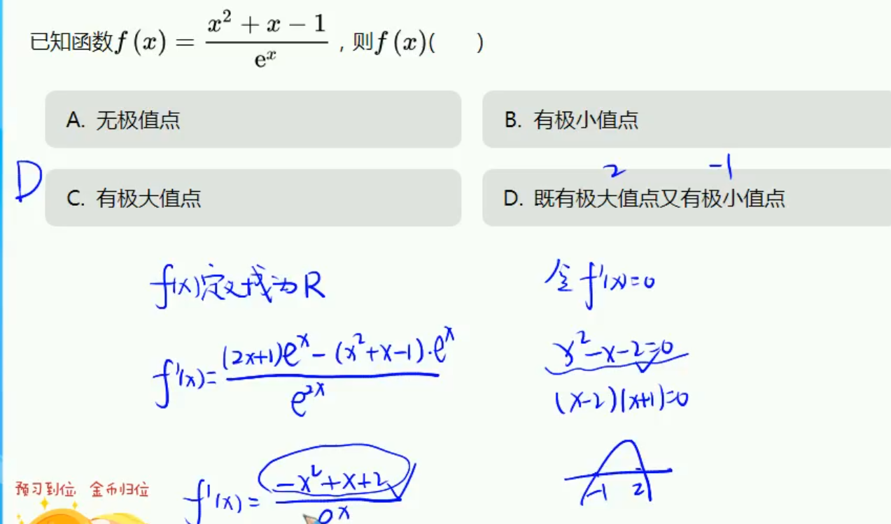

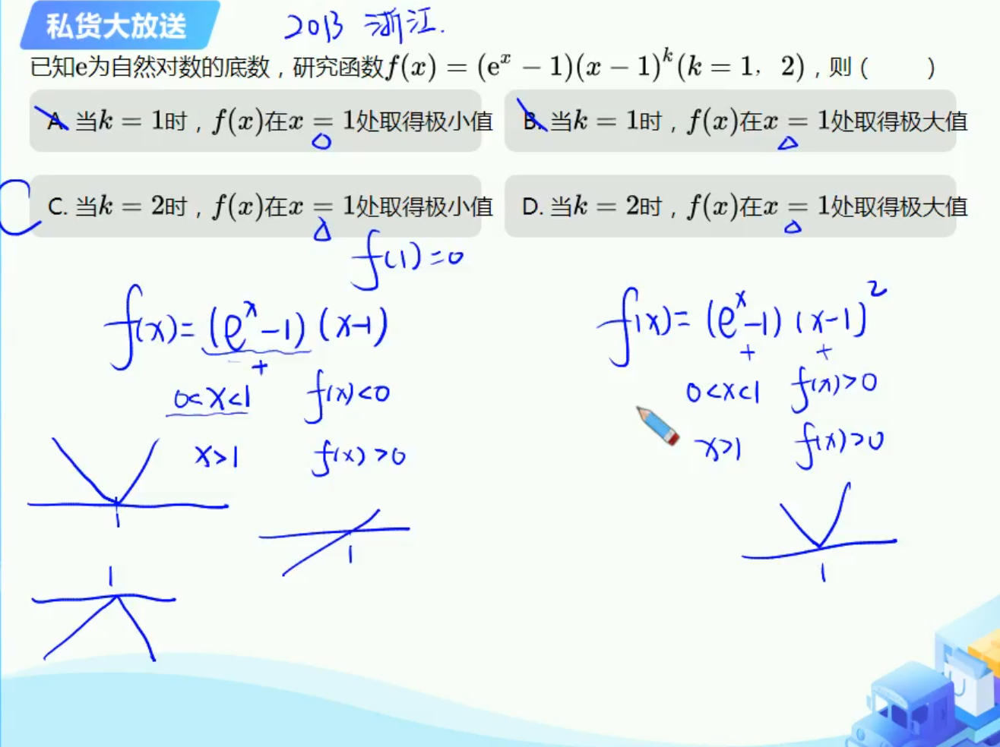

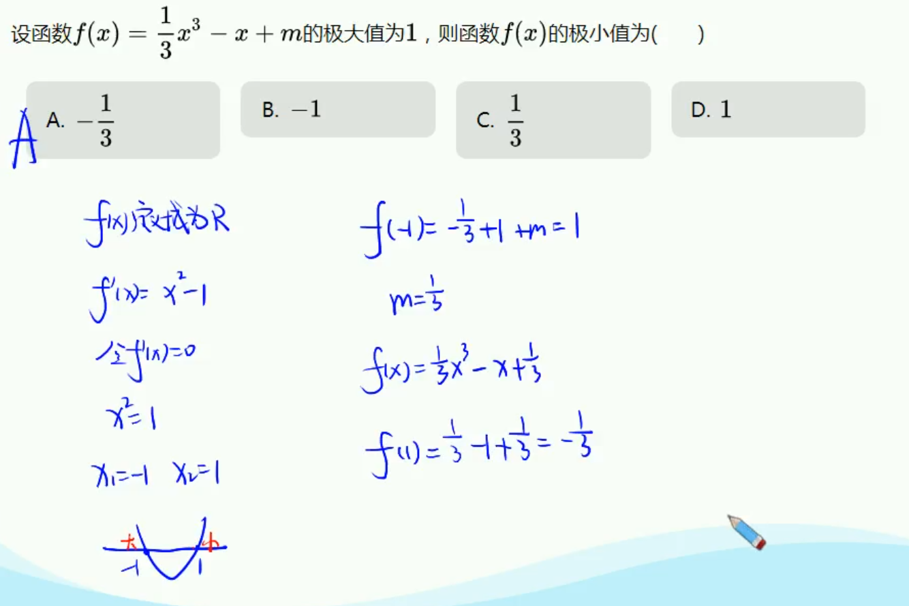

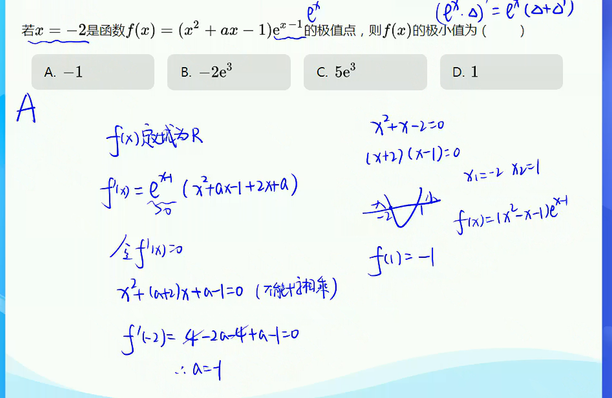

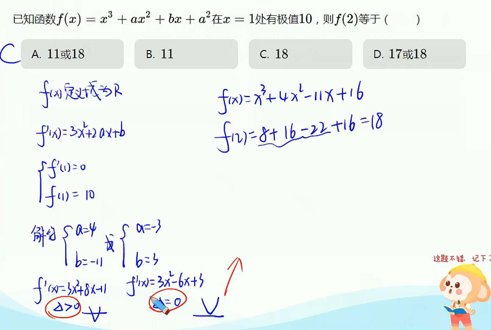

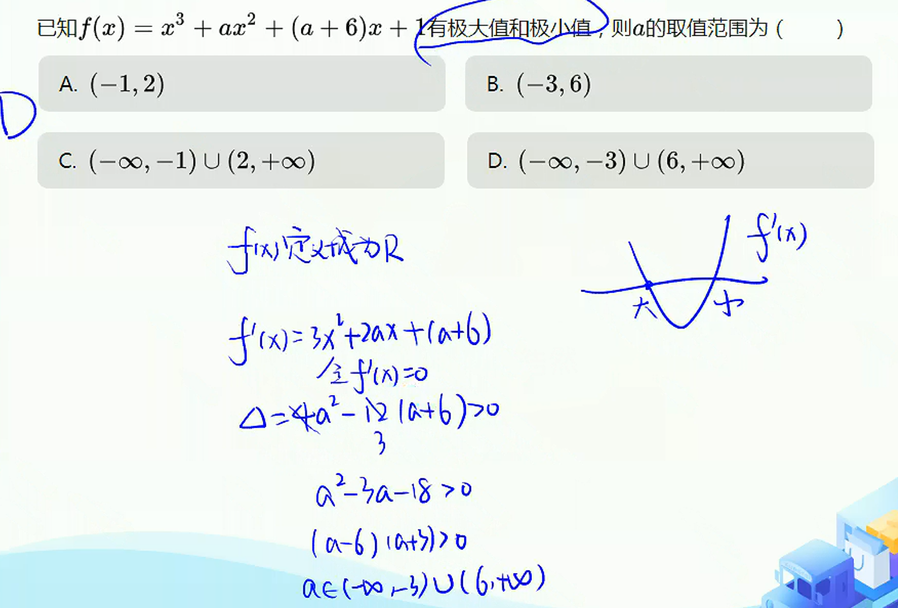

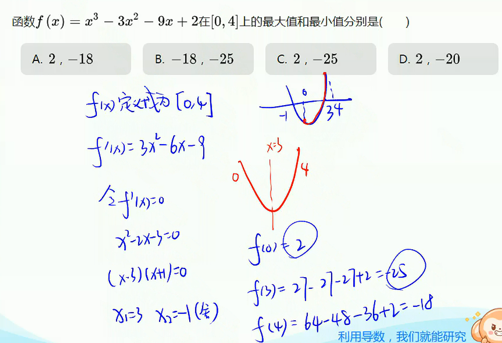

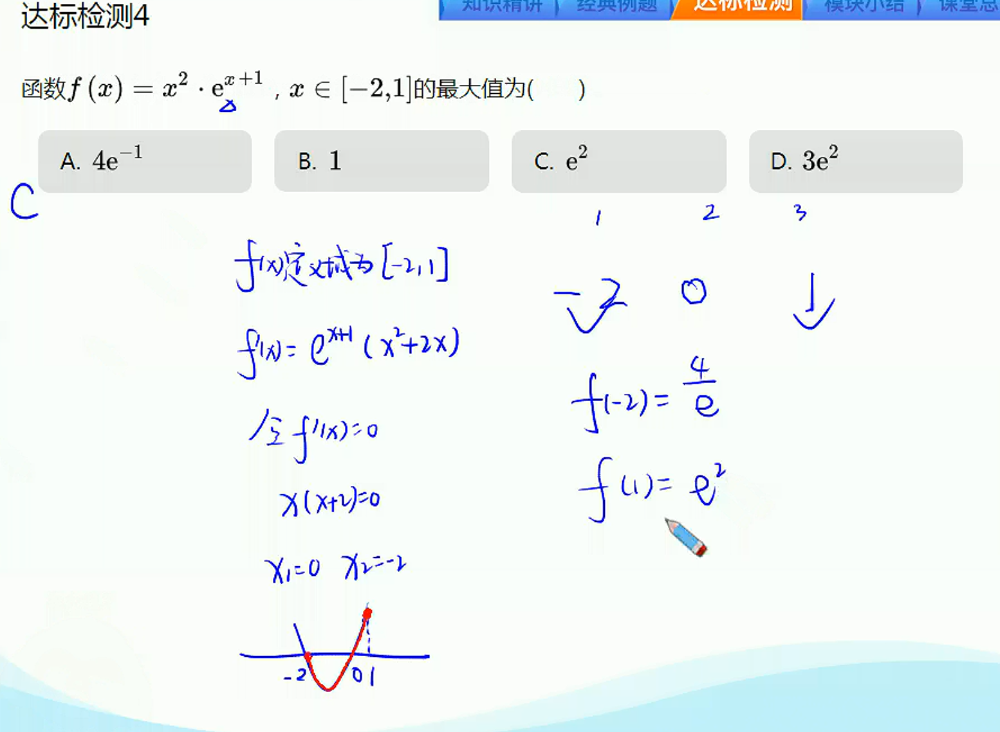

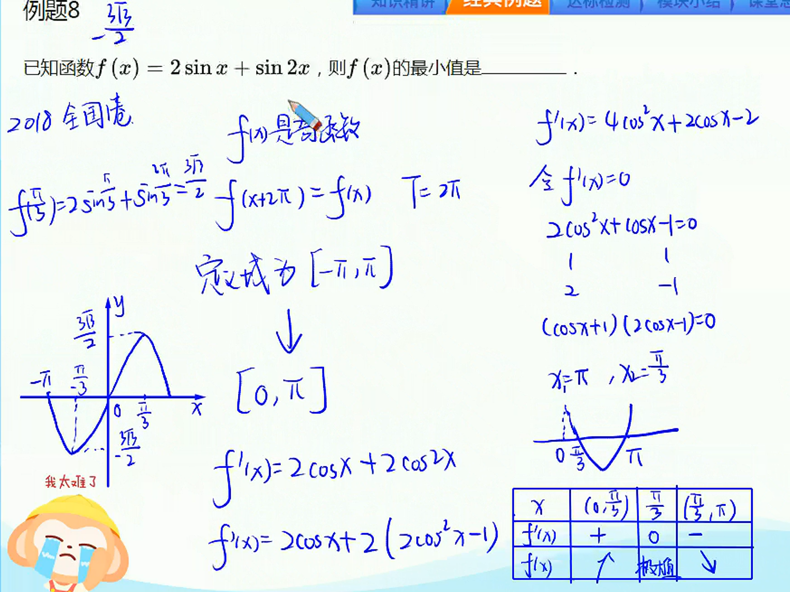
