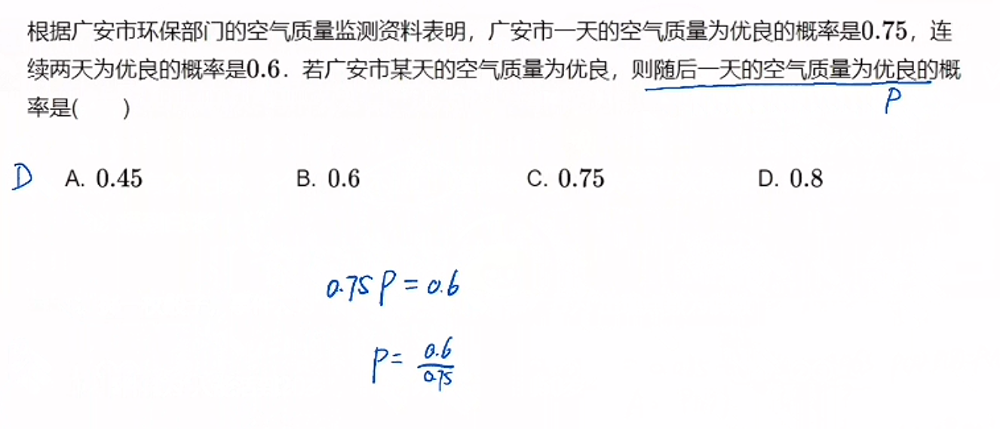

# 14

## 事件概念

1. 必然事件：在一定条件一定会发生的事件
2. 不可能事件：在一定条件一定不会发生的事件
3. 确定事件：必然事件和不可能事件统称为确定事件
4. 随机事件：在一定条件可能发生也可能不发生的事件

## 互斥事件、对立事件及概率加法公式

1. 互斥事件：事件A和事件B不可能同时发生
   集合语言：$A∩B=\varnothing$
   公式：$P(A∪B)=P(A)+P(B)$
2. 对立事件：事件A和事件B不可能同时发生，但必有一个发生
   集合语言：$A∩B=\varnothing,A∪B=U$
   公式：$P(A∪B)=P(A)+P(B)=1,P(A)=1-P(B)$

## 独立事件及概率乘法公式

   相互独立事件：事件A发生不发生与事件B发生不发生无关
   公式：$P(A∩B)=P(A)P(B)$
   

****

