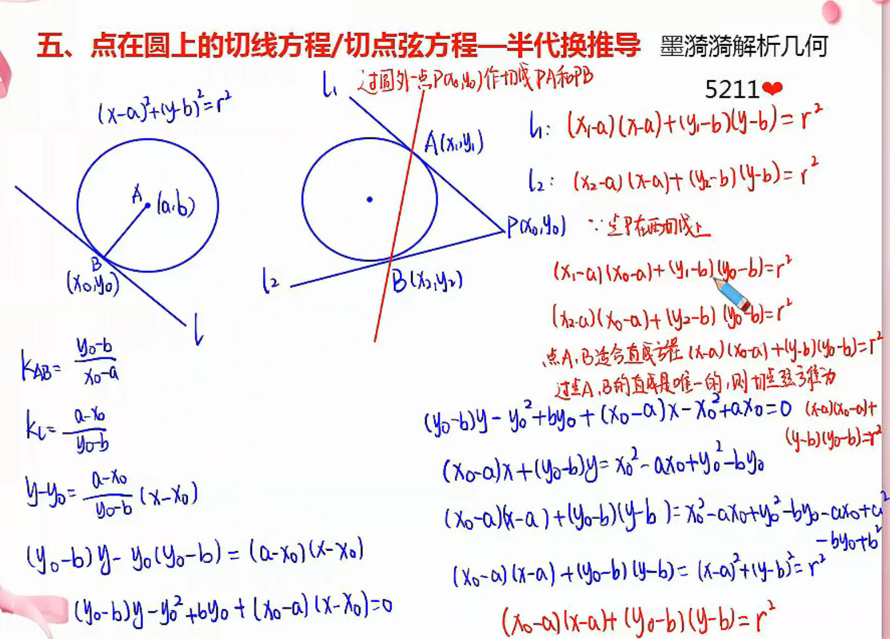

# 圆的方程与相关位置关系

## 圆的方程

1. 标准方程
   $$
   (x-a)^{2}+(y-b)^{2}=r^{2}
   $$
   其中，$(a,b)$ 是圆心的坐标，$r$ 是半径。
2. 一般方程
   $$
   x^{2}+y^{2}+Dx+Ey+F=0\\
   (x+\frac{D}{2})^{2}+(y+\frac{E}{2})^{2}=\frac{D^{2}}{4}+\frac{E^{2}}{4}-F
   $$
   其中，$D,E,F$ 是常数，$D^{2}+E^{2}-4F=r^{2}$。

> 推导（非必要）：
> 

****

