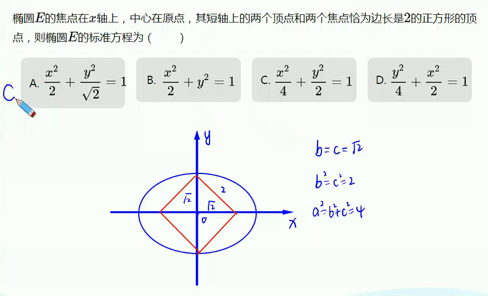

# 椭圆基本量与几何性质

## 椭圆定义

1. 椭圆第一定义
   平面内到两个定点$F_1$、$F_2$的距离之和等于常数（大于$|F_1F_2|$）的点的轨迹叫做椭圆，这两个定点叫做椭圆的焦点，两焦点间的距离叫做焦距。
2. 椭圆第二定义
   平面内到一定点与一定直线的距离之比等于定值（小于1）的点的轨迹叫做椭圆（平面内到定点与到定直线的距离的比是常数$e$（$e>0$）的点的轨迹，当$0<e<1$时，是椭圆）。
3. 椭圆第三定义
   平面内到两定点$A_1(a,0)$、$A_2(-a,0)$的斜率乘积等于常数$e^2-1$(大于$-1$小于$0$)的点的轨迹叫做椭圆，两个定点叫做椭圆的顶点。

## 椭圆标准方程与几何性质

## 三焦结论——焦半径

## 三焦结论——焦点弦

## 三焦结论———焦点三角形

## 椭圆两个最大张角

## 椭圆离心率

1. 定义
   椭圆的焦距与长轴长的比
2. 几何意义
   离心率决定椭圆的形状
3. 求解方法
   1. 直接法：求出$a$和$c$，代入
   2. 构造齐次关系（是指简化后所有非零项的指数相等）

****

