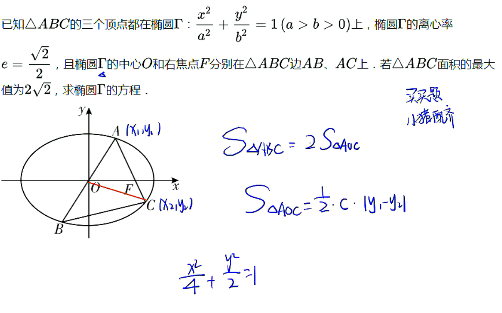
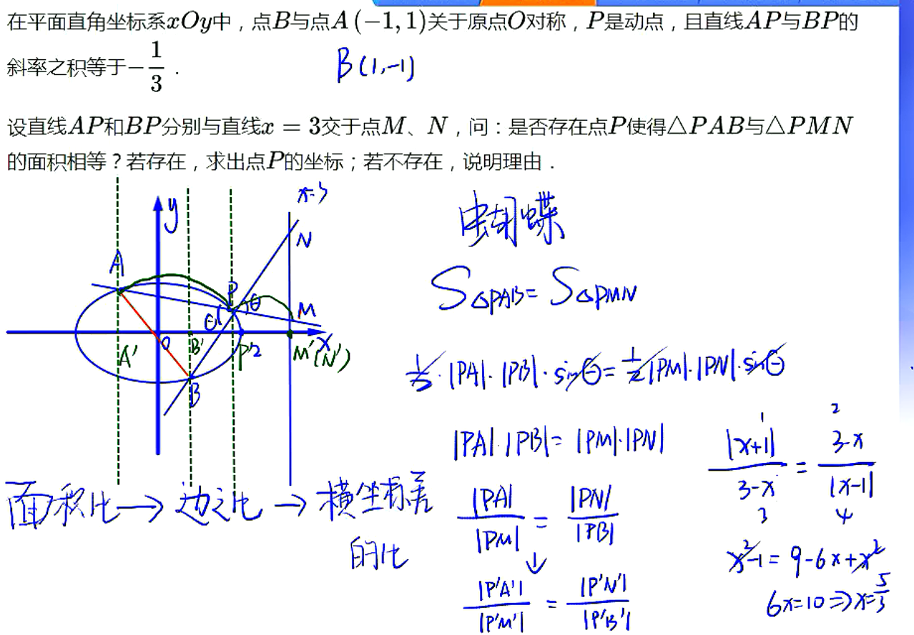

# 09

## 圆锥曲线大题的常规考法

1. 题型结构
   1. 基本条件：一条（带参数的）直线与圆锥曲线交于两点A、B
   2. 核心条件：与两交点相关的几何量（弦长、面积、角度、斜率、比例等）或者向量表达式
2. 设问方式：
   1. 求几何量或表达式的值；
   2. 由几何量或表达式的值求直线参数；
   3. 求几何量或表达式的最值；
   4. 证明几何量为定点或表达式为定值

## 圆锥曲线大题的基本套路

一设：将直线方程设为恰当形式（斜截式或倒斜横截式）
二联：直线方程与圆锥曲线方程联立，消掉$x$或$y$,转化为关于$y$或$x$的一元二次方程
三韦达：用几何量表示两根和与两根积
四不知道：…放弃，下一道题

## 设直线的技巧与△的讨论

## 弦长公式

## 面积公式

1. 三角形面积：
   1. 弦底高法（弦长为底，点到直线距离为高）：
   2. 两边一夹角：
   3. 分割法：水平高×铅垂高
2. 四边形面积：
   1. 特殊四边形：平行四边形，矩形，菱形，…
   2. 对角线互相垂直的四边形：
   3. 对角线夹角为的四边形：
   4. 分割法：特殊图形面积或三角形面积等

****

