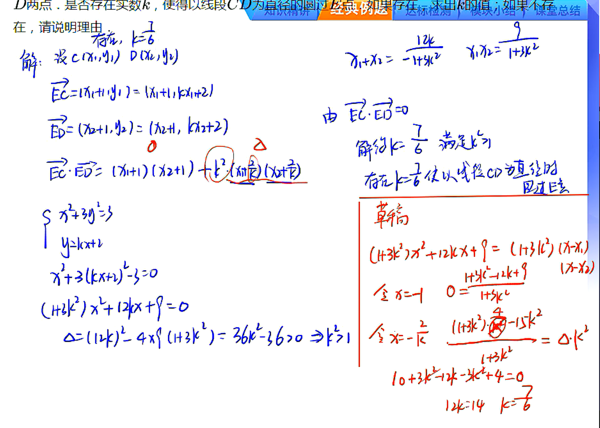

# 几何量的表达——向量与斜率

## 向量与角度

### 向量问题

重点：向量运算的坐标表达

### 比例问题

重点：共线线段比例的转化方法
方法：图形确定用相似，不确定用向量

### 角度问题

1. 转化为数量积
2. 转化为斜率

## 条件转化

### 向量角度转化

当$A,O,B$三点不共线时：

1. $∠AOB$为直角$\rightleftharpoons \overrightarrow{OA} \cdot \overrightarrow{OB} = 0$
2. $∠AOB$为锐角$\rightleftharpoons \overrightarrow{OA} \cdot \overrightarrow{OB} > 0$
3. $∠AOB$为钝角$\rightleftharpoons \overrightarrow{OA} \cdot \overrightarrow{OB} < 0$

### 斜率转化

顶点在坐标轴上的角相等或互补一般转化为斜率来处理点P在以AB为直径的圆周上

## 向量相关的大题基本套路

一设：将直线方程设为恰当形式（斜截式/倒斜横截式）
二联：直线方程与圆锥曲线方程联立，消掉$x$或$y$,转化为关于$y$或$x$的一元二次方程
三韦达：用几何量表示两根和与两根积
四代入：将为韦达定理结果代入到表达式，整理得到答案
> 注意：
>
> 1. 直线分类讨论
> 2. 判断是否需要验证$\Delta$，如需要，必须验证

> 化简到$y=a(x-x_1)(x-x_2)$的形式，再看结构直接得值
> 大题答题请装作运用韦达定理

****

