# 第13讲——点差法与第三定义

## 点差公式

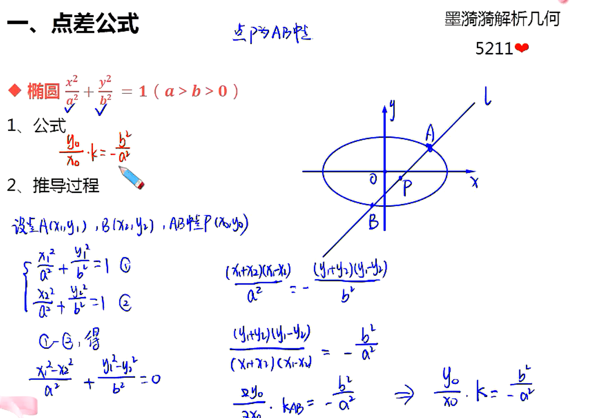

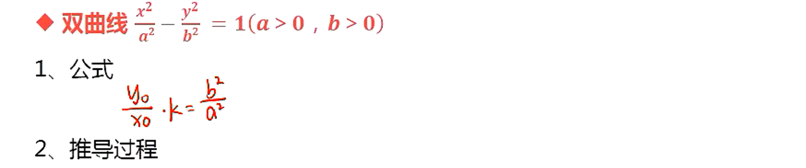

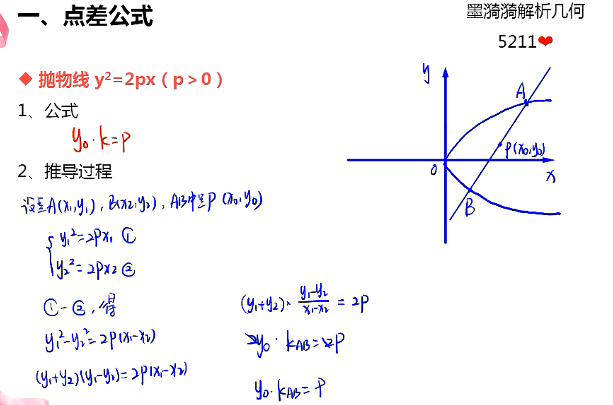

## 点差法解题关键

- 点差法的应用
  - 解决弦中点问题
  - 点差法的优劣势
  - 优势：避免联立，计算量小
  - 劣势：不能解决弦长问题
- 点差法的不等价性
  1. 不能保证直线与椭圆相交，要算$\Delta > 0$的参数范围
  2. 用点差法的前提条件：中点在椭圆内

## 对称与中垂线问题

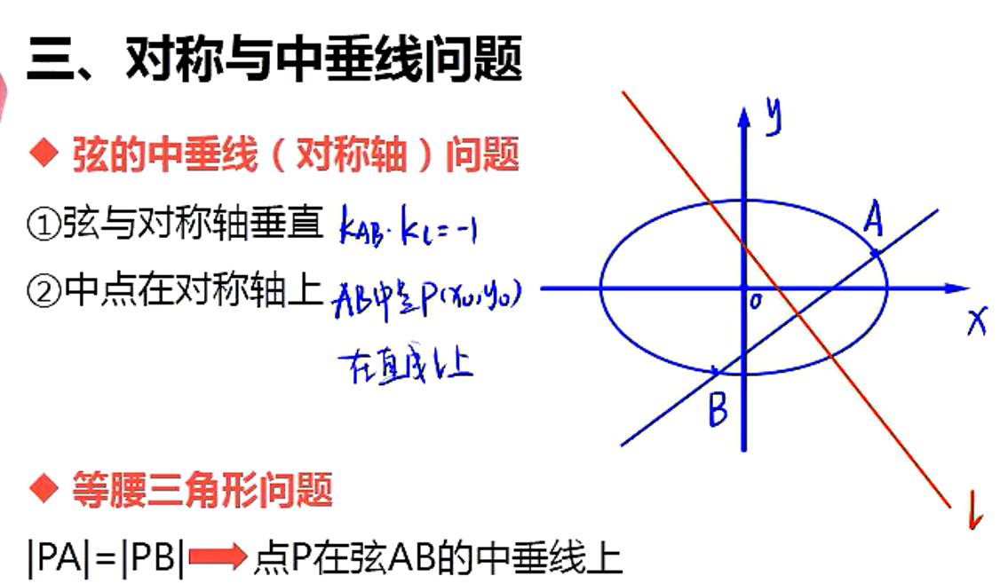

## 椭圆和双曲线第三定义

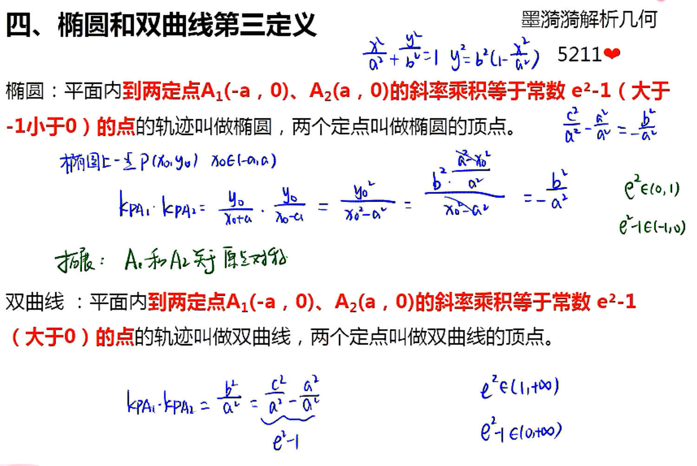

****

## 题目

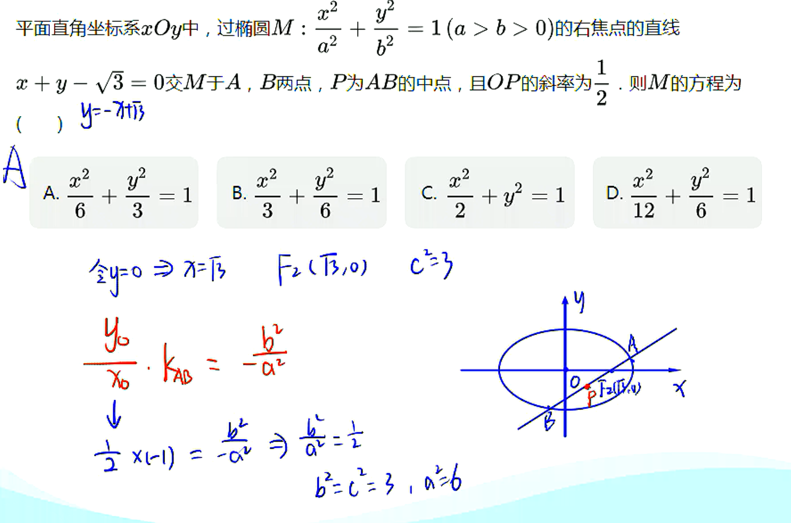

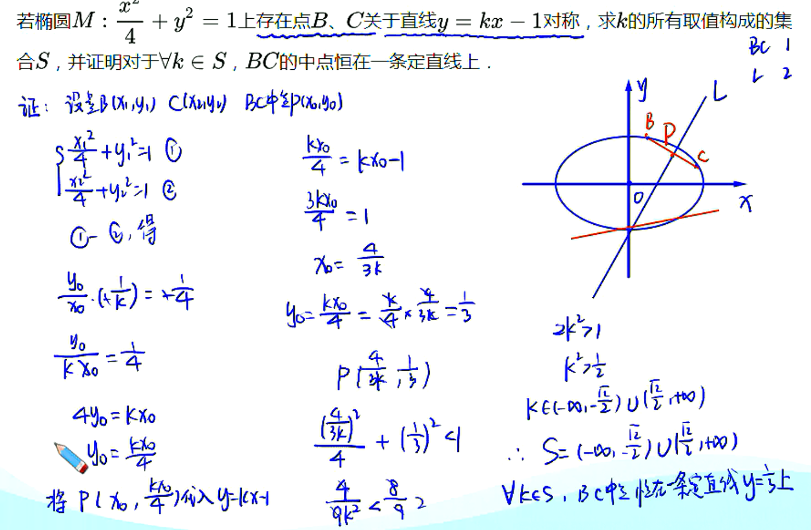

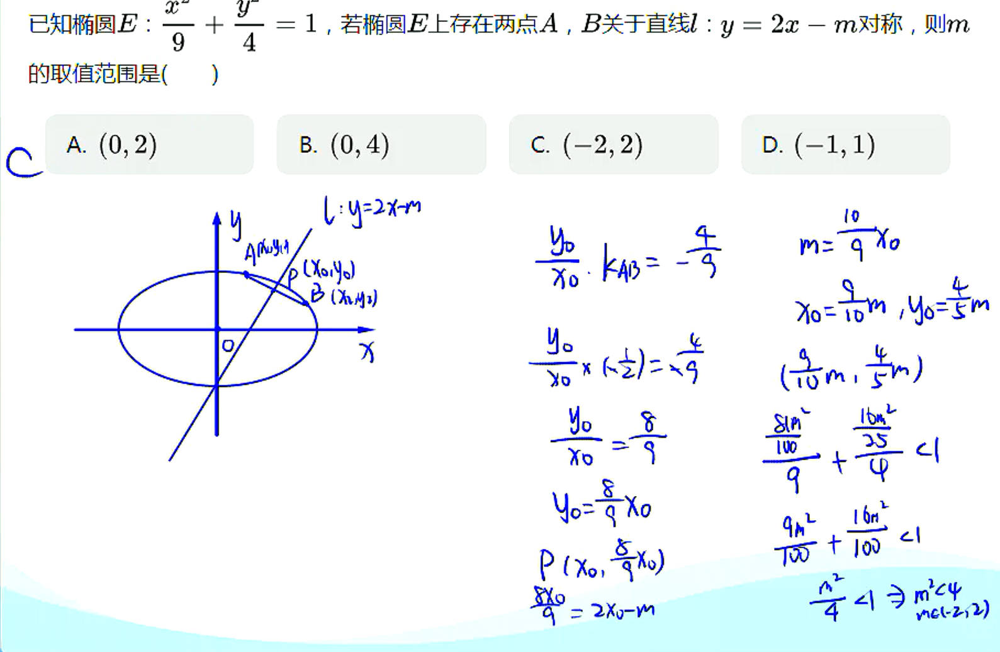

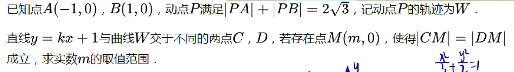

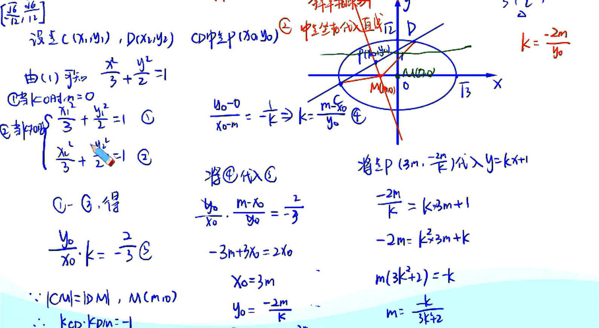

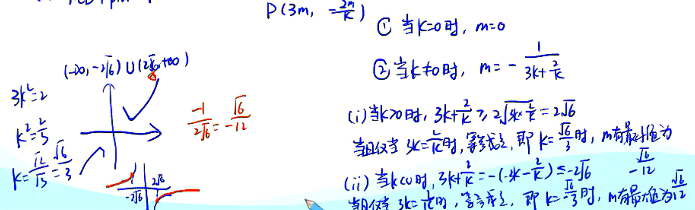

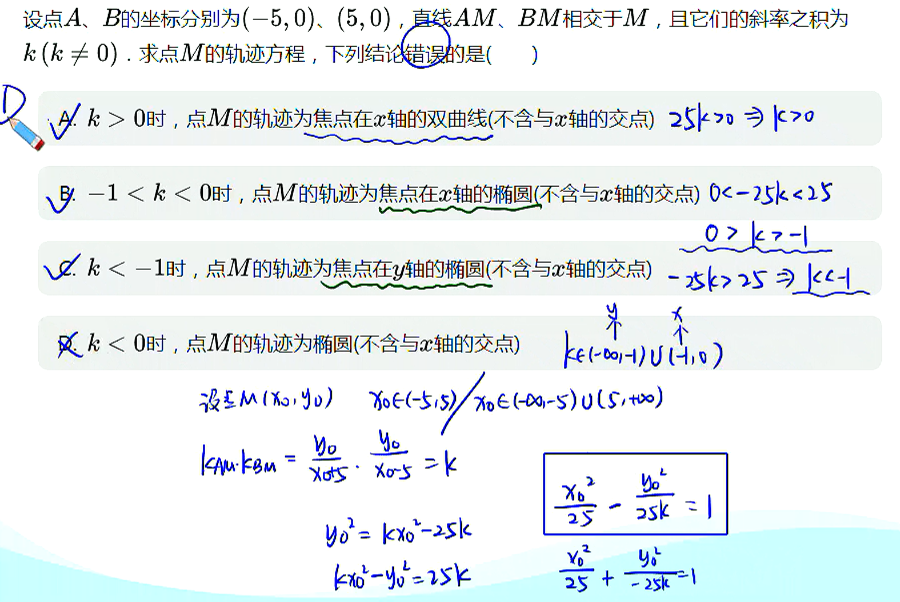

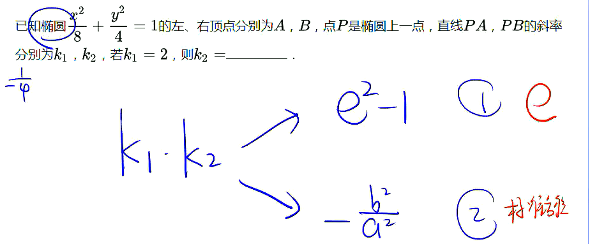

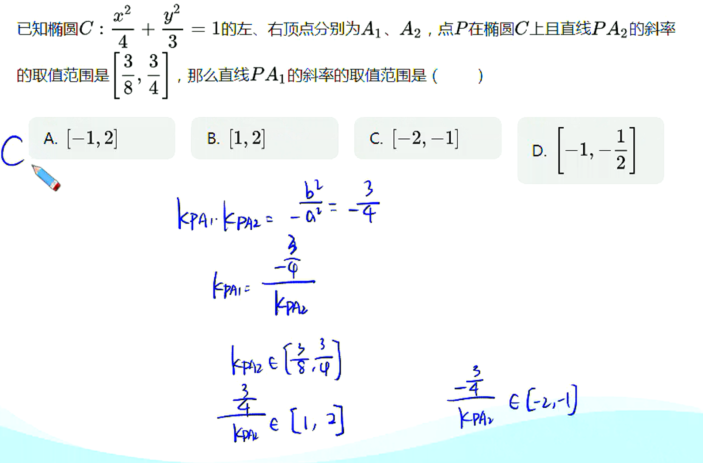

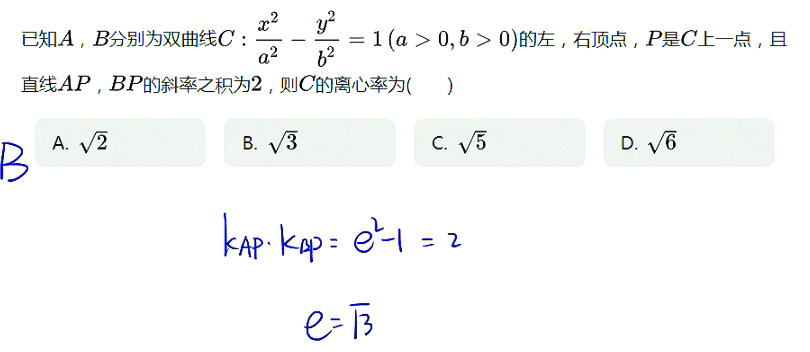

> 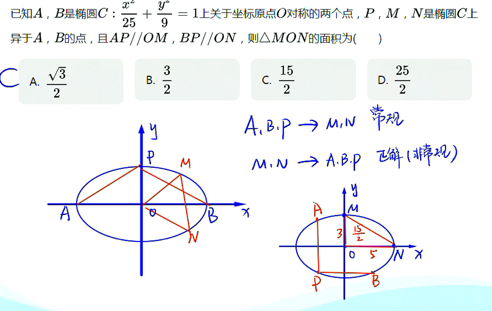
