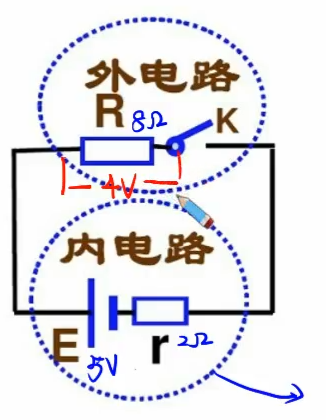
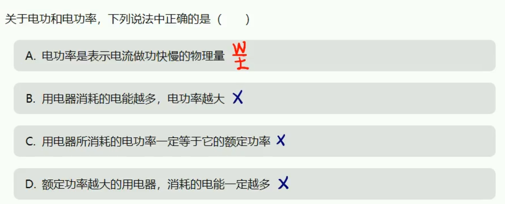
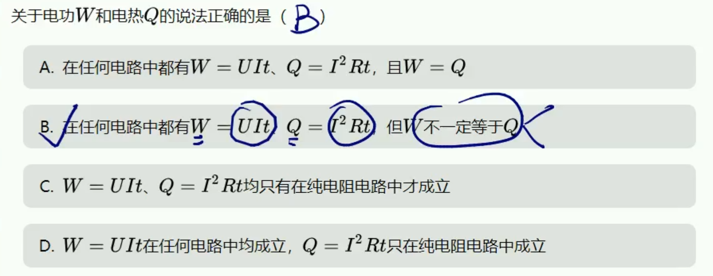
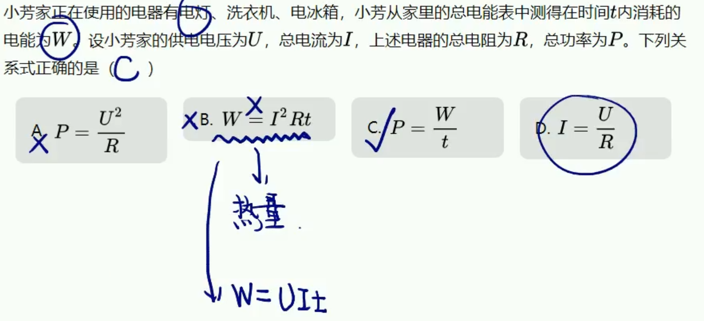
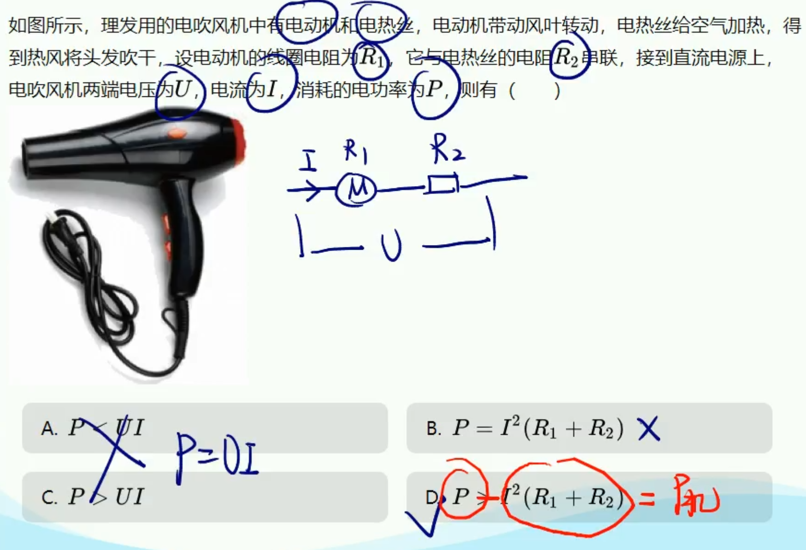
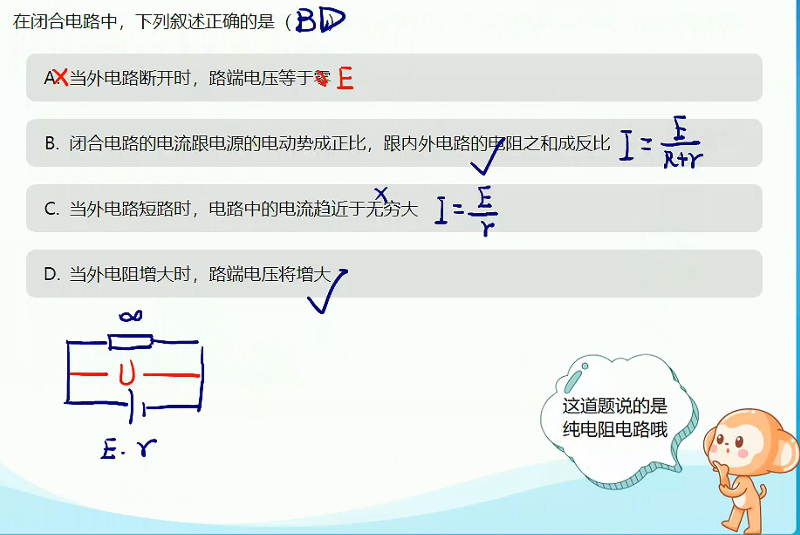
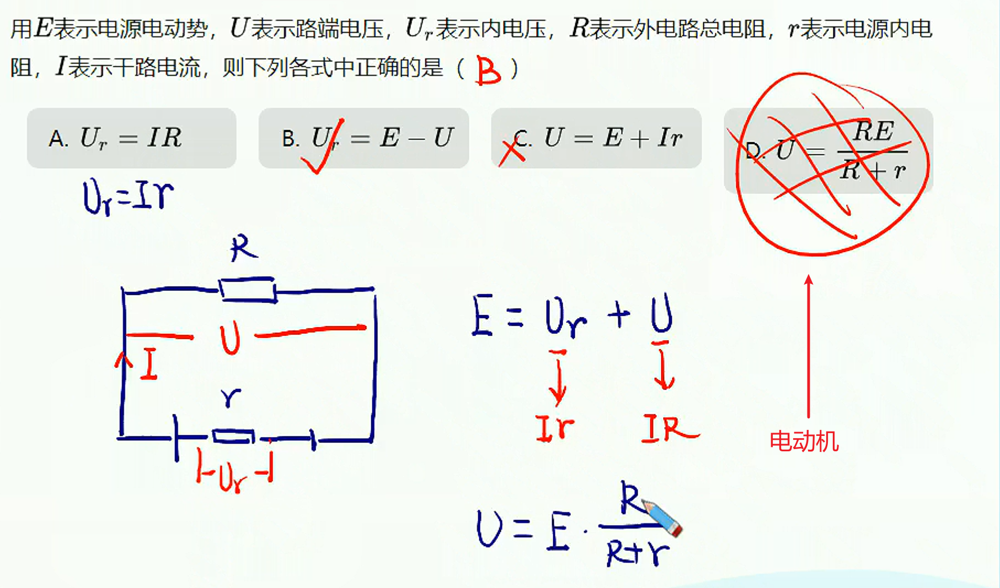

# 第二讲-闭合电路欧姆定律

## 电功和电功率

1. 电功：导体中的自由电荷在电场力作用下发生定向移动，电场力对电荷做的功叫电功。
   
   > $W=Uq$
   > 
   > $\dfrac{W}{t}=U\dfrac{q}{t}$
   > 
   > $P=UI$

2. 电功率
   
   1. 总功率：$P=UI$——普适
   
   2. 热功率：$P=I^2R$——普适
   
   3. 纯电阻电路：$P=\dfrac{U^2}{R}$
   
   4. 非纯电阻电路
      
      常见非纯电阻电路：电动机，充电电池，电解槽等

## 闭合电路欧姆定律

1. 电源：非静电力做功（比如化学能）
   
   其他能量转变为电能

2. 电动势：电动势是描述电源非静电力做功能力的物理量，一般用$E$表示。电动势在数值上等于非静电力把$1C$的正电荷在电源内从负极移送到正极所做的功。
   
   1. 定义式：$E=\dfrac{W}{q}$
   
   2. 单位：$V$
   
   3. 特点：只与电源有关
   
   **电动势≠电源两端电压**

3. 闭合电路欧姆定律
   
   能量分析：$E=Ir+U$
   
   1. 断路：$U=E$、$I=0$
   
   2. 短路：$U=0$、$I=\dfrac{E}{r}$
   
   

4. 电动势与路端电压的区别：数值不同，定义不同

