# 恒定电流综合

> **前情回顾**
> 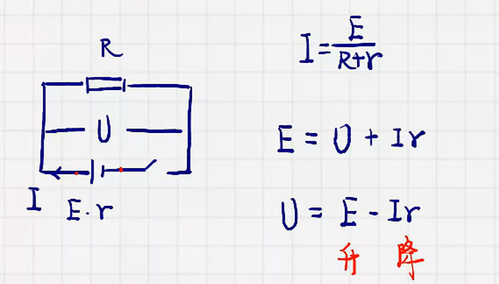

## 电源外部特征曲线

1. 原理：$U=E-Ir$
2. 图像：
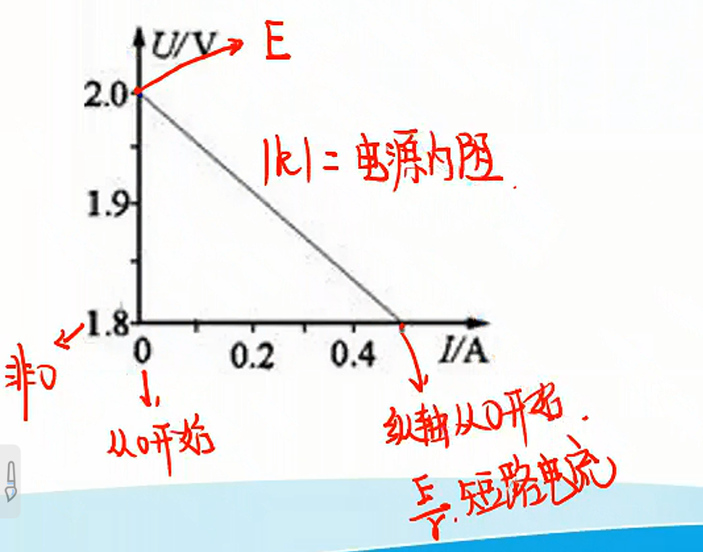

## 电源的输出功率与效率

1. 电源总功率：$P=EI$
2. 内阻热功率：$P=I^2r$
3. 电源输出功率：$P=UI$

   > $R$增加:
   >
   > $P_总$变小
   >
   > $P_热$变小
   >
   > $P=UI$

4. 纯电阻电路的输出功率：
   1. 推导:
      $$
      P_出=I^2R=(\dfrac{E}{R+r})^2R\\
      =\dfrac{E^2R}{(R+r)^2}\\
      =\dfrac{(R+r)^2}{R}\\
      =\dfrac{(R-r)^2+4Rr}{R}\\
      =\dfrac{(R+r)^2}{R}+4r
      $$

      $R=r$时，$P_出$最大，配方法

   2. $P-R$图像
   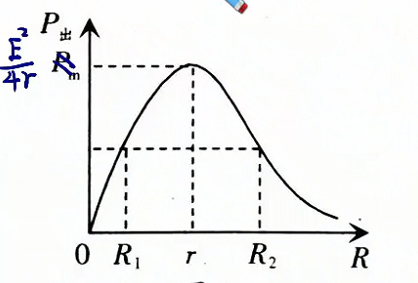
   $R<r$时，$R$变大，$P_出$增大
   $R>r$时，$R$变大，$P_出$减小

   3. 等效电源
   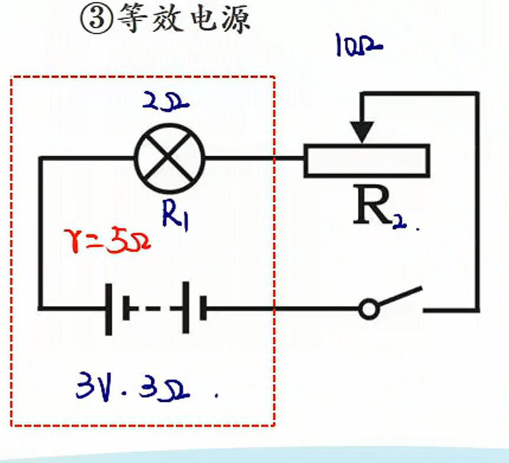
      1. $R_2=1\Omega$，$P_出$最大
      2. $R_2=0$时，$P_1$最大
      3. $R_2=50\Omega$，$P_2$最大
   4. 电源的效率

      $\eta=\dfrac{P_{输出}}{P_总}\times100\%=\dfrac{UI}{EI}=\dfrac{IR}{I(R+r)}$

      $\eta=\dfrac{R}{R+r}$

      $R=r$时，$\eta=50\%$

      $R$变大时，$\eta$增大

****

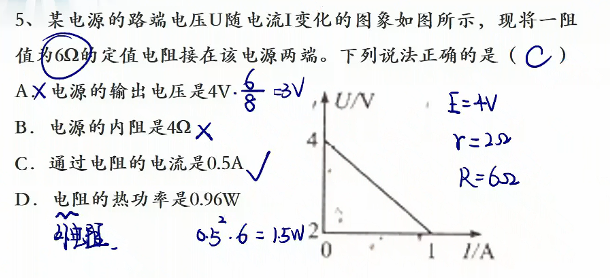

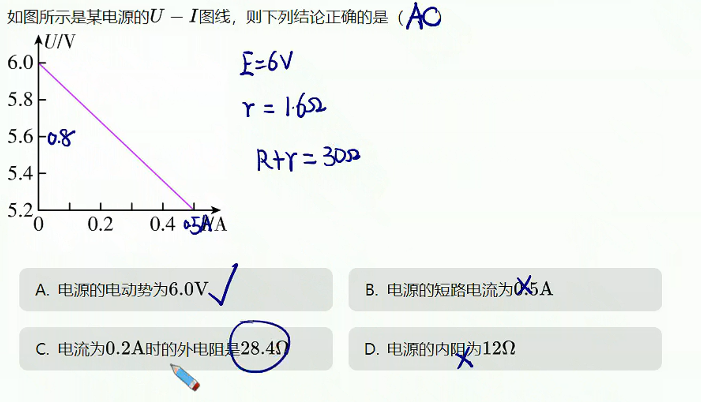

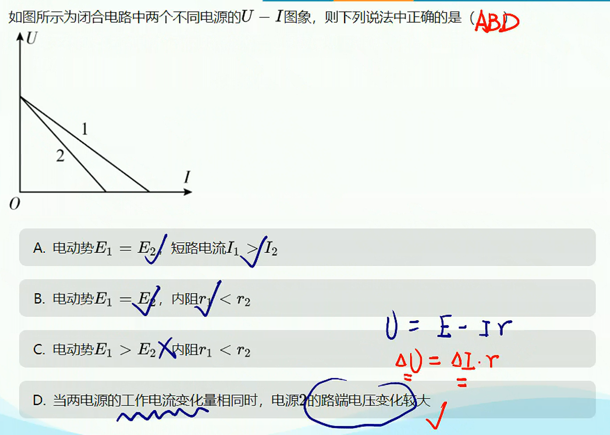

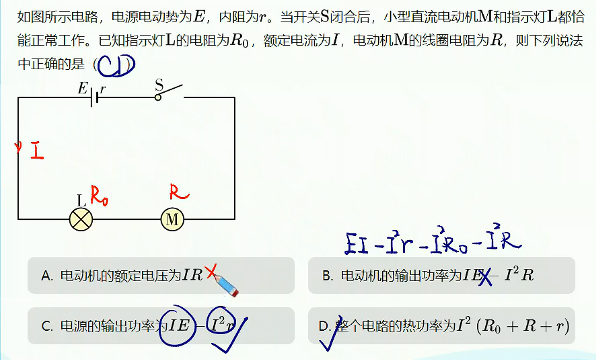

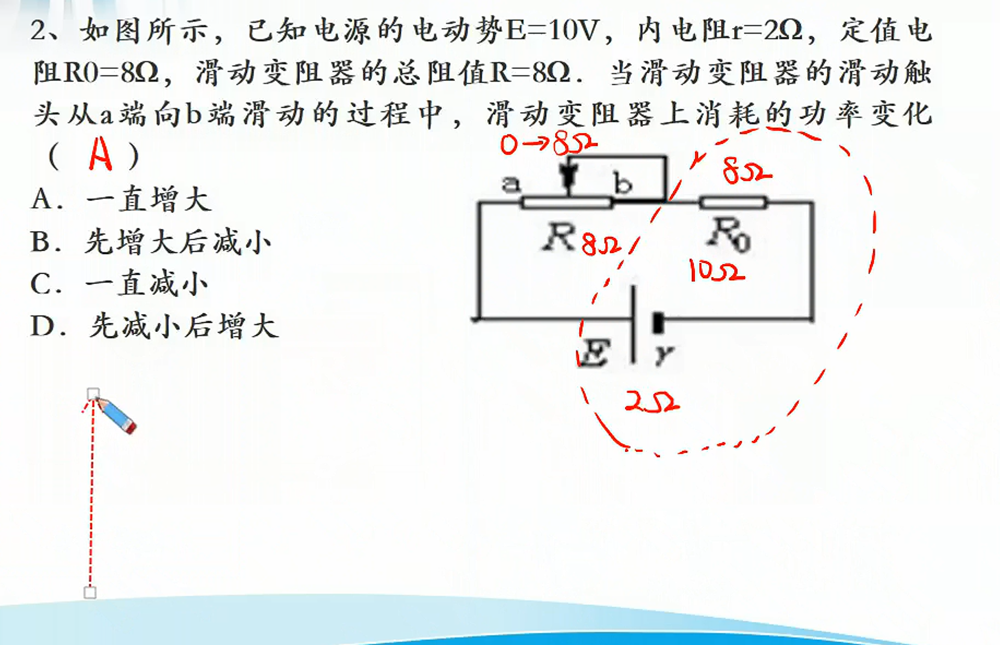

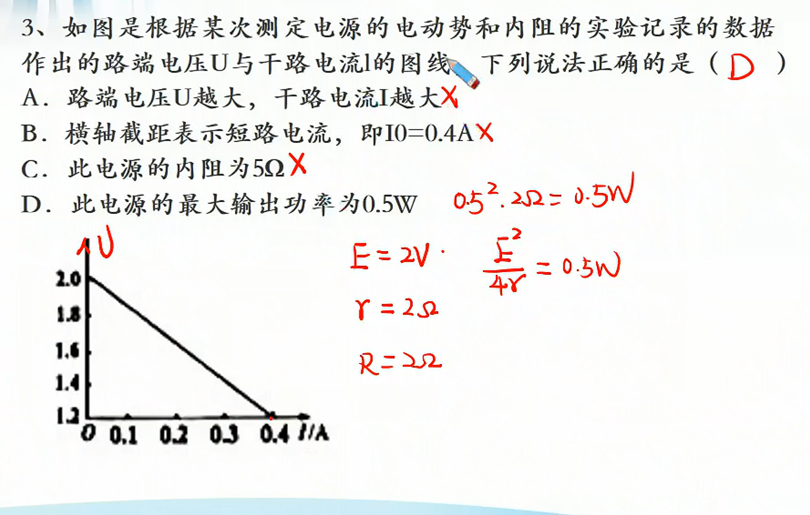

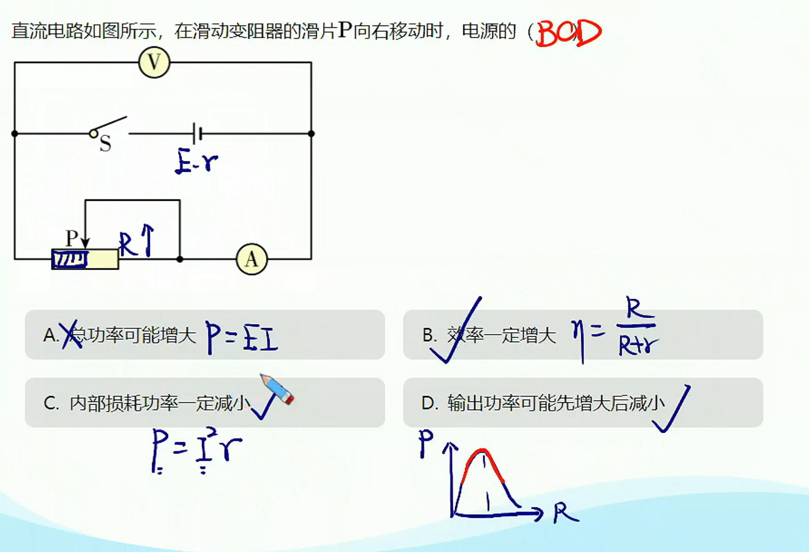

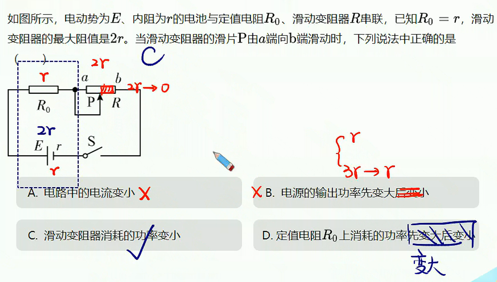
