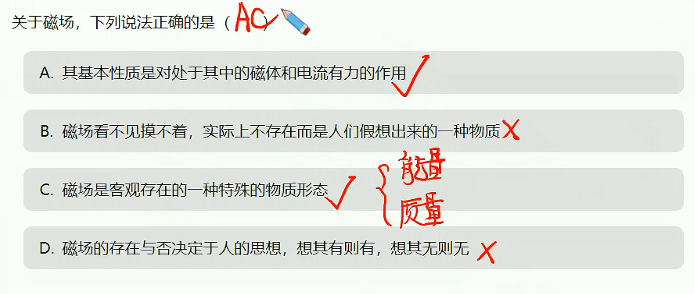

# 磁场初步

## 磁场、磁现象

1. 磁现象
   1. 磁性：吸引铁、钴、镍等物体的性质。
   2. 磁体：具有磁性的物体。
   3. 磁极：磁体上磁性最强的部分。
   4. 力的作用：同名磁极相互排斥，异名磁极相互吸引
      
   5. 电流的磁效应：奥斯特发现
   6. 磁场：传递磁体与通电导线，磁体与磁体，导线与导线之间的相互作用。〖客观存在〗
2. 磁感应强度
   1. 方向：小磁针静止时$N$极所指的方向规定为该点的磁感应强度方向。
   2. 大小：导线与磁场垂直时$F=BIl$，$B$为磁感应强度
   3. 单位：$T$（特斯拉），$1T=10^4G$（高斯）。
   
3. 磁感线：
   1. 磁感线切线方向为磁感应强度方向。
   2. 磁感线越密集的地方，磁感应强度越大。
   3. 磁感线是闭合的，磁体外部从$N$极指向$S$极，内部由$S$极指向$N$极
4. 

## 常见磁场

1. 条形磁铁、马蹄形磁铁
   
2. 地磁场
   1. 地磁场方向：$N$极指向地磁北极，$S$极指向地磁南极。
   2. 地磁场大小：$5\times10^{-5}T$左右。
   3. 地磁场方向：与地球表面法线方向一致。
      

## 安培定则

1. 通电螺线管
   
2. 环形电流
   
3. 直导线
   

****

