# 4

## 安培力

1. 定义：通电导线在磁场中受到的力。
2. 方向：左手定则。
   > 左手定则：
   >
   > 手的伸开方向为电流方向，四指弯曲的方向为磁场方向，大拇指所指的方向为安培力的方向。
3. 安培力大小：$F=BIl\sin\theta$

   其中，$B$为磁感应强度，$I$为电流，$l$为导线长度，$\theta$为电流方向与磁场方向之间的夹角。

   仅适用于直导线和匀强磁场。

4. 有效长度
   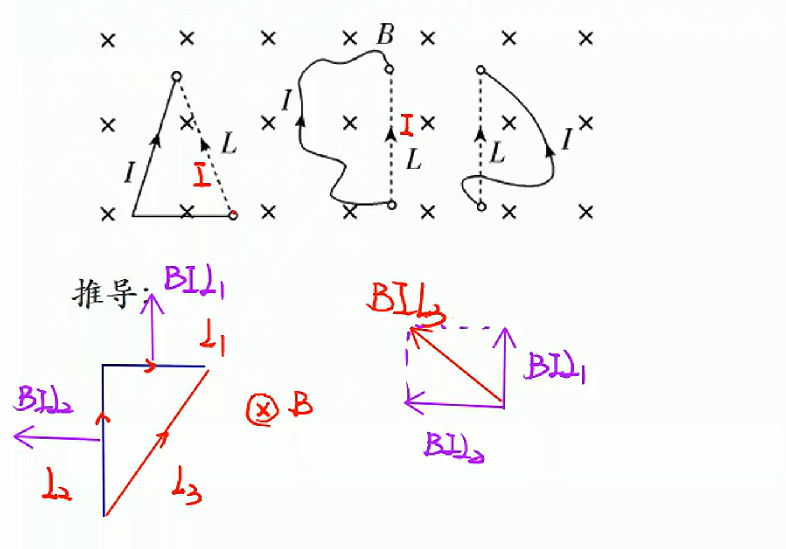

## 通电导线之间的相互作用

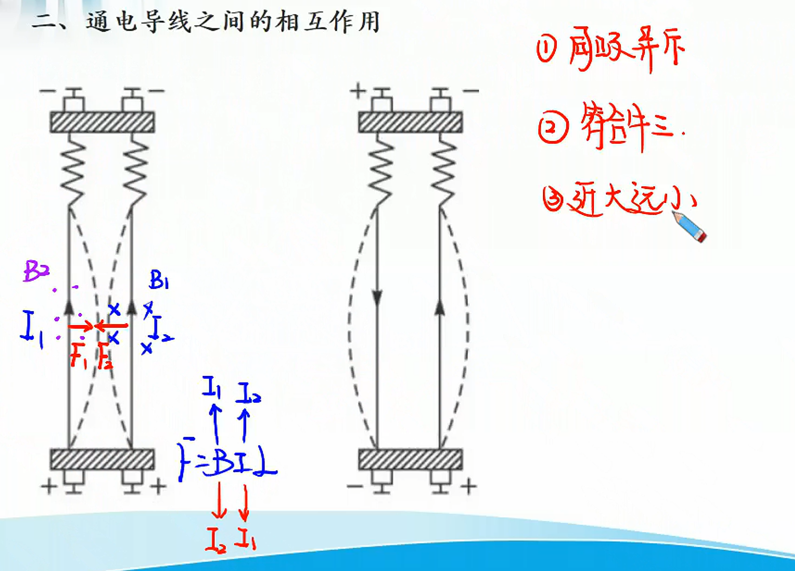

****

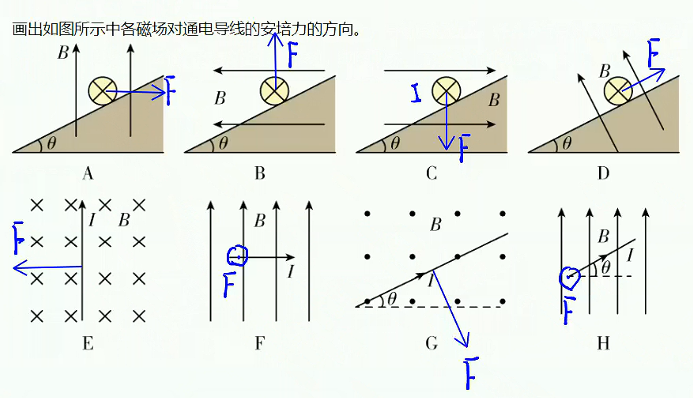

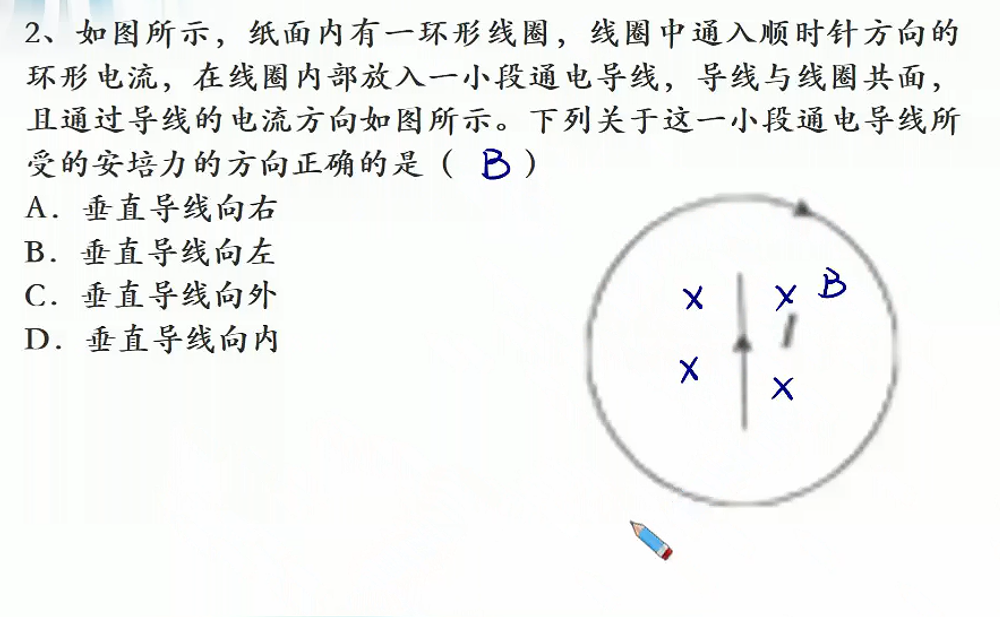

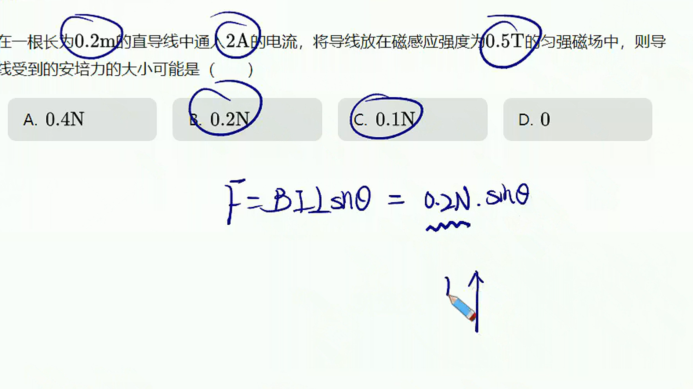

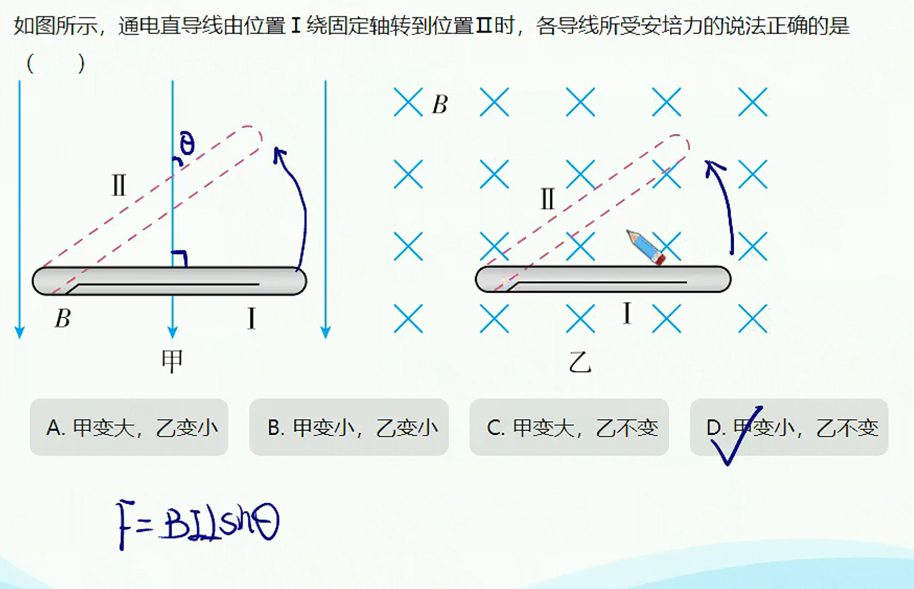

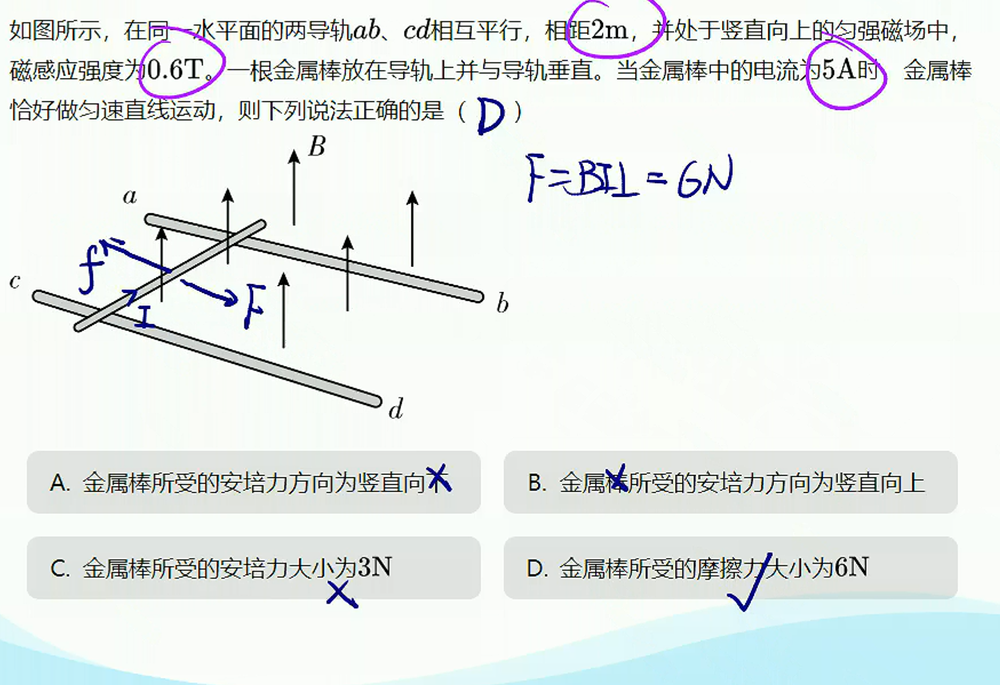

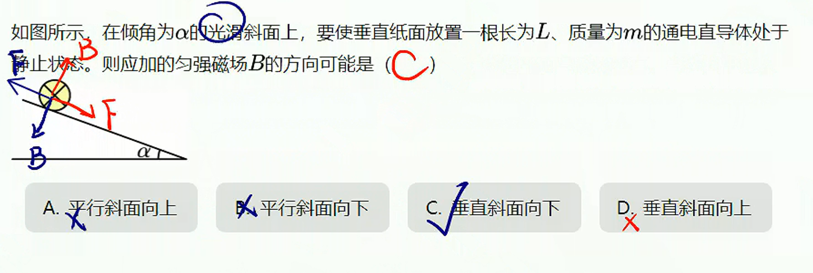

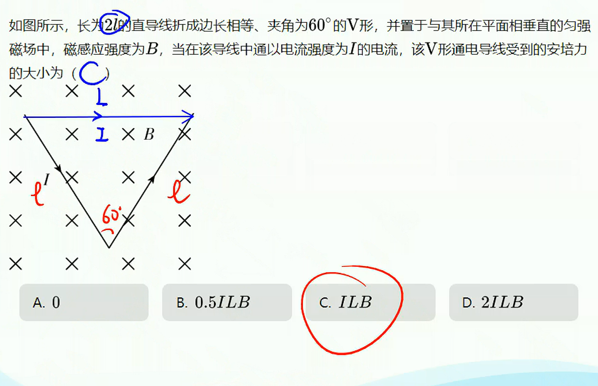

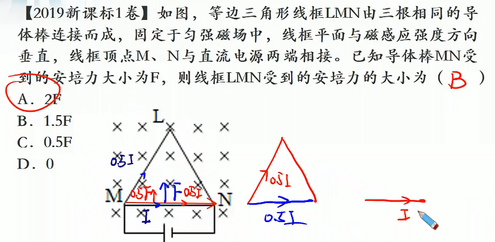

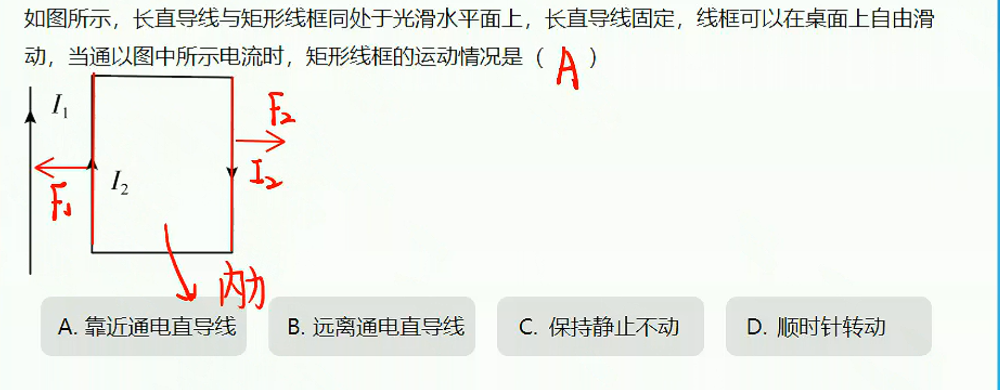
