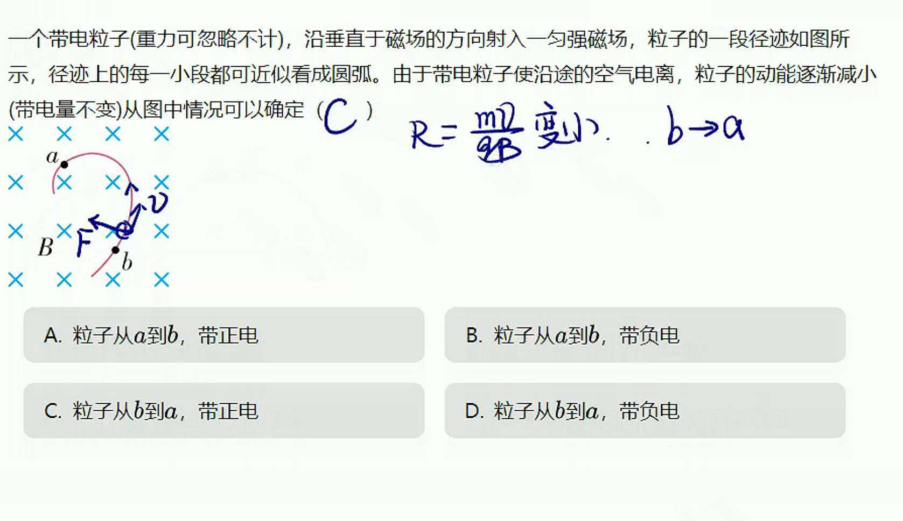

# 06

## 洛伦兹力

1. 定义：磁场对运动电荷力的作用。
2. 方向：左手定则
   > 磁感线穿过掌心，四指弯曲方向为电荷运动方向，大拇指方向为洛伦兹力方向。
   >
   > 
3. 公式：$\vec{F}=q\vec{v}\times\vec{B}$
4. 特点：
   - 只改变速度的方向
   - 永不做功
5. 安培力和洛伦兹力的区别：
   $$
   F_{安培}=ILB=BLnqsv\\
   = nsLqDB
   $$
   $nsL$电子总数，$qDB$单个电子的洛伦兹力。
   安培力为整体的宏观力，洛伦兹力为单个微观力。

## 带电粒子在磁场中的圆周运动

1. 半径公式：$qvB=m\dfrac{v^2}{R}=\dfrac{mv}{qB}$
2. 周期公式：$T=\dfrac{2\pi R}{v}=\dfrac{2\pi m}{qB}$
   > 周期与速度无关

****

