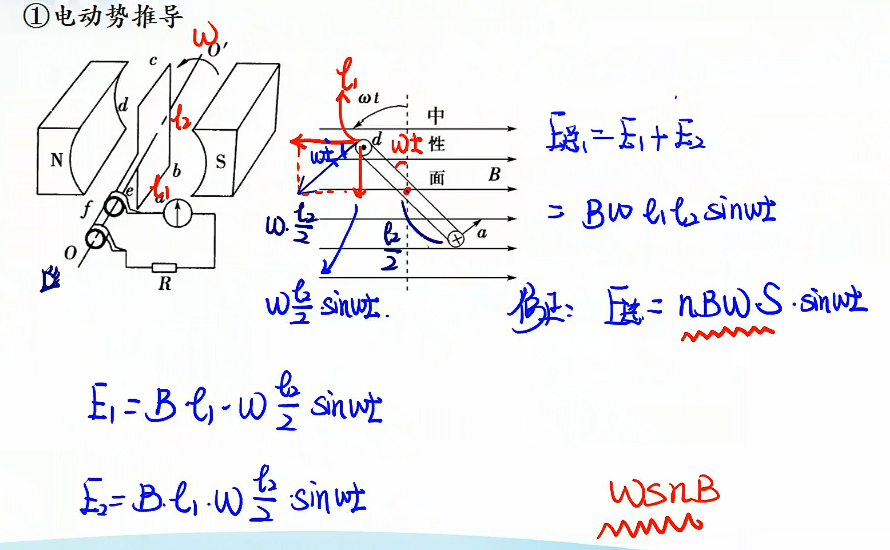
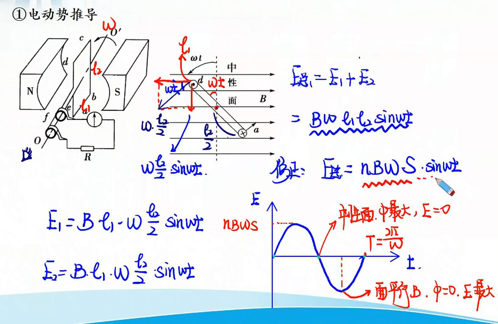
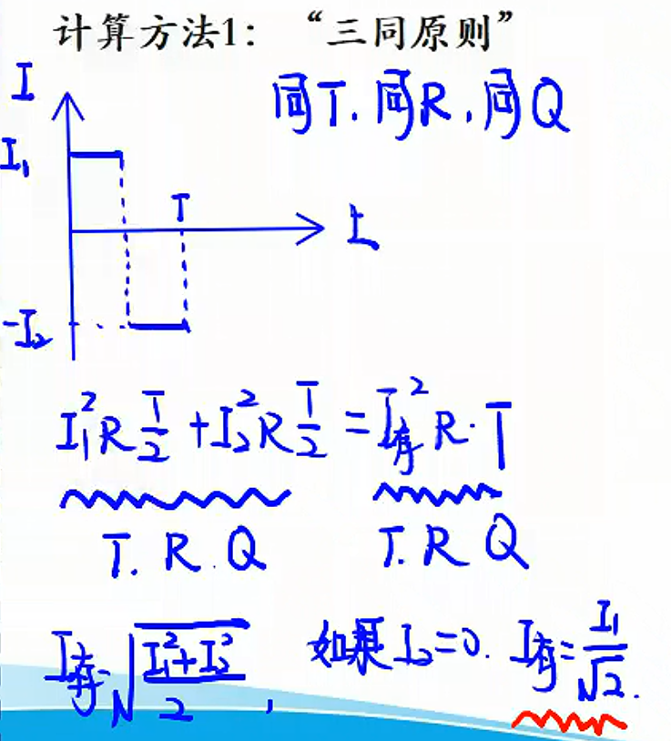

# 交变电流的产生

## 交变电流

1. 定义：大小和方向随时间周期性改变的电流
2. 

| 位置 | 线圈平面与磁场垂直 | 线圈平面与磁场平行 |
|:-----------------:|:-----------------:|:-----------------:|
| **磁通量** | $\Phi = BS$最大 | 0 |
| **磁通量变化率** | ？ | ？ |
| **感应电动势** | 0 | 最大 |
| **感应电流** | 0 | 最大 |
| **电流方向** | 改变 | ？ |

1. 周期与频率
   1. 周期：交变电流一次周期性变化所需要的时间，也是线框转动周期
   2. 频率：$f=\dfrac{1}{T}$
   3. 有效值：反应交变电流做功本领。
      1. 计算方法1：“三同原则”
         
      2. 计算方法2：结论法
         
2. 交流电的值
峰值：$\epsilon _m = NB\omega S$
瞬时值：$\epsilon = \epsilon _m\sin \omega t$

> ⚠ 注意
>
> 1. 计算与**电流的热效应**有关的物理量，如**电功、电功率，电热**等，公式中的$U$，$I$必须用有效值。
> 2. 电器设备“铭牌”上所标的**电压电流**值都是指交变电流的有效值。
> 3. 交流电表测量的电压电流都是**有效值**。
> 4. 保险丝的熔断电流值为**有效值**。
> 5. 在没有具体说明的情况下，所给出的交变电流的电压，电流值均指的是**有效值**。

****

