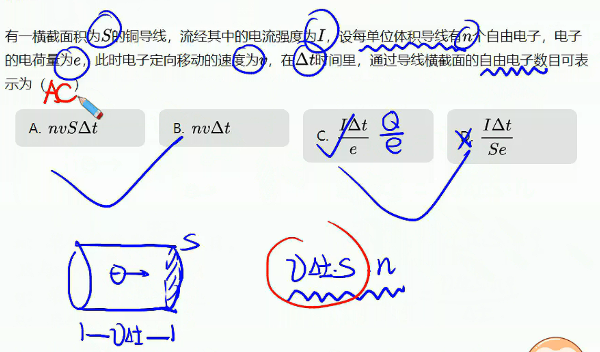
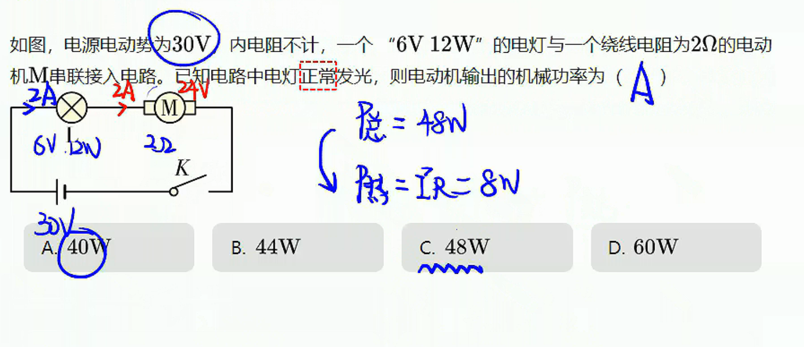
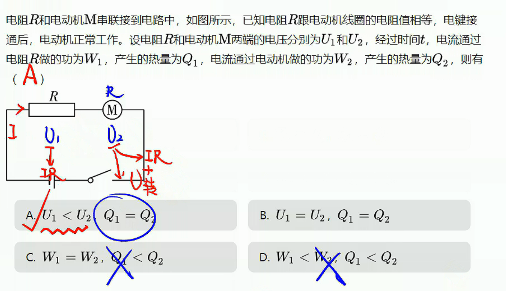

# 01

## 电流

1. 产生：电荷的定向移动形成电流。
   范例：
   1. 导体电子热运动
   2. 通电导体电子定向移动
   3. 旋转的带电圆环
2. 方向：规定正电荷定向移动的方向为电流的方向。若电流是负电荷的定向移动形成的（如金属导体中的自由电子），则电流的方向与自由电子定向移动的方向相反。—标量
3. 大小：$I=\frac{q}{t}$
   （注意截面的选取）
4. 单位：$A$
5. 恒定电流：大小、方向都不随时间变化的电流叫做恒定电流。
6. 电流微观表达式（适用条件：导体导电）：$I=nqSv$
$n$：单位体积载流子数目，只与导体材料有关。
$q$：单个载流子电量
$S$：导体横截面积
$v$：电子定向移动速率
7. 电阻
   1. 定义式：$R=\dfrac{U}{I}$
   2. 电阻定律：$R=\rho \dfrac{l}{s}$
   

## 欧姆定律

1. 欧姆定律：导体中的电流跟导体两端的电压成正比，跟导体的电阻成反比，即$I=\dfrac{U}{R}$
2. 导体的伏安特性曲线：在实际应用中，常用纵坐标表示通过导体的电流$I$、横坐标表示导体两端的电压$U$,这样画出的$I-U$图像叫做导体的伏安特性曲线。

## 电功和电功率

1. 电功：导体中的自由电荷在电场力作用下发生定向移动，电场力对电荷做的功叫电功。
2. 电功率
   1. 总功率：$P=UI$
   2. 热功率：$P=I^2R$
   3. 纯电阻电路：$P=UI=I^2R=R^2\dfrac{U^2}{R}=U^2\dfrac{I^2}{R}$

> 电动机概念辨析
>
> 1. 输入功率=总功率=电功率=UI
> 2. 热功率=I2R
> 3. 输出功率=机械功率=UI=I2r
> 注：电动机停止旋转时，转变为纯电路电路

****

