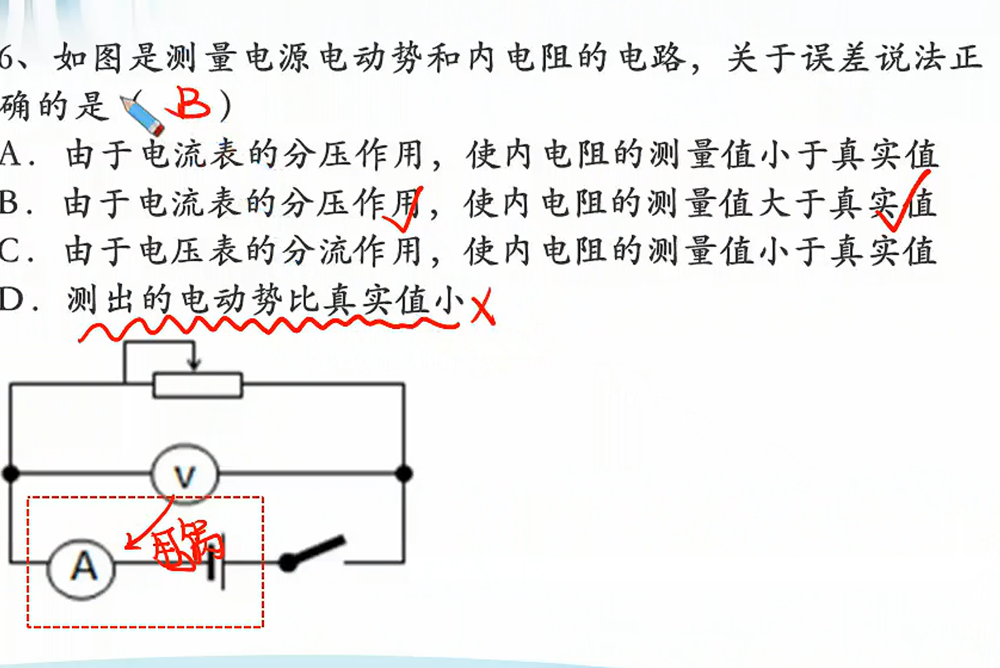
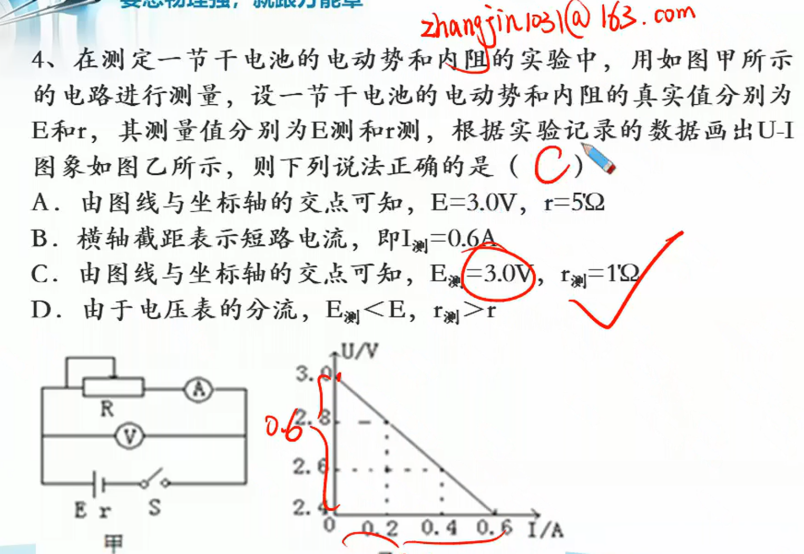

# 04

> **基础知识**
>
> 1. 会小灯泡伏安特性曲线实验器材选择及理解滑动变阻器分压接法的原因。
> 2. 掌握伏安法测电源电动势与内阻实验的原理及会进行误差分析。
> 3. 掌握其他测定电源电动势与内阻的方法并会进行误差分析。
>
> **核心考点**
>
> 描绘小灯泡伏安特性曲线（重点）、伏安法测定电源电动势与内阻（重难点）；涉及题型3个。
>
> **技巧把握**
>
> 熟练把握闭合电路欧姆定律在此类实验中的应用

> 不估读

> 估读

## 小灯泡伏安特性曲线

****

