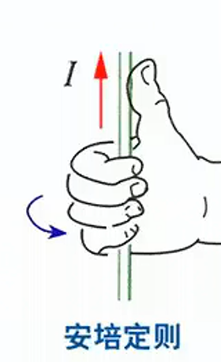
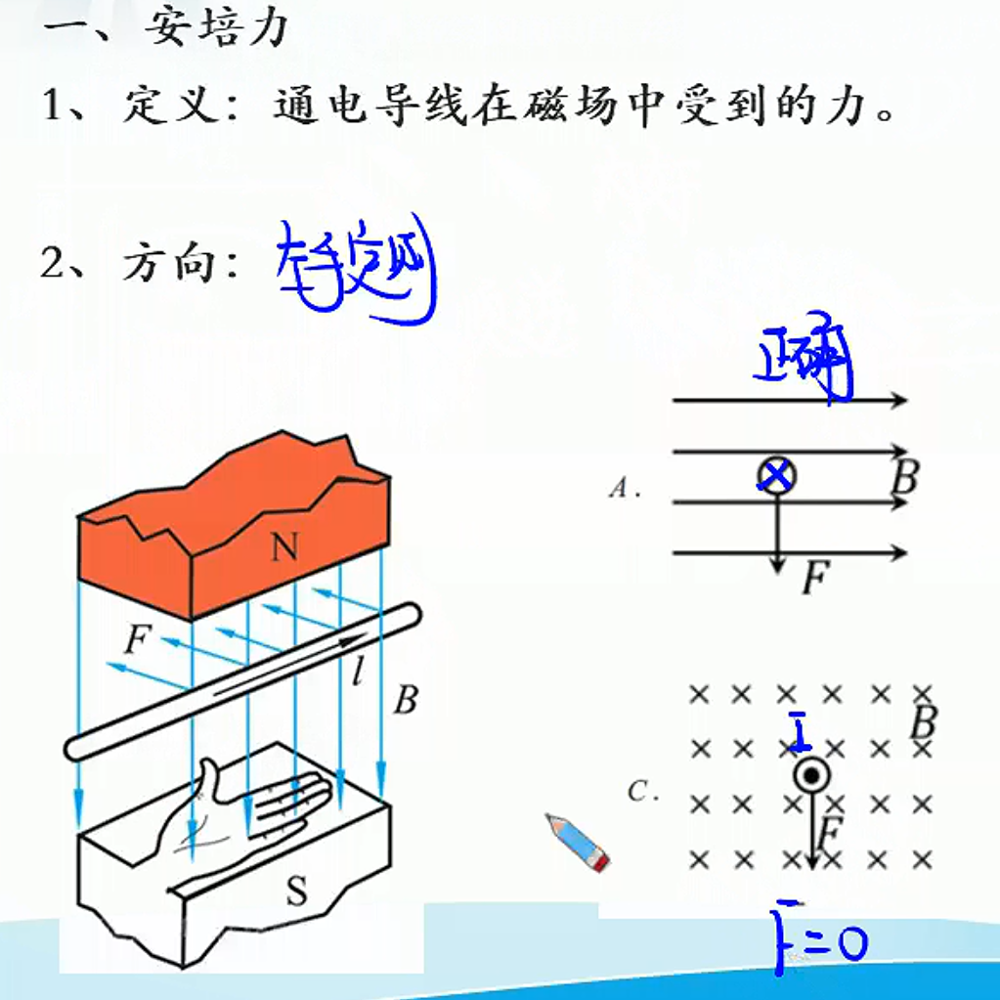

# 06

> 书接上回……
>
> 

一、磁场、磁现象
1、磁现象
①磁性：吸引铁钻镍等物体的性质。
②磁体：具有磁性的物体。
③磁极：磁体上磁性最强的部分。
④力的作用：同名磁极相互排斥，异名磁极相互吸引

⑤电流的磁效应：奥斯特发现
⑥磁场：传递磁体与通电导线，磁体与磁体，导线与导线之间的相互
作用。【客观存在】
2、磁感应强度
①方向：小磁针静止时N极所指的方向
规定为该点的磁感应强度方向。
②大小：导线与磁场垂直时：$B=\frac{F}{I\cdot l}$
③单位：$T$（特斯拉）

3、磁感线
（构鱼）
①磁感线切线方向为磁感应强度方向。
②磁感线越密集的地方，磁感应强度越大。
③磁感线是闭合的，磁体外部从N极指向S极，内部由S极指向N极

二、常见磁场
1、条形磁铁、马蹄形磁铁

3、安培定则
①通电螺线管

②环形电流

③直导线

③直导线在某点场强方向判断

****

