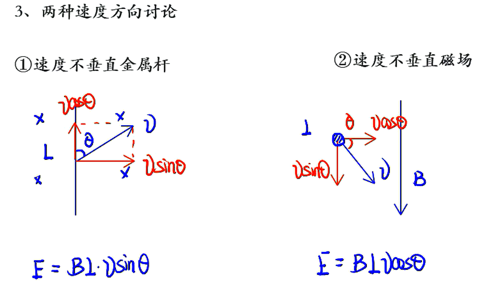

# 12——法拉第电磁感应定律

## 法拉第电磁感应定律

1. 感应电动势
   1. 定义：电磁感应现象中产生的电动势。
   2. 产生条件：穿过回路的磁通量发生变化，与电路是否闭合无关。
   3. 方向判定：利用楞次定律，电流从低电势流向高电势。
2. 法拉第电磁感应定律
   1. 内容：电路中的感应电动势大小与穿过电路的磁通量的变化率成正比。
   2. 公式：$E=n\dfrac{\Delta\phi}{\Delta t}$
   3. 物理意义：
      1. $\Delta t$不趋于$0$，$E$为平均值。
      2. $\Delta t$趋于$0$，$E$为瞬时值。

## 电路问题

步骤：

1. 确定电源
2. 确定电路，画等效电路图
3. 求解

注意：路端电压不是电动势

****

