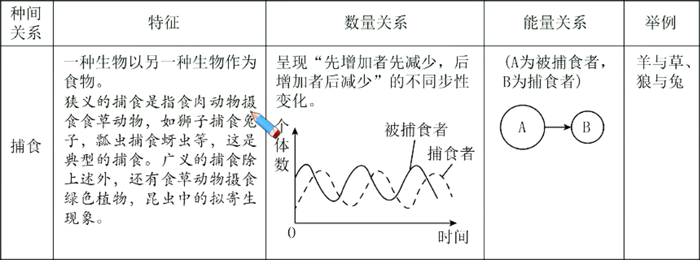
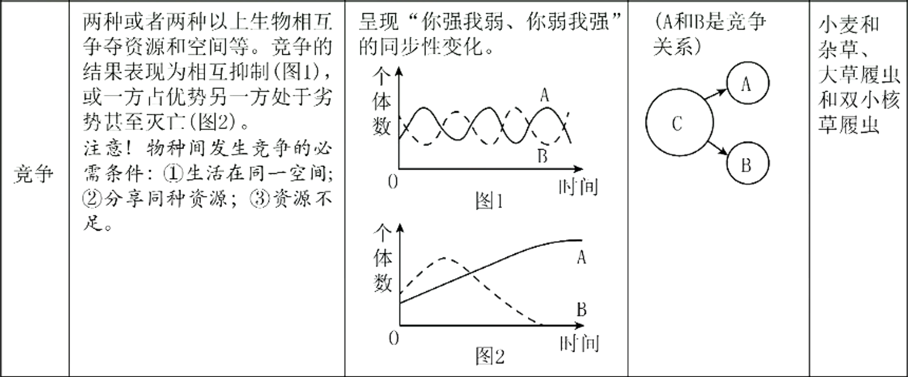
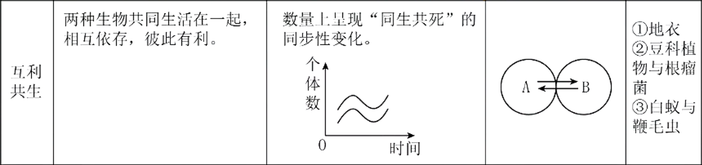
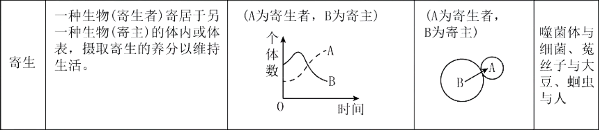

# 生物群落

## 种间关系

1. 常见的种间关系
   生物之间的关系十分复杂，有种内关系和种间关系，有直接影响和间接影响，有有利的与不利的作用等等。常见物种之间的相互关系类型如下：
   
   
   
   
2. 6
3. 拓展：生态位
   生态位是指某一物种在群落中所处时间和空间上的位置及与其他物种（如食物和天敌等）之间的相互关系的总和。它表示物种在群落中的地位、作用和重要性。
   当两个物种利用同一资源时就会发生生态位重叠。在两个物种的生态位完全重叠时，竞争优势较大的物种就会把另一物种完全排除掉，这就是生态学上的竞争排除原理。该原理决定了在同一群落中不可能有两个物种的生态位是完全相同的。但当两个物种的生态位发生部分重叠时，每个物种都会占有一部分无竞争的生态位空间，因此可以实现共存，并且具有竞争优势的物种最终将会占有那部分重叠的生态位空间。
   生态位越相似的物种，竞争越激烈，竞争的结果可能使其中一个物种趋于灭绝，但这种现象较少发生，更多的一种情况是，生态位相以的物种，通过自然选择，生态位发生变化，从而减少或排除了它们的竞争，使它们共存下来。
   如果资源很丰富，两个生物就可以共同利用一种资源而彼此不给对方造成损害（如蜜峰采蜜）。这就是说，生态位重叠本身并不一定伴随着竞争，只有当资源短缺时才会发生竞争。
   另外，如果两个物种利用的资源完全分开，那么就有某些未被利用的资源。扩充利用范围的物种将在进化过程中获得好处：同时，激烈的种内斗争促使种群扩展其资源利用的范围。由于这两个原因，进化将导致物种的生态位靠近，重叠增加，种间竞争加刷
   生态位的多样性是群落结构相对稳定的基础。
