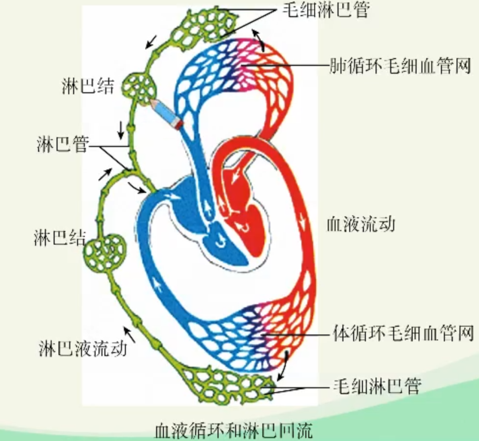
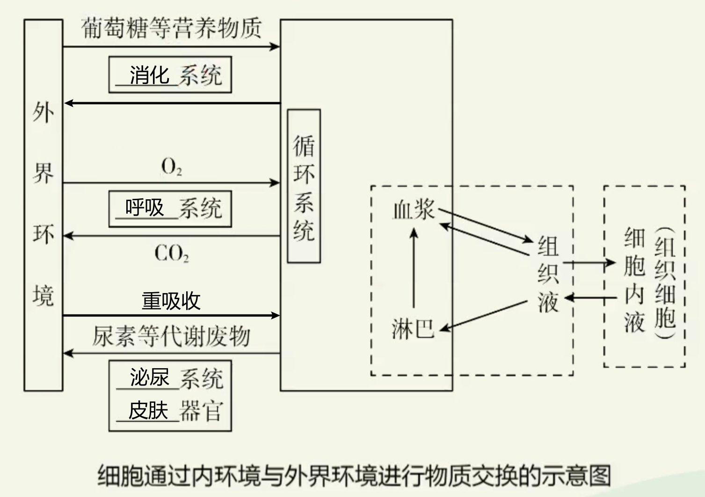

# 人体的内环境与稳态

## 一、内环境的定义与组成

### 体液

1. 细胞内液（存在于细胞内，约占$\dfrac{2}{3}$）
2. 细胞外液（存在于体内细胞外，约占$\dfrac{1}{3}$）

### 内环境

由细胞外液构成的液体环境叫做内环境，内环境是体内细胞直接生活的环境。

> #### 体内？体外？
> 
> 凡是与外界连通的都算体外
> 
> 所以**消化液啥也不是**

#### 内环境的定义

由细胞外液构成的液体环境叫做**内环境**。内环境是体内细胞直接生活的环境。

#### 内环境的组成部分

内环境是由细胞外液组成的 ， 主要包括**血浆、淋巴和组织液（组织细胞间隙液）**。

#### 体内各种细胞的内环境

血细胞的内环境是**血浆**（血浆和血细胞组成血液），绝大多数组织细胞的内环境是**组织液**（也叫细胞间隙液 ）。

> ##### 血浆？血清？
> 
> 没加抗凝剂的是血清，血清没有凝固因子。
> 
> ##### 淋巴？
> 
> 
> 
> 动脉中的血泵沿动脉流入毛细血管的动脉端，其中的许多物质会透过毛细血管壁进入组织液，进而由组织液将营养物质提供给组织细胞，细胞的代谢产物也透过细胞膜进入组织液。
> 
> 组织液中的代谢产物，大部分被毛细血管的静脉端吸收，又进入血浆；小部分被毛细淋巴管吸收，汇集到淋巴管中，经过淋巴回流由左右锁骨下静脉汇入血浆中。淋巴管中流动的液体称为淋巴液（也叫淋巴），其中生活有大量的淋巴细胞和吞噬细胞等。

#### 『知识梳理』

> 部分细胞直接生活的环境：
> 
> 红细胞直接生活的环境是：**血浆**
> 
> 毛细血管壁细胞直接生活的环境是：**血浆和组织液**
> 
> 毛细淋巴管壁细胞直接生活的环境是：**淋巴和组织液**
> 
> 体内绝大多数细胞直接生活的环境是：**组织液**

#### 各组成部分间的物质交流

> ##### 区分毛细血管和毛细淋巴管？
> 
> 
> 
> 毛细淋巴管可以有盲端（见上）
> 
> 通过淋巴回流可以进行蛋白质的回收
> 
> 『不回收可能导致组织水肿（过敏也有可能造成）』

## 内环境的成分：内环境是细胞与外界环境进行物质交换的媒介

### （一）内环境的成分

1. 细胞外液本质上是一种容液，类似于海水。

2. 血浆的主要成分包括：水、无机盐、蛋白质、各种营养物质（如葡萄糖、氨基酸）、各种代谢产物（如尿素）、气体（$O_2$、$CO_2$）、激素等。

3. 组织液、淋巴的成分和含量与血浆相近，但又不完全相同，主要区别是：<u>血浆中含有较多的蛋白质，而组织液和淋巴中的蛋白质含量很少。</u>

4. 血红蛋白和消化酶**不**属于内环境的成分

### （二）内环境是细胞与外界环境进行物质交换的媒介

体内细胞直接与内环境进行物质交换，获取生命活动所需要的物质，排出代谢产物。内环境与外环境的物质交换过程，需要体内各个器官、系统的参与。

> 脂肪类物质主要吸收到**淋巴**里

## 内环境稳态

细胞外液**成分**和**理化性质**的相对稳定，共同构成了内环境稳态。

### （一）内环境稳态的定义

正常机体通过调节作用，使各个器官、系统协调活动，共同维持内环境的相对稳定状态叫做稳态

> 例如，机体会通过调节使相关器官、系统协调活动，维持机体内的水平衡。体内水含量过高时，机体会通过调节肾脏尿的形成速率多排尿；体内缺水时，机体会通过调节肾脏多重吸收原尿中的水，减少尿量。

> 『思考探究』
> 
> 1. 若内环境各种化学成分的含量都保持在正常的动态平衡范围内，我们的机体生命活动不一定是正常的。
> 
> 2. 内环境稳态与否如何影响机体正常生命活动？
>    
>    *内环境稳态，则细胞代谢正常（细胞的营养供应、酶促反应的适宜条件），机体生命活动正常内环境稳态失调，则细胞代谢紊乱，机体正常生命活动受影响。*

（二）内环理化性质的稳态

1. 渗透压
   
   1. 溶液渗透压的定义
      
      渗透压指溶液中溶质微粒对水的吸引力。溶液渗透压的大小取决于单位体积溶液中溶质微粒的数目。
   
   2. 影响血浆渗透压大小的因素
      
      血浆的渗透压主要与无机盐、蛋白质的含量有关。细胞外液渗透压的$90％$以上来源于$Na^+$、$CI^-$。

2. 酸碱度
   
   1. 正常值正常人血浆$pH$维持在7.35～7. 45之间
   
   2. 调节原理
      
      血浆中含有许多对酸碱缓冲物质，如$H_2CO_3$和$HCO_3^-$、$H_2PO_4$和$HPO_4^-$
   
   3. 体温一般维持在$37℃$左右。

3. 内环境稳态的实质
   
   在正常生理情况下，健康人体内环境的各种成分和理化性质通过机体的调节作用处于动态平衡状态，这就是内环境稳态的实质。

4. 内环境稳态的调节机制
   
   内环境稳态是在神经系统、内分泌系统和免疫系统的调节下，通过机体个器官、系统分工合作、协调统一而实现的。神经-体液-免疫调节网络是机体维持稳态的主要调节机制。

> 补充：内环境稳态失调
> 
> 在一些情况下，内环境稳态会出现失调的情况，会影响到机体的正常生命活动。例如，血液中钙、磷的含量降低时影响骨组织的钙化，在成年人表现为骨软化病，在儿童表现为骨质生长障碍、骨化不全的佝偻病。血钙过高则会引起肌无力等疾病。
> 
> 再如，发高烧、严重腹泻、高原反应、低/高血糖、尿毒症、中暑、病菌侵入机体导致发病等稳态失调情况。想一想这些稳态失调情况出现的原因是什么？
> 
> *根本原因：人体维持稳态的调节能力有一定的限度。*
> 
> *直接原因：外界环境变化过于剧烈或者人体自身调节功能出现障碍。*
