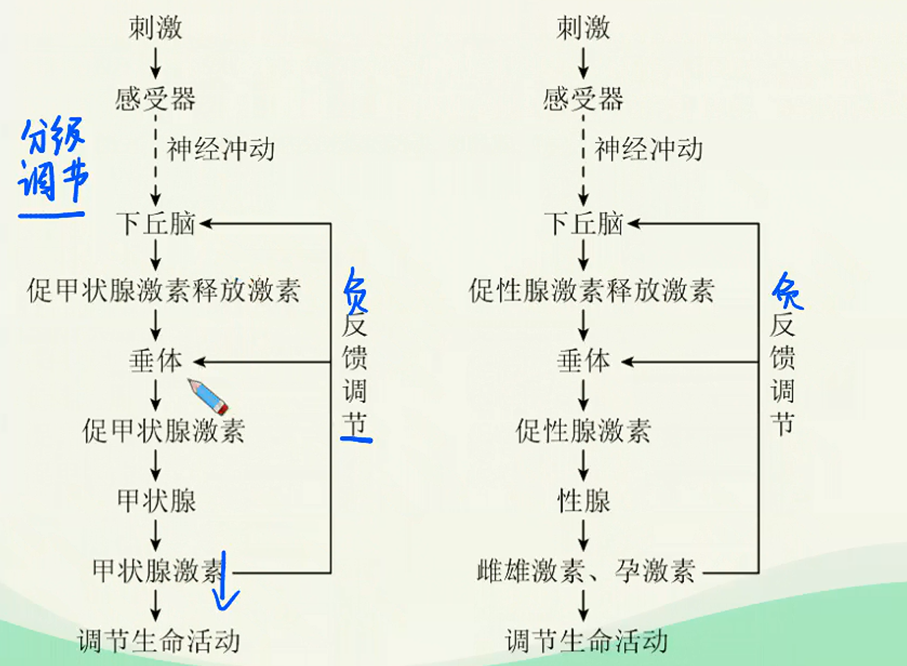
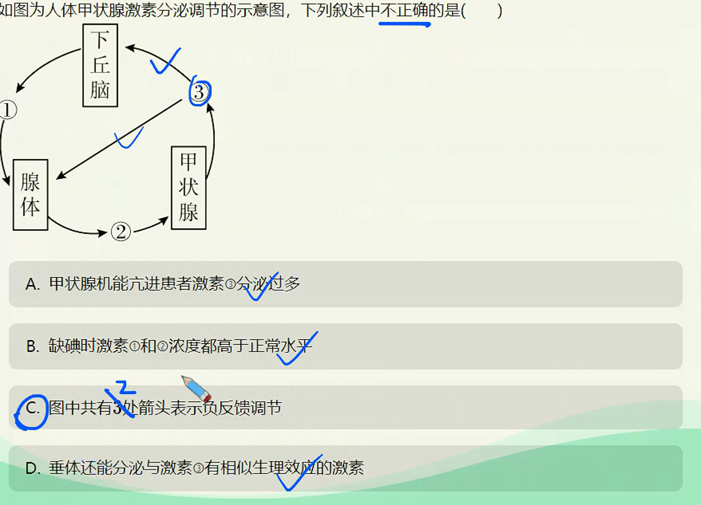

# 第二讲-激素与体液调节

> **基础知识**
>
> 1. 人体主要激素及其作用
>
> 2. 激素调节的基本特点
>
> 3. 激素调节的实例：甲状腺激素调节
>
> **核心考点**
>
> 1. 人体主要内分泌腺及其分泌激素的种类、作用与关系
>
> 2. 激素与激素调节的特点
>
> 3. 激素的分级调节与反馈调节
>
> **技巧把握**
>
> 1. 激素的分级调节图解（下丘脑一腺垂体一内分泌腺）

## 人体内的主要激素

### 体液调节的定义

1. 体液调节：某些化学物质（如激素、$CO_2$等）通过体液的传送，对人和动物体的生理活动所进行的调节。激素调节是体液调节的主要内容。

2. 激素调节：激素是由内分泌器官（或细胞）分泌的化学物质，激素对人和动物体的生命活动所进行的调节就是激素调节。

> 内/外分泌腺？
>
> 1. 有导管
>
> 2. 排放到体外

> 能产生激素的细胞一定能产生酶
>
> 能产生酶的细胞<mark>**不一定**</mark>能产生激素

| 产生部位              | 激素名称                  | 生理功能                                                   |
|:-----------------:|:---------------------:|:------------------------------------------------------:|
|                   | 促甲状腺激素释放激素            | 促进垂体合成和分泌促甲状腺激素。                                       |
| **下丘脑**           | 促性腺激素释放激素             | 促进垂体合成和分泌促性腺激素。                                        |
|                   | 抗利尿激素                 | 促进**肾小管**和**集合管**对水分的**重吸收**，减少尿的排出。                   |
|                   | 促甲状腺激素                | 促进甲状腺的生长发育，调节甲状腺激素的合成和分泌。                              |
| **垂体**            | 促性腺激素                 | 促进性腺的生长发育，调节性激素的合成和分泌。                                 |
|                   | 生长激素                  | 促进生长，主要促进蛋白质的合成和骨的生长。                                  |
| **甲状腺**           | 甲状腺激素 *含碘的氨基酸衍生物* | 促进细胞代谢； 促进生长发育，尤其对中枢神经系统的发育具有重要影响； 提高神经系统的兴奋性。 |
| **肾上腺**           | 肾上腺素                  | 增强心脏活动，使动脉收缩、血压升高； 促进细胞代谢； 促进肝糖原分解，使血糖升高。      |
| **胰岛-$\beta$细胞**  | 胰岛素                   | 促进细胞摄取、利用和储存葡萄糖，抑制非糖物质转化为葡萄糖，从而降低血糖浓度。                 |
| **胰岛-$\alpha$细胞** | 胰高血糖素                 | 促进糖原分解和非糖物质转化为葡萄糖，从而升高血糖浓度。                            |
| **性腺-睾丸**         | 雄性激素                  | 促进雄性生殖器官的发育和生殖细胞的形成，激发并维持雄性第二性征。                       |
| **性腺-卵巢**         | 雌性激素                  | 促进雌性生殖器官的发育和生殖细胞的形成，激发并维持雌性第二性征。                       |
|                   | 孕激素2                  | 促进子宫内膜和乳腺等的生长发育，为受精卵着床和泌乳准备条件                          |

