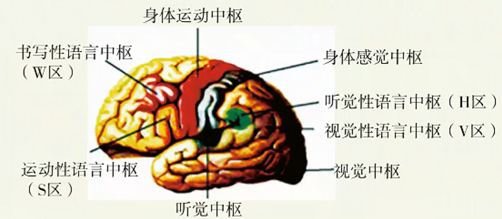

# 神经调节（一）

> **基础知识**
>
> 1. 神经系统和神经元的结构、功能
> 2. 反射弧的组成和反射过程
> 3. 神经中枢的分布与关系，大脑的高级功能
>
> **核心考点**
>
> 1. 反射的过程
> 2. 大脑对低级中枢的控制
> 3. 条件反射与非条件反射
>
> **技巧把握**
>
> 1. 三元反射弧五部分的结构组成、功能及其分布位置

## 神经系统与神经元

### 神经元

1. 神经元的基本结构
   典型的神经元由细胞体和突起两部分组成，突起分为树突和轴突。
   

   | 名称 | 描述 |
   | --- | --- |
   | **树突** | 树突是从胞体发出的多个且多分支的突起，呈放射状。胞体起始部分较粗，经过反复分支而变细，形如树枝状。树突具有接受刺激并将信息传入细胞体的功能，其广泛的分支可扩大神经元的接受刺激的表面积。 |
   | **轴突** | 轴突是由胞体发出的细而长的突起（可长达1mm多），每个神经元有一个轴突。轴突是神经元的信号输出通道，作用是将细胞体发出的信息传递给下一个或多个细胞。 |

2. 神经元的功能：接受刺激、产生兴奋、传导兴奋
   动物或人体内的某些组织或细胞（如神经元、肌细胞）在受到外界刺激后，从相对静止状态变为显著活跃状态的过程称为**兴奋**。在神经系统中，这种兴奋通过**神经纤维**（即由突触或感觉神经元的长树突以及套在神经元表面的髓鞘）传导，这种电信号也被称为**神经冲动**。

### 神经系统

人的神经系统包括中枢神经系统（约含$10^{11}$个神经元）和周围神经系统（也叫外周神经系统）两部分。

## 反射与反射弧

1. 反射的定义

   反射是指在中枢神经系统参与下，动物体或人体对内环境变化作出的规律性应答。
2. 完成反射的的结构基础——反射弧

   一个完整的反射弧一般包括五部分：**感受器、传入神经、神经中枢、传出神经和效应器**。

   如下图示意典型的三元反射弧（包含三个神经元：感觉神经元、中间神经元和运动神经元）。另外也有二元反射弧（如膝跳反射）和多元反射弧。

   

   | 结构名称 | 结构组成 | 分布部位 | 功能 |
   | --- | --- | --- | --- |
   | 感受器 | 感觉神经末梢（树突） | 周围神经系统 | 接受体内外的刺激，将其转化为兴奋 |
   | 传入神经 | 感觉神经纤维 | 周围神经系统 | 将感受器产生的兴奋传至神经中枢 |
   | 神经中枢 | 中间神经元和突触 | 神经中枢系统 | 对传入的信息进行分析和综合 |
   | 传出神经 | 运动神经纤维 | 周围神经系统 | 将神经中枢的兴奋传至效应器 |
   | 效应器 | 运动神经末梢（轴突）和它所支配的肌肉或腺体等 | 周围神经系统 | 对刺激作出应答反应 |

3. 反射的神经过程

   ```mermaid
   graph TD;
       A[刺激] --> B[感受器：接受体内外的刺激，将之转化为兴奋];
       B --> C[兴奋];
       C --> D[传入神经：沿着传入神经向神经中枢传导];
       D --> E[神经中枢：对传入的信息进行分析和综合];
       E --> F[兴奋];
       F --> G[传出神经：把神经中枢的兴奋传到效应器];
       G --> H[效应器：对刺激作出应答反应];
       H --> I[反应];
   ```

   发生反射活动的必需条件是：一定强度的刺激；结构和功能完好的反射弧。

## 神经中枢间的关系

1. 各弧神经中枢的分布位置
   脊椎动物和人的中枢神经系统包括脑和脊髓，它们含有大量的神经元，组合成许多不同的神经中枢，分别调控某一特定的生理功能。
   | 部 位 | 神经中枢 |
   | --- | --- |
   | 大脑 | 躯体感觉中枢、躯体运动中枢、听觉中枢、视觉中枢等；语言、学习、记忆和大脑思维等高级功能中枢 |
   | 小脑 | 维持身体平衡的中枢 |
   | 脑干 | 维持生命必要活动的中枢，如呼吸中枢、内脏活动中枢 |
   | 下丘脑 | 体温调节中枢、水平衡调节中枢、血糖平衡调节中枢、生物节律的调节中枢 |
   | 脊髓 | 调节躯体运动的低级中枢，如膝跳反射、肌缩反射、眨眼反射、排尿反射等 |
2. 神经系统的分级调节
   1. 一般来说，位于脊髓的低级中枢受脑中相应高级中枢的调控。
   2. 大脑皮层对低级中枢的控制
   - 实例1：排尿反射
     - 尿在肾脏不断生成，经输尿管流入膀胱暂时贮存。当膀胱储尿量达到一定程度时，兴奋传至大脑皮层相应感觉区引致。控制排尿的初级中枢在脊髓。一般成年人可以有意识地控制排尿，即可以“憋尿”，在适宜的环境下才排尿；但婴儿经常尿床。有些人由于外伤等使意识丧失，出现小便失禁现象。
   - 实例2：缩手反射
     - 平时，不小心手被刺扎了一下，会迅速缩回，这是机体的自我保护机制，防止机体受到外界刺激的伤害，缩手反射的低级中枢在脊髓。但在体检抽血时，人们却能够忍痛不缩手，这要受到大脑皮层相应区域的控制。
   - 实例3：肺的牵张反射
     - 呼吸中枢位于脑干，大脑皮层可以一定程度上调控呼吸，如屏住呼吸。
3. 大脑的高级功能
   1. 大脑皮层是整个神经系统最高级的部位，它除了对外部世界的感知以及控制机体的反射活动外，还有言语、学习、记忆和思维等方面的高级功能。
   2. 大脑的高级功能包括语言中枢（言语区）。语言功能是人脑特有的高级功能，包括与语言、文字相关的全部智力活动，涉及听、说、读、写。
      > 人脑的语言区是后天逐渐建立的，研究显示，使用不同母语的人，其大脑语言区的分布有区别。
      >
      > 
   3. 条件反射与非条件反射
      非条件反射：只要反射弧完整，在相应的刺激下，不需要后天的训练就能引起的反射。
      条件反射：在一定条件下，外界条件刺激与生物体之间建立起来的暂时神经联系，是后天形成的反射。

****


