# 神经调节（二）

> **基础知识**
>
> 1. 兴奋的产生
> 2. 兴奋在神经纤维上的传导
> 3. 兴奋在神经元之间的传递
>
> **核心考点**
>
> 1. 探究兴奋的产生的实验
> 2. 兴奋在神经纤维上的传导的过程和特点
> 3. 突触的结构
>
> **技巧把握**
>
> 静息电位和兴奋电位产生的机理与离子在膜内外浓度的分析

## 兴奋的产生和传导

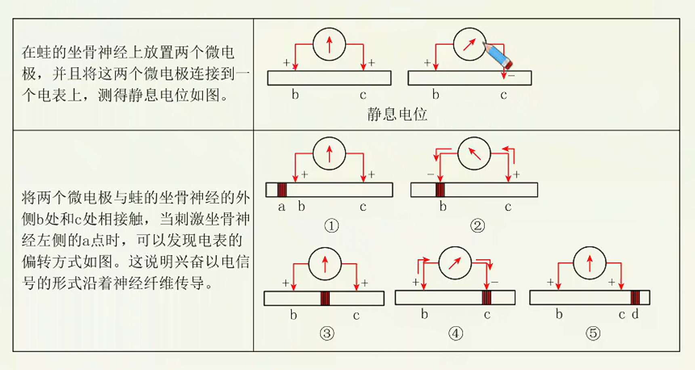

### 1. 兴奋的产生

1. 静息电位的产生机理
   正常生理状态下，由于$Na^+-K^+$泵的主动运输作用，导致细胞膜内$K^+$浓度高于膜外， $Na^+$浓度低于膜外。

   未受刺激时，处于静息状态，神经细胞膜主要对$K^+$有通透性（$K^+$通道的协助扩散作用），$K^+$顺浓度梯度扩散至细胞外，形成**外正内负的静息电位**。

   *而细胞内的负离子无法通过细胞膜，聚集于膜内表面，这样（跨膜电场）使$K^+$不会扩散太远，而是局限于膜外表面，所以静息电位仅存在于膜内外两侧很小的范围内。*

2. 兴奋电位的产生机理

   受刺激时，细胞膜对$Na^+$的通透性（$Na^+$通道的协助扩散作用）增加，$Na^+$内流，使兴奋部位膜内阳离子浓度高于膜外。

   兴奋部位膜两侧电位变为：**外负内正**。相邻未兴奋部位膜两侧电位仍是：**外正内负**。

   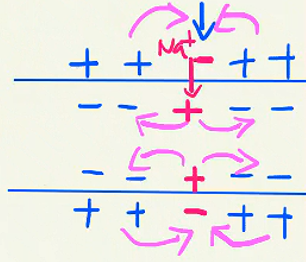

3. 兴奋的传导
   由于兴奋和未兴奋部位存在电位差，导致膜附近的带电离子发生移动，形成局部电流。

   在膜外，电流由未兴奋部位流向兴奋部位；在膜内，电流由兴奋部位留下未兴奋部位。

   这种局部电流又刺激相邻的未兴奋部位发生相同电位变化，兴奋向前传导下去，后方又恢复为静息电位。

   **因此，兴奋在神经纤维上双向传导。**

   > *一个神经元也是具有双向传导的能力的*
   >
   > *电流和兴奋方向：膜内相同，膜外相反*

   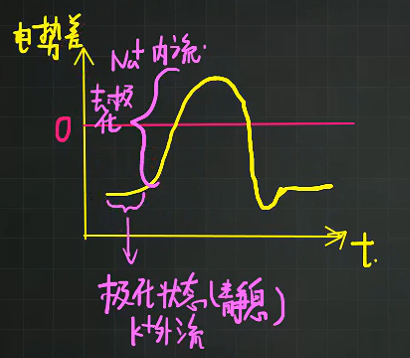

## 兴奋的传递

神经元的末梢经过多次分支，最后每个小枝末梢膨大，呈杯状或球状，叫做突触小体。突触小体与其他神经元的细胞体、树突等相接触，共同形成突触

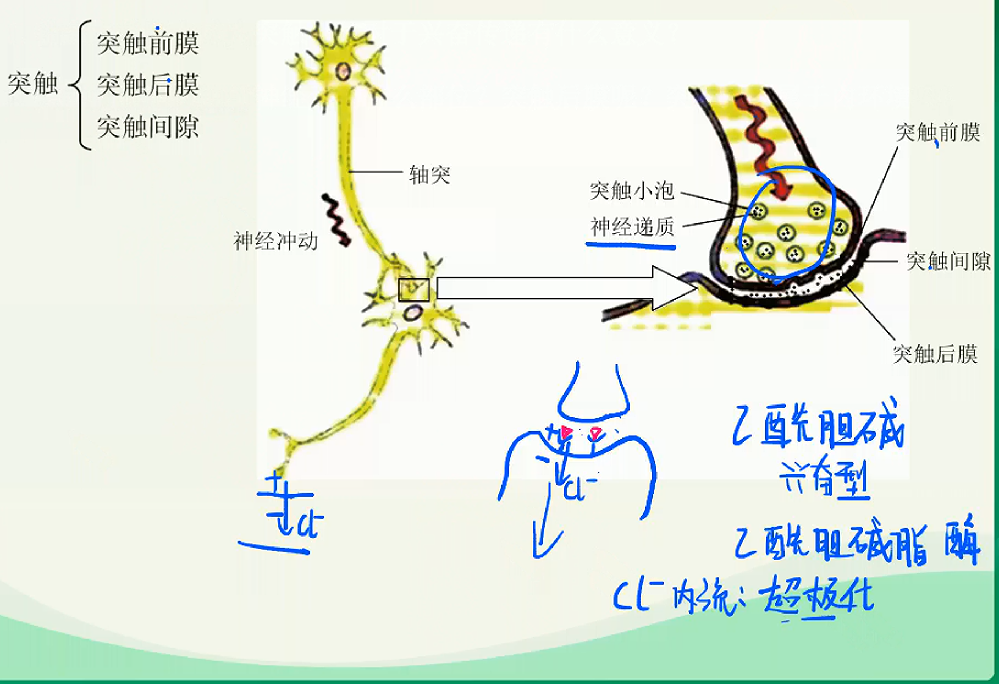

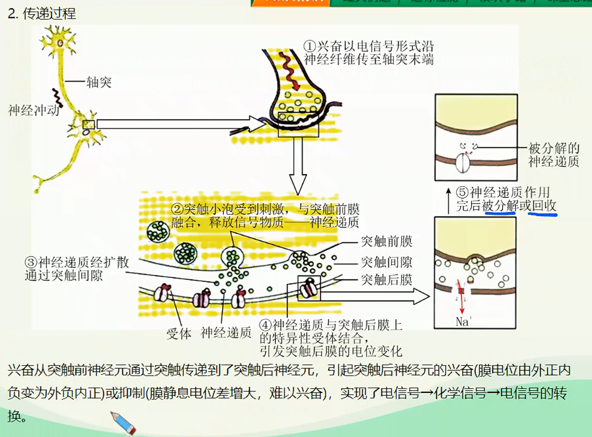

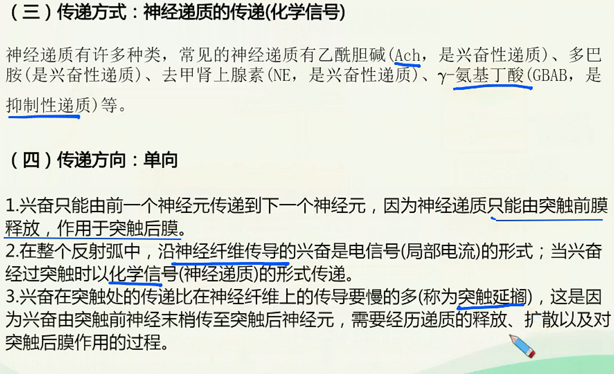

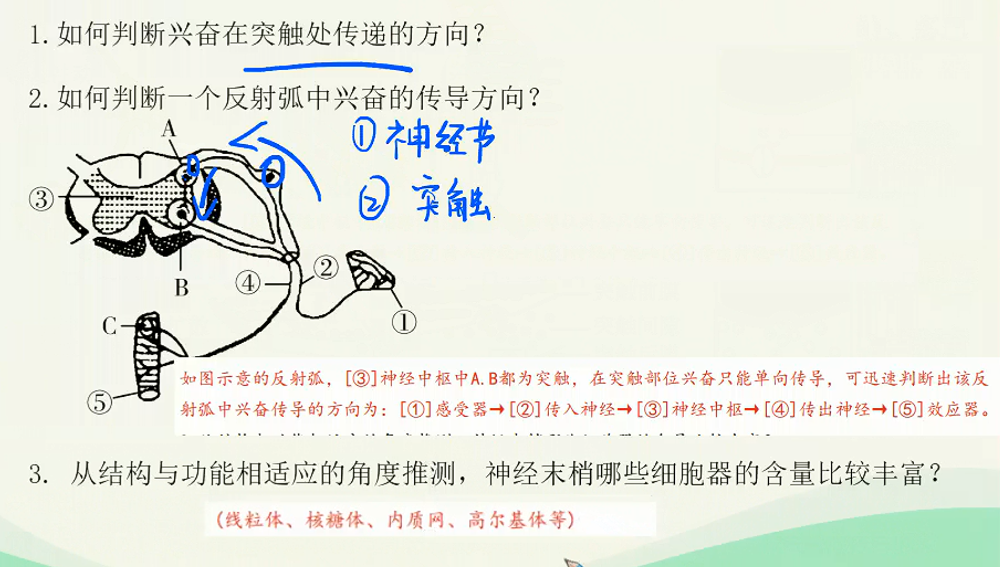

****

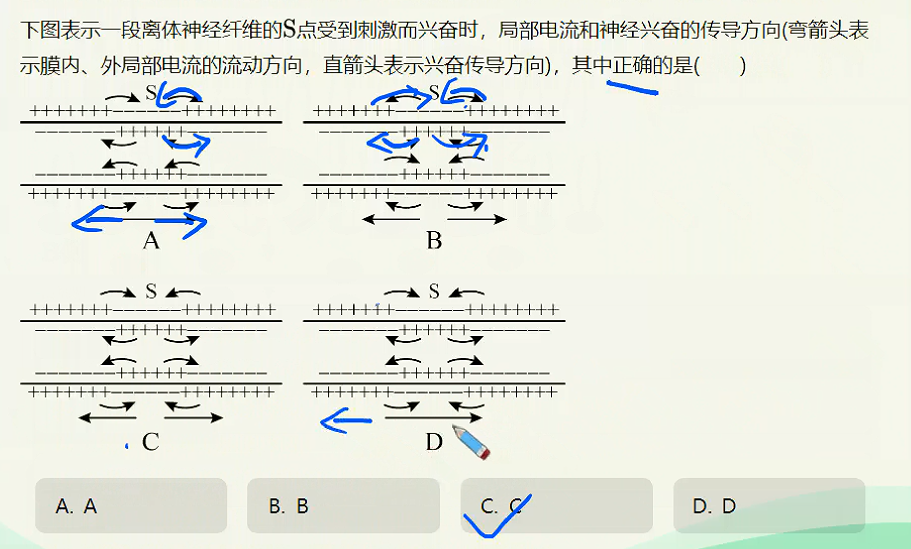

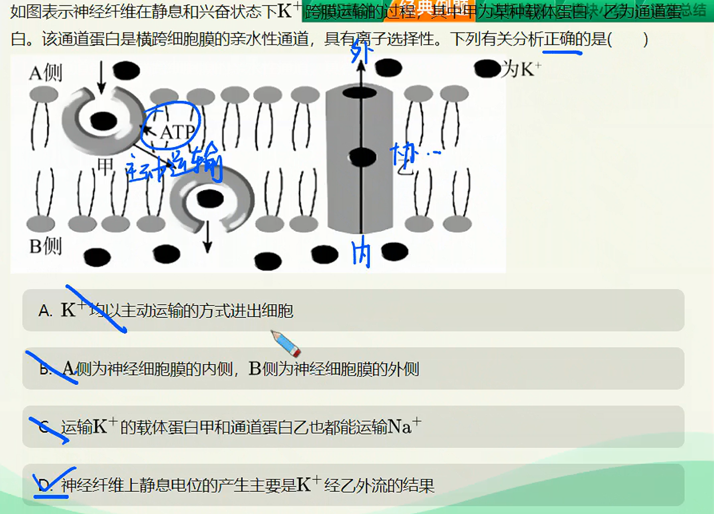

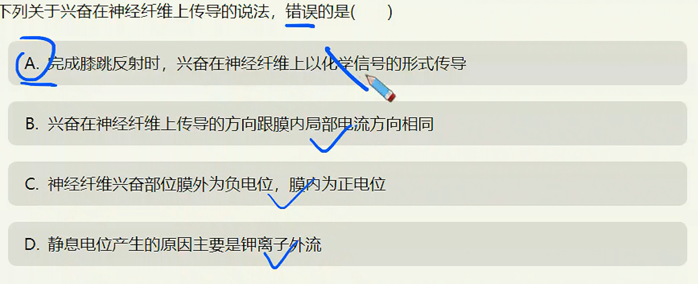

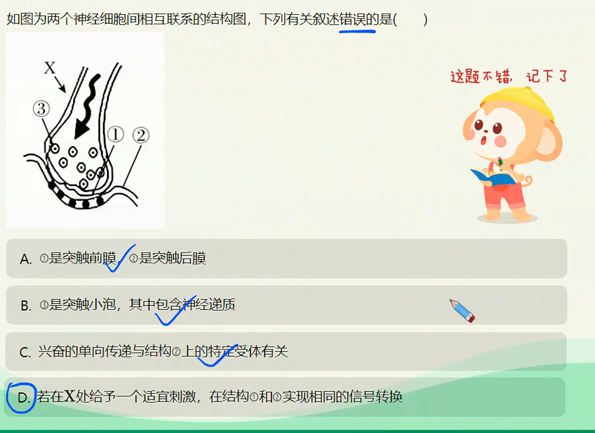

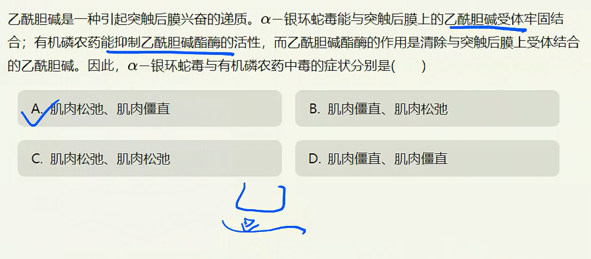

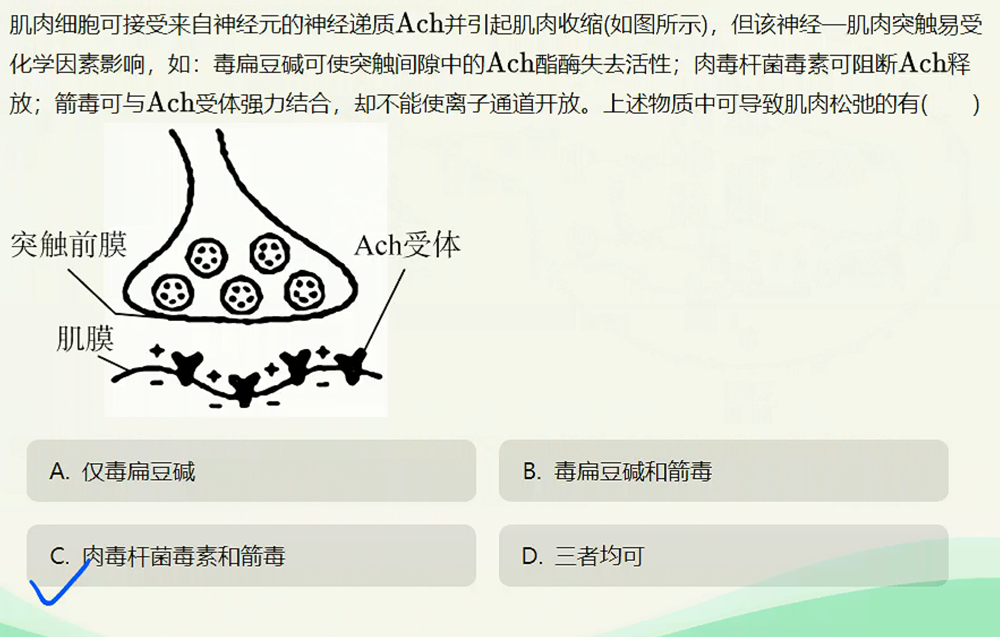
