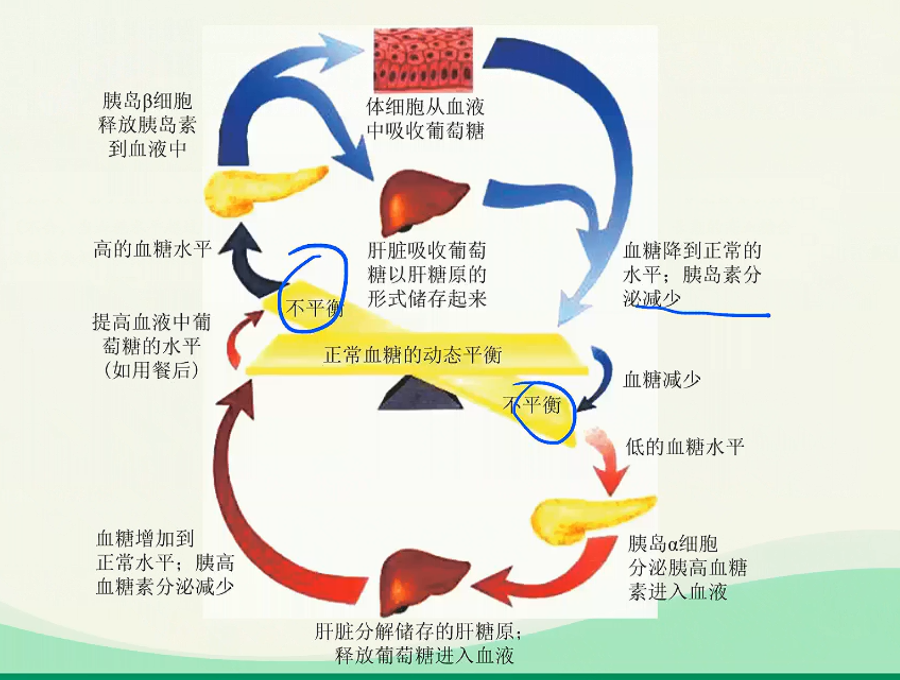
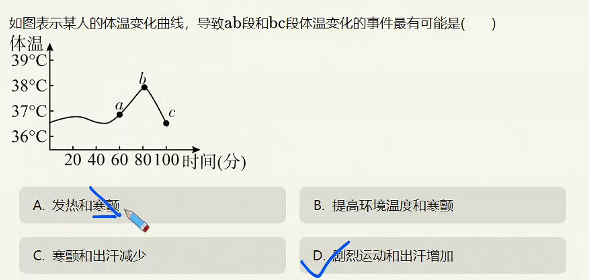

# 机体稳态的神经——体液调节

> **基础知识**
>
> 1. 血糖平衡调节的过程
> 2. 体温调节的过程
> 3. 水平衡调节的过程
>
> **核心考点**
>
> 1. 血糖的来源与去路
> 2. 体温调节的机制
> 3. 水平衡调节的机制
>
> **技巧把握**
>
> 神经-体液调节实例的相关曲线图

## 血糖的来源和去路

正常血糖浓度：$80-120mg·dL^{-1}$

胰岛素能促进组织细胞加速摄取、利用和储存葡萄糖，从而使血糖水平降低；胰高血糖素能促进糖原分解，并促进一些非糖物质转化为葡萄糖，从而使血糖水平升高。肾上腺素等也有升血糖的作用。

## 糖尿病

1. 病因：胰岛素分泌不足，或胰岛素利用缺陷。
2. 诊断：持续高血糖且有糖尿。
3. 糖尿病患者的典型症状：多尿、多饮、多食、体重减少（“三多一少”）
4. 防治：基因治疗、药物治疗、饮食习惯、加强锻炼等。

> 当身体不能产生足够的胰岛素时，血糖水平会一直升高吗？血糖浓度过高有什么危害？
>
> （不会，当血糖水平超过肾糖阔（$160mg·dL^{-1}$）,多余的糖会随尿排出，形成糖尿。长期的高血糖会使稳态失调，全身组织器官发生病变，并导致一系列并发症。）

## 体温调节
>
> 产热途径：细胞中物质氧化分解（骨骼肌、肝脏产热最多）
>
> 散热途径：汗液蒸发、血流将热量（皮肤毛细血管带到体表）散失、呼吸、排尿排便

1. 调节方式：神经-体液调节（中枢在下丘脑）。
2. 相关激素：甲状腺激素、肾上腺素等。
3. 调节机制
   

> 健康人体短时间处于40°C的环境时，机体仍能维持稳态，但长期处于40°C以上的高温环境就会“中暑”，试解释其原因。
> 正常体温有一个范围。短时间处于高温环境，机体可通过增加出汗、皮肤毛细血管舒张等方式增加散热，体温仍能维持在正常范围。但机体的调节能力是有限的，长期处于高温环境，机体产热量持续大于散热量，体温升高，酶的活性受影响，机体代谢紊乱：另外，大量出汗导致水盐流失，水盐调节紊乱，这些因素均导致中暑）

## 水平衡调节

****

