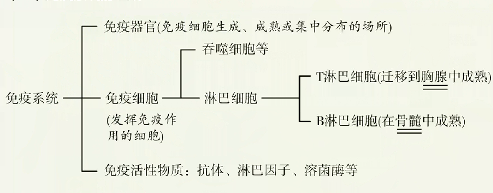
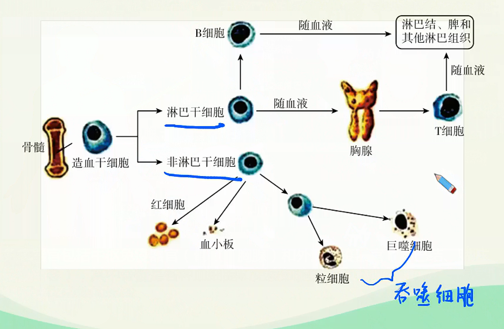
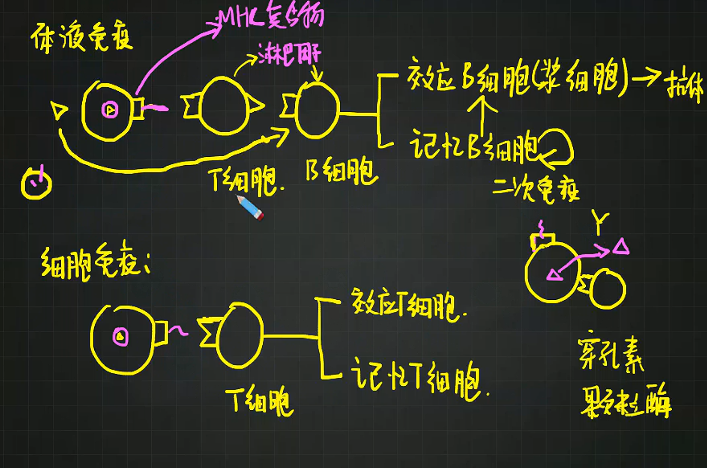

# 免疫系统的防卫功能

> 基础知识
> 1.人体的三道防线
> 2.免疫系统的组成
> 3.体液免疫和细胞免疫
> 核心考点
> 1.人体的第一、二道防线的组成和防御机制
> 2.特异性免疫和非特异性免疫的区别
> 3.体液免疫和细胞免疫的基本过程
> 技巧把握
> 体液免疫和细胞免疫过程中各种细胞的作用

## 免疫系统的组成

1. 免疫器官
   免疫器官包括中枢免疫器官（骨髓、胸腺）和外周免疫器官（淋巴结、脾脏、扁桃体等），其中骨髓是各种血细胞和免疫细胞发生和分化的场所，胸腺是T细胞分化成熟的场所。
2. 免疫细胞的分化
   
3. 免疫活性物质
   由免疫细胞或者其他细胞产生的发挥免疫作用的物质，如抗体（由效应B细胞分泌）、淋巴因子、溶菌酶等。

## 免疫防线

### 第一道防线

1. 组成：皮肤、黏膜
2. 举例
   1. 皮肤的角质层使病原体难以在此生存和入侵。
   2. 呼吸道纤毛的摆动能把吸附在黏液中的微生物、颗粒物等排出体外或通过吞咽经消化道排出。
   3. 呼吸道和消化道等处的黏膜能够粘附微生物和外来异物。
   4. 皮肤油脂腺分泌的油脂能抑制某些细菌和真菌。
   5. 胃黏膜分泌的胃酸可以杀死大多数细菌，并使其产生的毒素失效等。
   6. 汗液、泪液和唾液中都含有溶菌酶，能破坏一些细菌的细胞壁。

> 第一道防线就是我们机体这个系统已铸就的“边防线”，敌人在这道既是铜墙铁壁又有防御武器的边界外，一般难以入侵.但是，若这道边防线部分受损或者敌人伪装而来，那么它们就有了侵入甚至扩散至全身危害整个机体的可能性。

### 第二道防线

1. 组成：吞噬细胞的吞噬作用以及体液中的杀菌物质（如溶菌酶）
2. 举例
   局部炎症反应：如果病原体突破第一道防线进入了内环境，被侵害局部往往汇集大量的吞噬细胞和杀病菌物质如溶菌酶（破坏细菌细胞壁）、干扰素（抑制病毒增殖）等。这些有利于杀灭病原微生物，阻止其继续入侵，并重建内环境稳态。

   若伤口严重发炎，吞噬细胞会因细菌或毒素过多而大量死亡，此时如果后续的吞噬细胞赶不及奔赴炎症部位，那么细菌数量便会大增并且破坏伤口周围的组织细胞。因此如果伤口出现严重化脓现象需及早医治。
   > 组织胺：
   > 增大血管壁通透性，引发神经冲动

> 第二道防线是人体与病菌的“局部遭遇战”，敌人在这里遭遇我们的大部队，被各种物理、化学武器轮番轰炸。但是如果敌人数量过多，或者伪装成“平民”逃过了攻击，就会随血液循环扩散到全身。此时，就需要第三道防线对这些“逃犯”进行“通缉”和“清除”。
>
> 如果你看过《士兵突击》，一定对特种部队记忆犹新。第三道防线就是人体的“特种部队”，其中个个身怀绝技，有些善于识破伪装，有些擅长定点“爆破”，有些能制造生物“导弹”远程打击敌人。第三道防线是全身作战，战斗过于激烈时，可能出现头疼、发烧的现象，这是因为体温升高有利于“特种部队”快速集结。

### 第三道防线

1. 组成：由免疫器官和免疫细胞借助血液循环和淋巴循环而组成。
2. 举例
   1. 患流感后一般7天后痊愈。
   2. 患SARS病毒侵染后患严重急性呼吸综合症等。

****

人体的第一、二两道防线是人人生来就有的，不针对某一种特定病原体，而是对大多数病原体都有防御作用，因此称作**非特异性免疫**，又称**先天性免疫**。
第三道防线是针对特异性病原体的。外来病原体侵入后，机体内会形成相应的淋巴细胞，特异性地对抗它，因此称作**特异性免疫**，也称**获得性免疫**。

## 抗原与抗体

抗原是指能引起机体产生特异性免疫反应的物质。例如，病毒、细菌等病原体表面的蛋白质等物质，都可以作为引起特异性免疫反应的抗原。抗体是指机体的免疫系统在抗原刺激下，由淋巴细胞产生的、可与相应抗原发生特异性结合的蛋白质，主要分布在血清中，也分布于组织液及外分泌液中。

## 特异性免疫过程

### 液体免疫

1. 大多数抗原经吞噬细胞的摄取和处理，暴露出抗原，吞噬细胞将抗原呈递给T细胞，再由T细胞将信息传递给B细胞，同时抗原也会直接刺激B细胞，两条途径传来的信号共同作用激活B细胞。
2. B细胞增殖分化，大部分B细胞分化为浆细胞（效应B细胞），小部分形成记忆B细胞。
3. 浆细胞产生特异性抗体
（浆细胞寿命很短，经过几天产生大量抗体后就死去，每一个浆细胞每秒能产生2000个抗体）
4. 抗体与该抗原特异性结合，形成沉淀凝集，进而被吞噬细胞吞噬消化。

### 细胞免疫

1. 抗原经吞噬细胞的摄取和处理，暴露出抗原，吞噬细胞将抗原呈递给T细胞。
2. T细胞接受抗原刺激后活化，开始进行一系列增殖、分化，大部分形成效应T细胞，少部分形成记忆T细胞。
3. 效应T细胞与抗原入侵的宿主细胞密切接触，通过释放穿孔素、颗粒酶等物质，改变靶细胞细胞膜的通透性，并通过膜分子信号使靶细胞的调亡机制启动，导致靶细胞裂解。
4. 原失去寄生的基础，进一步被体液中的抗体消灭。

