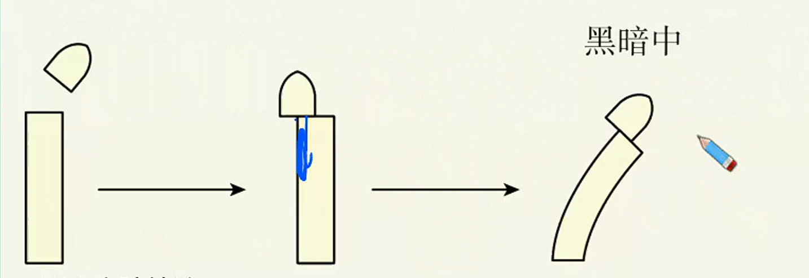

# 植物激素调节（一）

> **基础知识**
>
> 1. 生长素的发现过程
> 2. 生长素的产生、运输和分布
>
> **核心考点**
>
> 1. 探究植物向光性的各实验分析
> 2. 生长素的极性运输
> 3. 植物向性运动的解释
>
> 技巧把握
>
> 各种条件下的胚芽鞘/幼苗生长情况分析

## 植物向光性的探究

1. 达尔文的实验
   1. 实验材料：胚芽鞘
      胚芽鞘是单子叶植物，特别是禾本科植物胚芽外的锥状保护套结构，顶土能力强，可保护胚芽中的幼嫩叶片。胚芽鞘对光非常敏感，如果受到单侧光的照射，1h内即可发生显著的向光弯曲生长现象。
   2. 实验过程和现象
      
   3. 实验结论
      达尔文根据实验提出：胚芽鞘尖端受单侧光刺激后，就向下面的伸长区传递某种“影响”，造成伸长区背光侧比问光侧生长快，使胚芽鞘出现向光性弯曲。
2. 鲍森•詹森的实验（1910年）
   1. 实验过程和现象
      
   2. 实验结论
      胚芽鞘尖端产生的“影响”能透过琼脂片（化学物质可渗入、透过)传到下部但不能透过云母片（化学物质不能透过）。初步推测，尖端产生的影响可能是一种化学物质造成的。
3. 拜尔的实验（1914年）
   1. 实验过程和现象
      切去胚芽鞘尖端，移至去顶胚芽鞘的一侧，置于黑暗中培养，胚芽鞘向放尖端的对侧弯曲生长。
      
   2. 实验结论
      胚芽鞘的弯曲生长，是因为尖端产生的影响（化学物质）在其下部分布不均匀造成的。
4. 其他科学家的发现
   1931年，科学家从人尿中分离出能促进植物生长的物质。
   1946年，科学家从高等植物中分离出生长素，并确认其为哚乙酸（IAA）

### 对植物向光性的解释

| 外因           | 内因                                                                 |
| -------------- | -------------------------------------------------------------------- |
| 单侧光照射     | 胚芽鞘的尖端（分生区）能产生生长素；                                 |
|                | 尖端感应单侧光后背光侧的生长素量多于向光侧；                         |
|                | 生长素由尖端向下运至伸长区（生长素促进细胞纵向伸长）；               |
|                | 伸长区背光侧比向光侧生长快（背光侧生长素量多于向光侧）；             |
|                | 从而造成向光弯曲生长。                                               |

## 生长素的产生、运输和分布

1. 生长素的合成
   主要部位：幼嫩的芽、叶和发育中的种子。在这些部位，色氨酸经过一系列反应转变成生长素。几乎所有的植物组织都可能产生生长素，但最主要的合成部位是那些快速分裂生长的组织，如茎尖分生组织、幼嫩的叶片、根尖分生组织等
2. 生长素的分布
   生长素分布于植物的各个器官，集中分布在生长旺盛的部位，如胚芽鞘、芽和根顶端的分生组织、形成层、发育中的种子和果实等。
