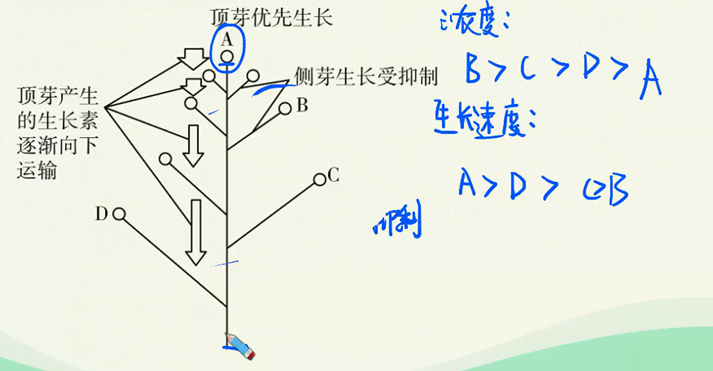

# 植物激素调节（二）

> **基础知识**
>
> 1. 生长素的生理作用与两重性
> 2. 其他植物激素
> 3. 植物生长调节剂的应用
>
> **核心考点**
>
> 1. 根的向地性与顶端优势的解释
> 2. 其他植物激素
> 3. 植物生长调节剂的应用
>
> **技巧把握**
>
> 表示生长素两重性的相关示意图

## 生长素的生理作用与两重性

### 生长素生理作用的两重性

研究发现生长素既能促进生长，也能抑制生长；既能促进发芽，又能抑制发芽既能防止落花落果，也能疏花疏果。生长素所发挥的作用，因浓度、植物细胞的成熟情况和器官的种类不同而有较大的差异，表现为**两重性**。

### 体现生长素作用两重性的具体实例

1. 顶端优势
   1. 定义：植物的顶芽优先生长而侧芽受到抑制的现象
   2. 机理：顶芽产生的生长素向下运输，大量地积累在侧芽部位。由于侧芽对生长素浓度比较海敏感，因此侧芽的生长受到抑制。距离顶芽越近的侧芽抑制越显著。生长素浓度和顶芽距离的关系如下图：
   
   3. 应用
      1. 果树修剪及某些农作物的生产上：通过打顶摘心，破坏顶端优势，以达到增产的目的。
      2. 盆景、花卉的栽培上：通过打顶摘心，破坏顶端优势，使侧芽萌发形成枝条，再对新生的枝条加以取舍，就可以造成一定形状的树冠。
      3. 木材生产上：要保护好顶芽，充分利用顶端优势。
2. 根的向地性

远地侧的生长素浓度低于近地侧，根和茎对生长素的敏感性不同，根表现出向地性，茎表现出背地性。

## 其它植物激素与植物生长调节剂

### 植物生长调节剂的应用

1. 定义：人工合成的对植物的生长发育有调节作用的物质。
2. 优点：容易合成、原料广泛、效果稳定。
3. 应用举例
   1. 生长素类似物：促进扦插枝条生根；促进果实发育；防止落花落果；除草剂。
   2. 用乙烯利催熟凤梨。
   3. 用赤霉素处理芦苇，可增加纤维长度；用赤霉素处理大麦，使大麦种子无需发芽产生C-淀粉酶。
   4. 青鲜素可以延长马铃薯、大蒜、洋葱等贮藏期，但其残留有可能有致癌作用。
