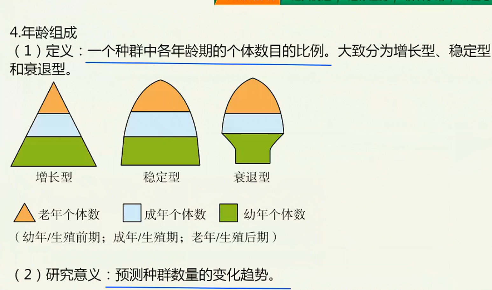
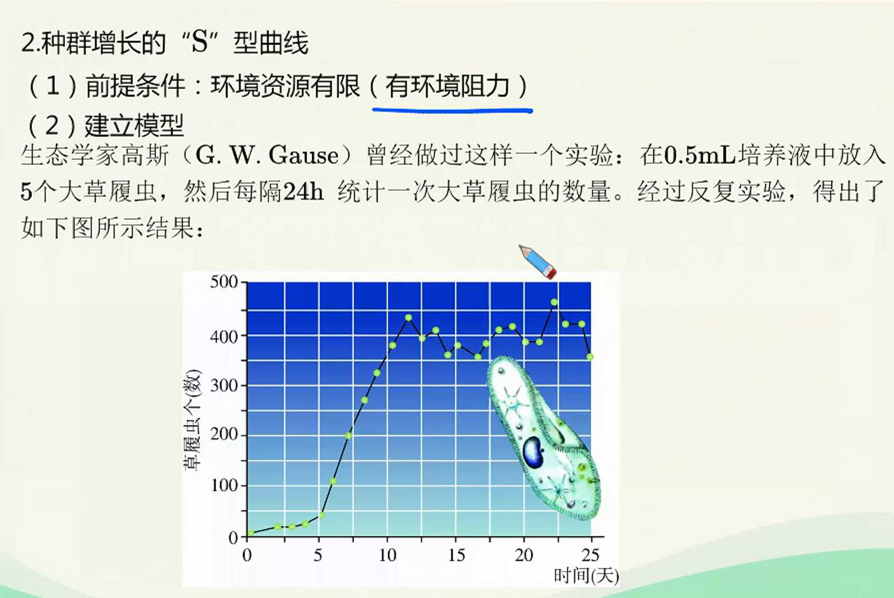
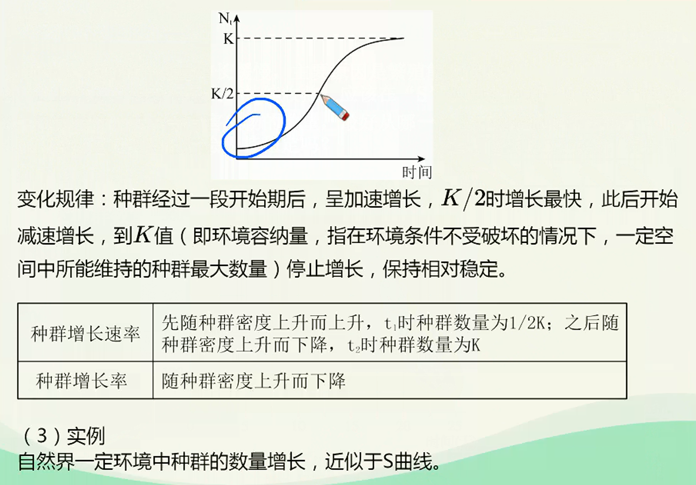
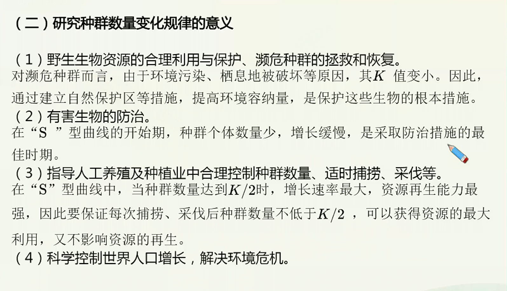

# 种群数量变化的数学模型

> 基础知识
> 1.种群的定义
> 2.种群的数量特征
> 3种群数量增长的数学模型
> 核心考点
> 1.种群的数量特征及其关系
> 2种群数量增长的“J”型和“S”型曲线
> 技巧把握
> 种群数量增长曲线的分析

1. 种群的定义
   在一定的自然区域内，同种生物的全部个体形成种群。
2. 对种群概，念的理解
   1. 种群内的个体属同一物种（能够在自然状态下相互交配并且产生可育后代的一群生物称为一个物种，不同物种间存在生殖隔离)，且包含了该区域内该物种的全部个体。
   2. 同一物种在不同区域可以形成多个种群。
   3. 种群是物种存在的具体形式。物种以种群的形式存在，通过内部个体的自由交配将该种群的基因库代代相传，种群是生物繁殖的基本单位，是生物进化的基本单位。
   4. 种群作为一个有机整体有发展、能自我调节、保持动态稳定。

3. 出生率和死亡率
   1. 定义：在单位时间内新产生或死亡的个体数目占该种群个体总数的比率分别称为出生率或死亡率。
   2. 研究意义：是炔定种群密度的重要因素。
   > 举例：2018年我国人口出生率为10.94，死亡率为7.13，自然增长率为3.81。

4. 迁入率和迁出率
   1. 定义：单位时闻内迁入或迁出的个体占该种群个体总数的比率，分别称为迁入率或迁出率。接
   2. 研究意义：决定种群密度的因素。
   > 例如，农田施用药物灭鼠后，田鼠种群大规模迁出，种群密度下降。
   > 

5. 性别比例
   1. 定义：种群中雌雄个体数目的比例。
   2. 研究意义：直接影响出生率，间接影响种群密度。

## 种群数量增长曲线

1. 种群的数量特征
   1. 种群密度
      1. 定义：种群在单位面积或单位体积中的个体数。是种群最基本的数量特征。
      2. 研究意义：反映了种群在一定时期的数量。

