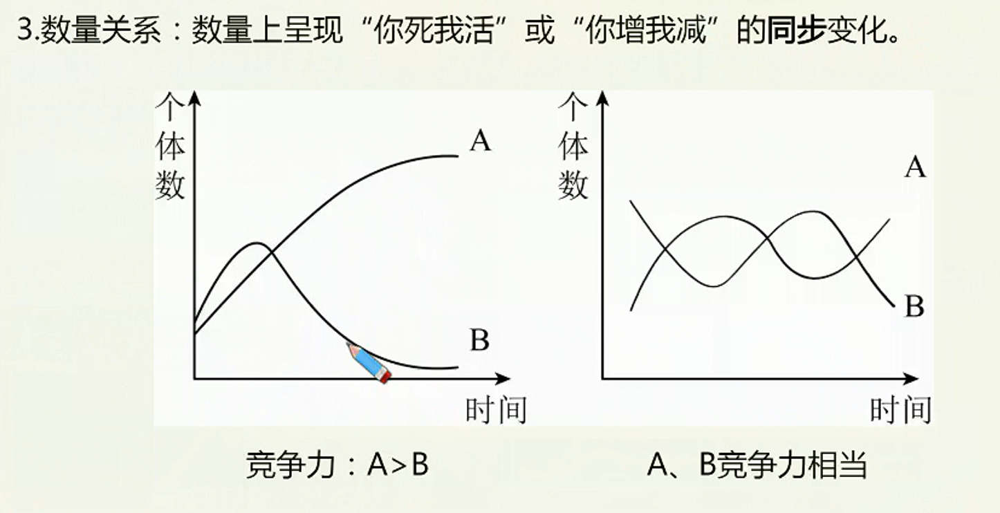
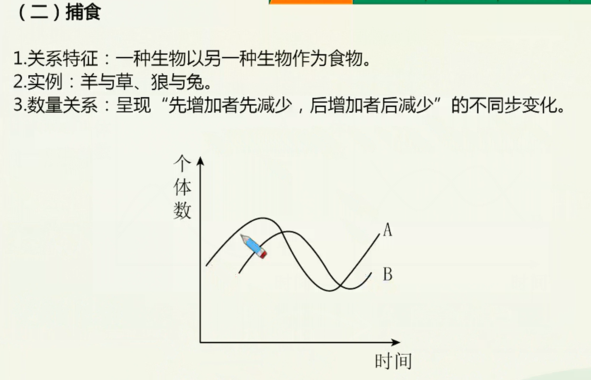
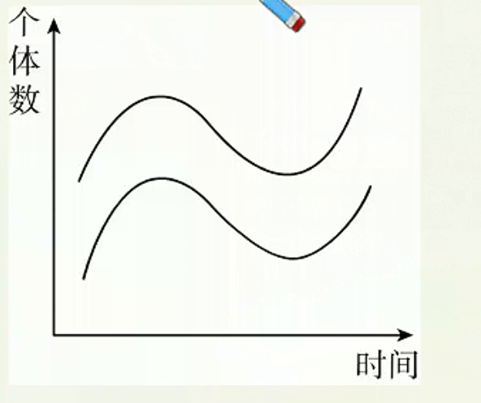
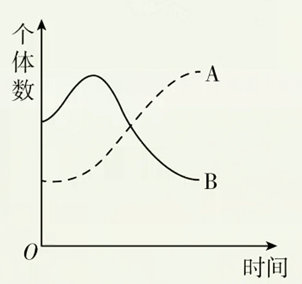

# 生物群落的物种组成和空间结构

> **基础知识**
>
> 1. 群落的定义和物种组成
> 2. 种间关系
> 3. 群落的空间结构
>
> **核心考点**
>
> 1. 群落的概念
> 2. 种间关系的实例与特征
> 3. 群落的垂直结构和水平结构
>
> **技巧把握**
> 物种间关系的数量制约曲线

## 群落的定义和物种组成

### 群落的定义

同一时间内聚集在一定区域中各种生物种群的集合，叫做群落。

### 群落的物种组成

1. 物种组成是区分不同群落的重要特征，不同群落间物种组成和种群中个体数量差别很大。
2. 群落中物种数目的多少称为丰富度，不同群落的丰富度不同。

## 种间关系

生物群落中的不同物种相互作用所形成的关系，称为种间关系。种间关系通常是围绕物质、能量、信息和栖息地等方面来展开的，其中最主要的是食物联系。一个群落中的物种通过复杂的种间关系，形成一个有机的整体。

### 竞争

1. 关系特征：两种或者两种以上生物相互争夺资源和空间等。表现为相互抑制，或一方占优势另一方处于劣势甚至灭亡。
2. 实例：小麦和杂草、大草履虫和双小核草履虫

### 捕食

1. 关系特征：一种生物以另一种生物作为食物。
2. 实例：羊与草、狼与兔。
3. 数量关系：呈现“先增加者先减少，后增加者后减少”的不同步变化。

### 互利共生

1. 关系特征：两种生物共同生活在一起，相互依存，彼此有利。
2. 实例：豆科植物与根瘤菌、地衣。
3. 数量关系：呈现“同生共死”的同步变化。

### 寄生

1. 关系特征：一种生物（寄生者）寄居于另一种生物（寄主）的体内或体表，摄取寄主的养分以维持生活。
2. 实例：噬菌体与细菌、菟丝子（寄生植物，细胞中不含叶绿体）与大豆、蛔虫
与人。
3. 数量关系

## 群落的空间结构

群落的空间结构是指群落中各个生物种群在空间上的配置。包括垂直结构和水平结构等方面。

### 群落的垂直结构

1. 含义：在垂直方向上，大多数群落具有明显的分层现象。

2. 表现
植物在不同的高度分层。植物分层为动物创造了多样的栖息空间和食物条件，因此动物也有分层现象。
3. 影响因素
   1. 陆生群落：光照、温度等。
   2. 水生群落：光照、温度、溶解氧等。
