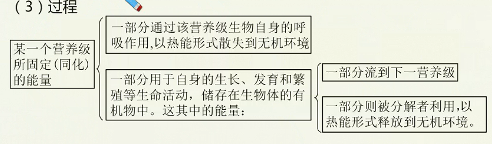

# 生态系统的组成和功能（二）

> **基础知识**
>
> 1. 生态系统的能量流动
> 2. 生态系统的信息传递
> 3. 生态系统的稳定性
>
> **核心考点**
>
> 1. 能量流动的过程与特点
> 2. 信息传递的分类和作用
> 3. 抵抗力稳定性和恢复力稳定性
>
> **技巧把握**
>
> 能量流动相关计算

## 生态系统中能量流动的基本规律

### 定义

生态系统中能量的输入、传递、转化和散失的过程，称为生态系统的能量流动。能量是生态系统的动力，是一切生命活动的基础。一切生命活动都伴随着能量的变化，没有能量的转化，也就没有生命和生态系统。

### 过程

1. 能量的输入
   1. 主要途径：绿色植物通过光合作用将太阳能转化为化学能储存在有机物中使太阳能输入到生态系统中。
   2. 总量：生产者所固定的太阳能的总量，就是流经这个生态系统的总能量。
2. 能量的传递
   1. 途径：食物链和食物网
   2. 形式：有机物中的化学能
   
3. 能量的散失：通过生物的呼吸作用，以热能形式散失到环境中。

### 特点：单向流动、逐级递减

1. 能量在相邻的两个营养级间的传递效率大约是10%~20%。（两个营养级间的传递效率等于某一营养级所固定的能量与上一营养级所固定能量的比值）
2. 在一个生态系统中，营养级越多，在能量流动过程中消耗的能量越多。因此，生态系统中食物链一般不超过4~5个营养级。

### 研究意义

1. 帮助人们科学规划设计人工生态系统，使能量得到最有效的利用。
   1. “桑基鱼塘”的生产方式
   农民摘桑养蚕，把蚕粪和蚕蛹放入水塘喂鱼；鱼粪积聚塘底，构成含丰富腐殖质的塘泥；再将塘泥挖上基面作肥料种桑；形成桑-蚕-鱼三者连环的生态链，塘鱼、桑蚕均获较高收成。
   2. 生态农业
   不直接燃烧秸秆，而是将秸秆做饲料喂牲畜，让牲畜粪便进入沼气池，将发酵产生的沼气做燃料，将沼气池中的沼渣做肥料，从而实现对能量的多级利用，大大提高能量的利用率。
2. 帮助人们合理调整生态系统中的能量流动关系，使能量持续高效地流向对人类最有益的部分。
   例如：在一个草场上，如果放养的牲畜过少，就不能充分利用牧草所能提供的能量；如果放养的牲畜过多，就会造成草场退化，使畜产品的产量下降。只有根据草场的能量流动特点，合理确定草场的载畜量，才能保持畜产品的持续高产。在农田中，通过锄草除虫，合理控制青蛙等有益生物的数量，使能量多流向庄稼。

## 生态系统中的信息传递

### 生态系统中信息的种类

1. 物理信息：光、声、温度、磁力等
2. 化学信息：植物的生物碱、有机酸等，动物的性外激素等
3. 行为信息：蜜蜂跳舞、孔雀开屏等

### 信息传递在生态系统中的作用

1. 维持生命活动的正常进行，种群的繁衍。
2. 种间关系的调节，维持生态系统稳定。

### 信息传递在农业生产上的应用

1. 提高农产品或畜产品产量。
2. 对有害动物的控制。

## 生态系统的稳定性

### 定义：生态系统具有的保持或恢复自身结构和功能相对稳定的能力，叫做生态系统的稳定性

### 生态系统的自我调节能力

1. 生态系统之所以能够维持相对稳定，是由于生态系统具有自我调节能力。
2. 这种调节属于负反馈调节，结果是抑制和减弱最初发生变化的那种成分所引起
的变化。

> 负反馈调节在生态系统中普遍存在，它是生态系统自我调节能力的基础，能使生态系统达到平衡和保持稳定。

### 抵抗力稳定性和恢复力稳定性

生态系统的稳定性表现在抵抗力稳定性和恢复力稳定性两个方面。不同生态系统在这两种稳定性的表现上有着一定的差别。

1. 抵抗力稳定性：生态系统抵抗外界干扰并使自身的结构和功能保持原状（不受损害）的能力。一般来说，生态系统中的组分越多，食物网越复杂，其自动调节能力就越强，抵抗力稳定性就越高。
2. 恢复力稳定性：生态系统在受到外界干扰因素的破坏后恢复到原状的能力。

### 提高生态系统稳定性的措施

一方面要控制对生态系统的干扰程度，对生态系统的利用应适度，不应超过生态系统的自我调节能力；另一方面，对人类利用强度较大的生态系统，应实施相应的物质和能量的投入，保证生态系统内部和功能的协调。
