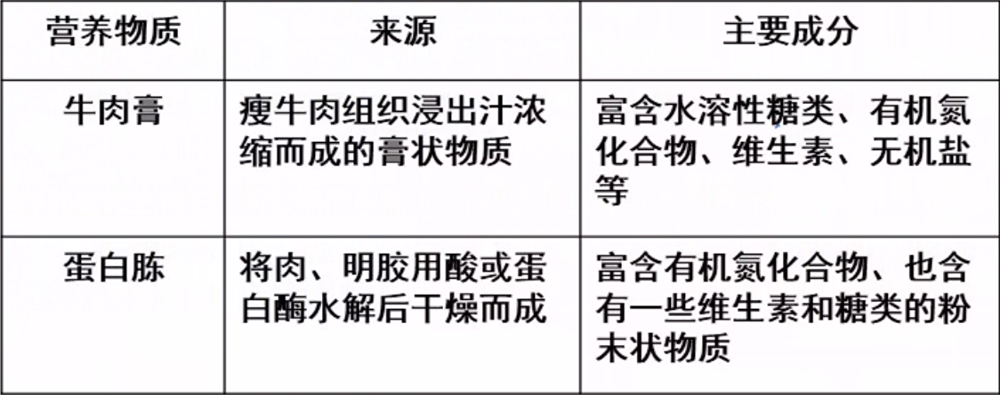
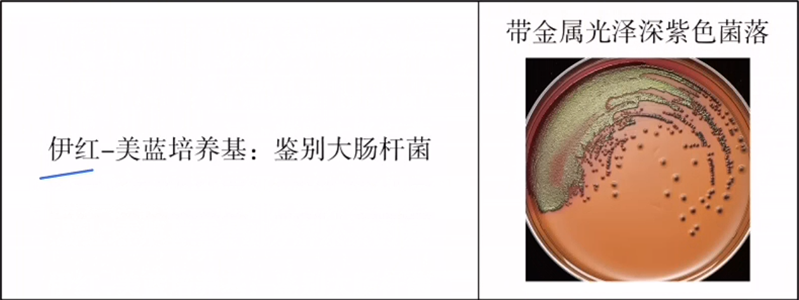
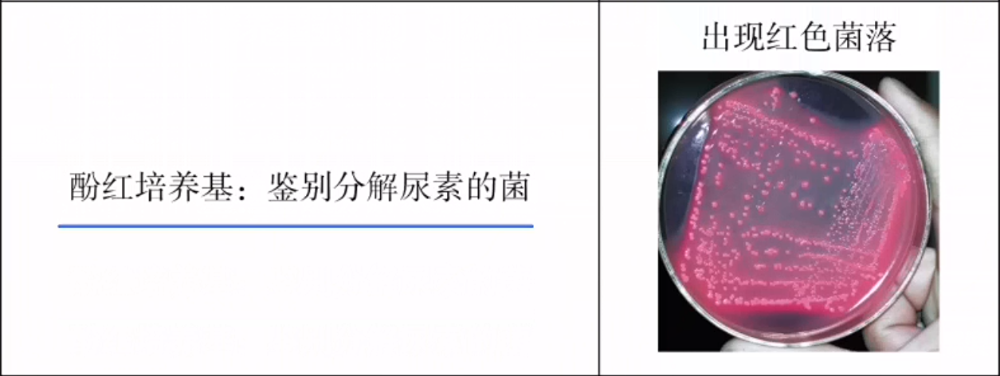
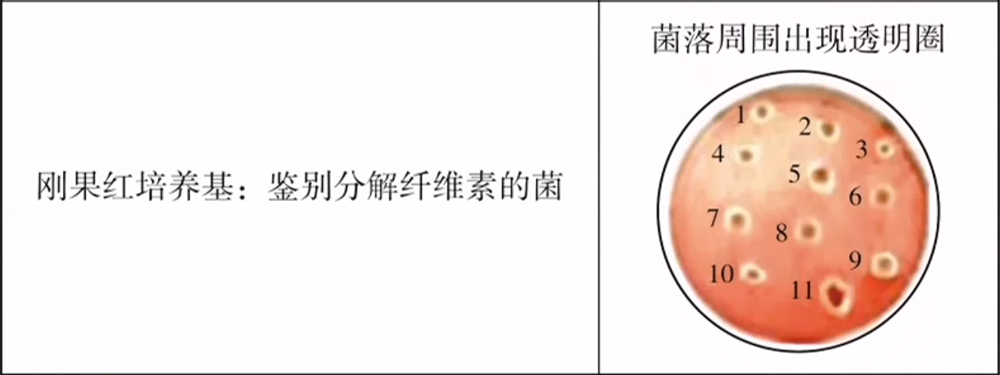

# 1

## 培养基

1. 定义：人们按照微生物对营养物质的不同需求，配制出的供其生长繁殖的营养基质。
2. 培养基中的营养物质：不同培养基的具体配方不同，但一般都含有水、碳源、氮源、无机盐和生长因子等。
   碳源：为微生物提供碳元素，可分为有机碳源和无机碳源。如$CO_2$、$NaHCO_3$等无机碳源；糖类、石油、花生粉饼等有机碳源。
   氮源：为微生物提供氮元素，可分为有机氮源和无机氮源。有机氮源包括牛肉膏，蛋白胨等，无机氮源包括$N_2$、$NH_3$、$NH_4^+$、$NO_3$等。
   生长因子：指那些微生物生长所必需而且需求量很小，但是微生物自身不能合成或合成量不足以满足机体生命需要的有机化合物。一般是酶、核酸等的组成成分。生长因子也可不单独添加，由培养基中的天然成分牛肉膏、蛋白胨等提供。
   
3. 培养基的类型
   1. 按物理状态分类
      1. 液体培养基：不加凝固剂（常用的凝固剂有琼脂、明胶等），主要用于扩大培养。
      2. 固体培养基：加入较多凝固剂，目的是获取单个菌落。
      3. 半固体培养基：加入较少凝固剂，可用于观察微生物的运动特征、菌种鉴定等。
   2. 按化学成分分类
      1. 天然培养基：含有化学成分还不清楚或化学成分不稳定的天然有机物，也称非化学限定培养基。例如：牛肉膏蛋白胨培养基、麦芽汁培养基。
         常用的天然有机营养物质包括牛肉浸膏、蛋白胨、酵母浸膏、豆茅汁、玉米粉、土壤浸液、麸皮、牛奶、血清、稻草浸汁、羽毛浸汁、胡萝卜汁、挪子汁等，嗜粪微生物可以利用粪水作为营养物质。
      2. 合成培养基：是由化学成分完全了解的物质配制而成的培养基，也称化学限定培养基。
   3. 按用途分类
      1. 基础培养基：含有一般微生物生长繁殖所需的基本营养物质，没有加入特殊物质，也没有特殊用途。
      2. 鉴别培养基：在培养基中加入某种特殊化学物质，某种微生物在培养基中生长后能产生某种代谢产物，而这种代谢产物可以与培养基中的特殊化学物质发生特定的化学反应，产生明显的特征性变化，用于微生物的鉴别。
         
         
         
      3. 选择培养基：根据微生物特殊营养需求配制培养基或加入种化学物质，以抑制不需要的微生物的生长，利于需要的微生物的生长。可用于培养、分离出特定微生物。
         例如：缺乏碳源的选择培养基可用来分离自养微生物；缺乏氮源的选择培养基可用来分离固氨微生物；利用以纤维素作为唯一碳源的选择培养基，可以从混杂的微生物群体中分离出能分解纤维素的微生物；利用以尿素为唯一氨源的选择培养基，可以分离出尿素分解菌；在培养基中加入青霉素、四环素或链霉素，可以抑制细菌和放线菌生长，从而分离出酵母菌和霉菌。
