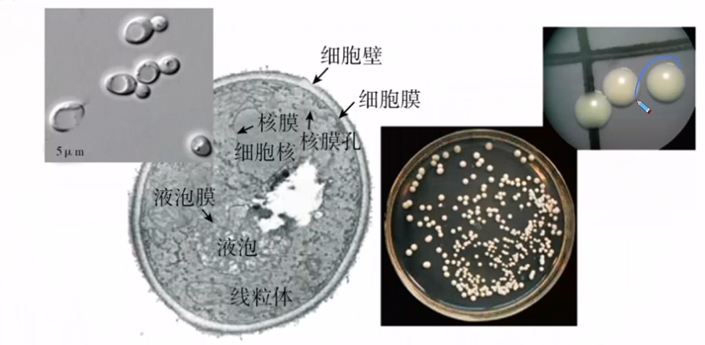
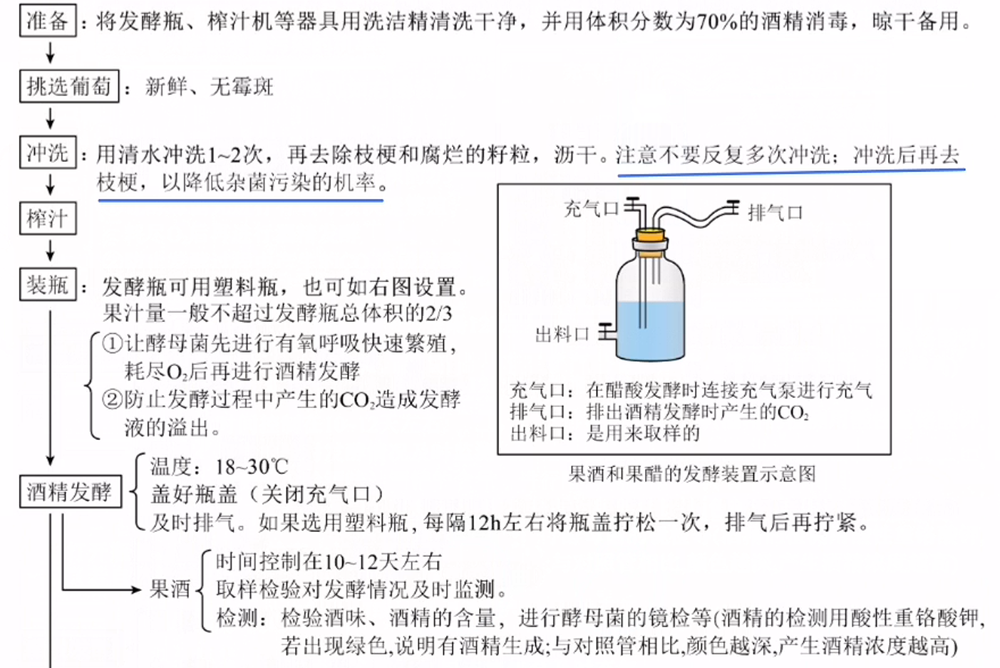
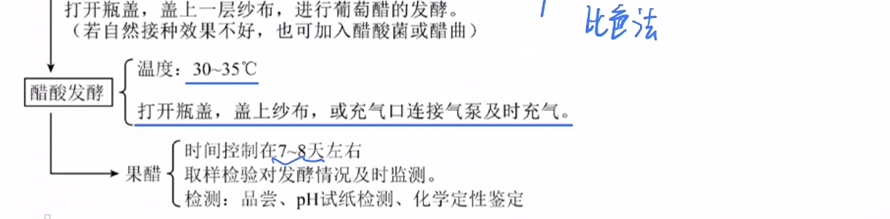
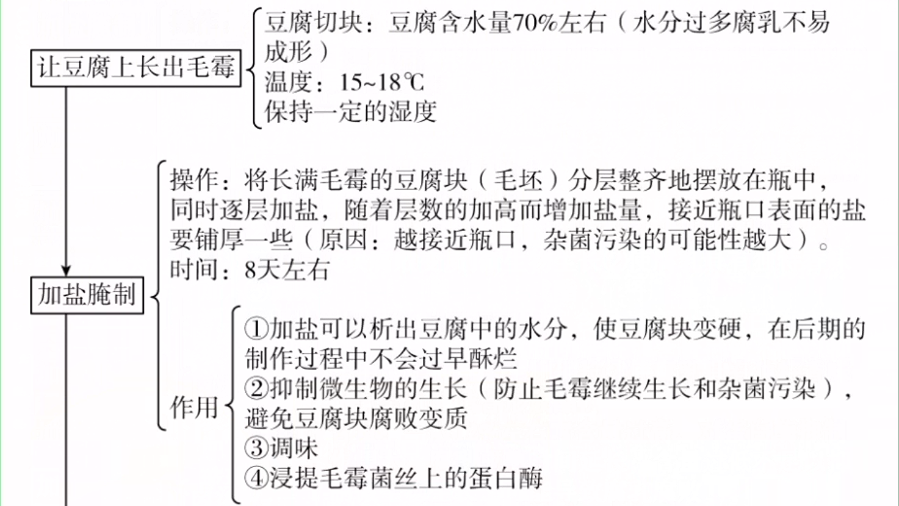
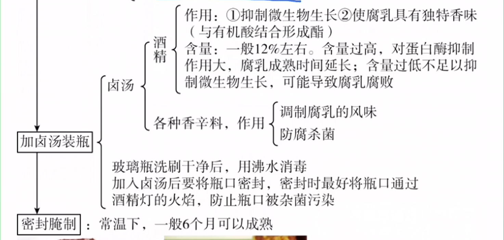
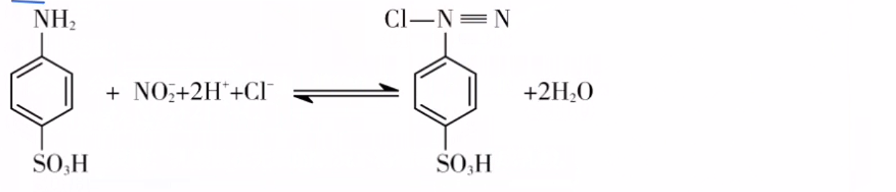
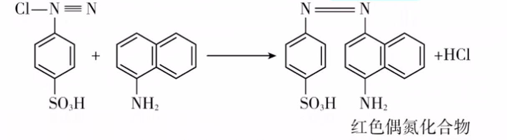
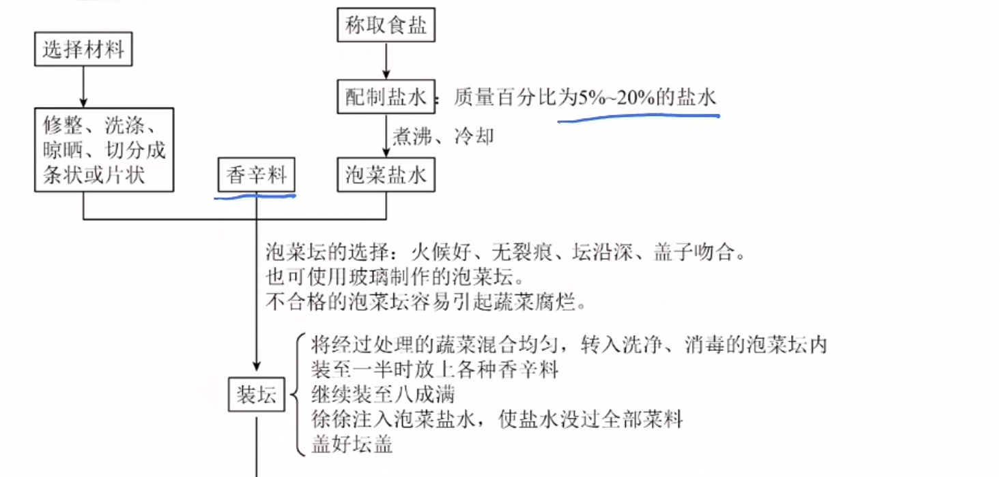

# 微生物培养与应用（二）

## 果酒和果醋的制作

> 发酵：利用微生物在适宜的条件下，将原料通过微生物的代谢转化为人类所需要的产物的过程。

1. 果酒的制作原理
   1. 菌种：酵母菌
      

      > 自然界中酵母菌分布广泛，多分布在含糖较高的偏酸环境中，如水果、花、树皮上。一年四季，土壤始终是酵母菌的大本营。

      1. 单细胞真菌，多以出芽方式进行无性生殖
      2. 代谢类型：异养兼性厌氧型
      3. 在葡萄酒自然发酵过程中，起主要作用的是附着在葡萄皮上的野生型酵母菌。
   2. 发酵条件
      1. 温度：一般控制在$18-30\degree C$，$20\degree C$左右最适合酵母菌繁殖。
      2. pH:酸性（约$5.0-6.0$）。
   3. 原理：酵母菌的呼吸作用
      1. 在有氧条件下，酵母菌进行有氧呼吸，大量繁殖：
         $$
         C_6H_{12}O_6+6O_2+6H_2O\stackrel{酶}{-\!\!-\!\!\!\!\rightarrow}6CO_2+12H_2O+能量
         $$
      2. 在无氧条件下，酵母菌能进行酒精发酵：
         $$
         C_6H_{12}O_6\stackrel{酶}{-\!\!-\!\!\!\!\rightarrow}2C_2H_5OH（酒精）+2CO_2+能量
         $$
2. 果醋的制作原理
   1. 菌种：醋酸菌
      1. 原核生物
      2. 代谢类型：异养需氧型
   2. 发酵条件
      1. 温度：醋酸菌的最适生长温度是$30一35\degree  C$。
      2. 氧气充足
   3. 果醋制作原理：醋酸菌的有氧呼吸
      1. 当氧气、糖源都充足时，醋酸菌将葡萄汁中的糖分解成醋酸。
         $$
         C_6H_{12}C_6\stackrel{酶}{-\!\!-\!\!\!\!\rightarrow}CH_3COOH
         $$
      2. 当缺少糖源时，醋酸菌将乙醇变成乙醛，再变为醋酸。
         $$
         C_2H_5OH+O_2\stackrel{酶}{-\!\!-\!\!\!\!\rightarrow}CH_3COOH+H_2O
         $$
3. 实验流程
   
   
   > 补充：
   >
   >葡萄酒制作过程中，其主要产物是乙醇和$CO2$,还有其他诸如氨基酸、小分子肽等其他有特殊香味的物质，因此葡萄酒口味独特。
   > 如果发酵装置密闭性不好，可能使产膜酵母菌在有氧条件下大量繁殖，将乙醇变为乙醛后再氧化为水和$CO_2$,从而降低酒精含量：若有效时间内酒精产量不足，便不能有效杀死（抑制）乳酸菌而使乳酸菌大量繁殖，导致葡萄酒变质；若氧气供应充足，在产膜酵母菌和醋酸菌的共同作用下，酒制成了醋。
   > 葡萄酒制作中，随发酵天数增加$CO2$越来越多，10天左右现象最明显，产热增多，使发酵液温度升高，因此必须及时排放CO2和散热。

## 腐乳的制作

1. 制作原理
   1. 菌种：起主要作用的是毛霉（多种微生物参与豆腐的发酵，如青霉、酵母、曲霉、毛霉等）。
      1. 毛霉是真菌，繁殖方式为孢子生殖；生长迅速，具有发达的白色菌丝。
      2. 代谢类型为异养需氧型。
      > 毛霉分布广泛，常见于土壤、水果、蔬莱、谷物上。传统腐乳的生产中，豆腐块上生长的毛霉来自于空气中的毛霉孢子，而现代的腐乳生产是在严格无菌的条件下，将优良毛霉菌种直接接种在豆腐上，这样可以避免杂菌的污染，保证产品质量。
   2. 原理：毛霉等微生物产生的蛋白酶能将豆腐中的蛋白质分解成小分子的肽和氨基酸，脂肪酶可将脂肪水解为甘油和脂肪酸。在多种微生物的协同作用下，普通的豆腐转变成风味独特的腐乳。
2. 实验流程
   
   

## 泡菜的制作

1. 泡菜的制作原理
   1. 菌种：乳酸菌，常见的有乳酸链球菌和乳酸杆菌。乳酸杆菌常用于生产酸奶。
      1. 原核生物
      2. 代谢类型：异养厌氧型
      3. 分布：分布广泛，空气、土壤、植物体表、人或动物的肠道内等。
   2. 泡菜的制作原理：
      乳酸菌发酵：乳酸菌在无氧的情况下将葡萄糖分解成乳酸。
      $$
      C_6H_{12}O_6\stackrel{酶}{-\!\!-\!\!\!\!\rightarrow}2C_3H_6O_3（乳酸）+能量
      $$
   3. 测定亚硝酸盐含量的原理
      盐酸酸化条件下，亚硝酸盐与对氨基苯磺酸（或对氨基苯磺酰胺）发生重氨化反应形成重氨化合物。
      
      重氨化合物再与$N-1-萘基乙二胺盐酸盐$偶合，形成玫瑰红色染料。
      
2. 实验流程
   
   
   > 注意控制腌制条件：时间、温度和食盐用量。温度过高、食盐用量过低、腌制时间过短，都容易造成细菌大量繁殖，亚硝酸盐含量增加。一般在腌制10天后，亚硝酸盐的含量开始下降。
