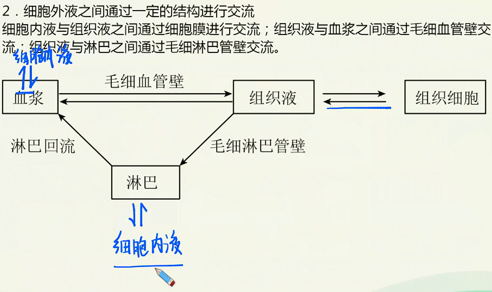
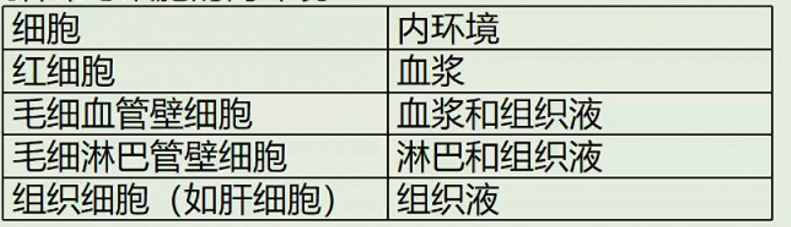

# 人休的内环境与稳态

## 内环境的概念

### 内环境的定义

动物细胞内、外的液体统称为体液。正常成年人中，体液量约占体重的$60\%$，其中水占$90\%$以上。体液中约$\frac{2}{3}$的液体存在于细胞内，称为细胞内液；其余$\frac{1}{3}$存在于细胞外，称为细胞外液。细胞生活在细胞外液中，通过细胞外液获取细胞代谢所需的$O_2$和营养物质，排出代谢废物。

为了区别于个体生活的外环境，我们把细胞直接生活的液体环境叫做内环境。

1. 内环境：机体内细胞直接生活的环境，也就是细胞外液。
2. 内环境和外环境的范围：
   1. 外环境：呼吸道、消化道、肺泡、输尿管、输卵管、子宫、生殖道等。
   2. 内环境：细胞外液，主要包括血浆、淋巴组织液。

> 【小贴士】
>
> 细胞外液不只有这三种，还有脑脊液等。
>
> 【注意】
>
> 不属于内环境的液体：
>
> 1. 各种消化液（唾液、胃液、肠液、胰液等）、泪液、汗液、尿液等；
> 2. 细胞内液。
>
> 不属于内环境的生理过程：
>
> 1. 消化、出汗、受精作用等发生在外环境的生理过程；
> 2. 细胞代谢等发生在细胞内的生理过程。

### 不同类型细胞外液之间的联系

### 细胞外液的成分

1. 细胞外液本质上是一种盐溶液，类似于海水，这在一定程度上反映了生命起源于海洋。
2. 血浆的主要成分包括：水、无机盐、蛋白质、各种营养物质（如葡萄糖、氨基酸）、各种代谢产物（如尿素）、气体($O_2$、$CO_2$)、激素等。
3. 组织液、淋巴的成分和含量与血浆相近，但又不完全相同，这是因为毛细血管壁和毛细淋巴管壁具有选择透过性。大分子蛋白质只能由组织液经淋巴回流汇入血浆，而不能由血浆渗出到组织液。
   组织液、淋巴与血浆成分的主要区别在于：血浆中含有较多的蛋白质，而组织液和淋巴中蛋白质含量很少。
4. 正常情况下不存在于内环境的物质：
   1. 外环境成分：纤维素、各种消化酶（如胃蛋白酶等）。
   2. 细胞内成分：胞内酶（如呼吸酶、DNA聚合酶）、血红蛋白等。

### 细胞外液之间水分的交流（渗透问题）

1. 组织水肿及其成因分析
   组织水肿是在不同条件下，组织液浓度升高或血浆、细胞内液浓度下降，引起水分移动，使血浆、细胞内液中的水渗透到组织液引起的水肿现象。

   组织水肿的常见原因归纳如下：
   1. 营养不良时，血浆蛋白或细胞内蛋白质减少，使血浆浓度降低或细胞内液浓度下降，水分进入组织液。（全身水肿）
   2. 淋巴回流受阻，组织液中大分子蛋白质不能通过淋巴回流至血浆而使组织液浓度升高。
   3. 局部组织细胞代谢旺盛，代谢产物增加，引起组织液浓度升高。（局部水肿)
   4. 肾小球肾炎，导致血浆蛋白透出而流失。（全身水肿
   5. 过敏反应中组织胺的释放引起毛细血管壁通透性增高，血浆蛋白进入组织液使其浓度升高，吸水造成水肿。

> 注意事项：
>
> 1. 几种常考细胞的内环境
>    
> 2. 内环境的物质成分指存在于血浆、淋巴和组织液等中的物质成分可分为三类：
>    1. 小肠吸收的需要在血浆和淋巴中运输的物质，如水、无机盐、葡萄糖、氨基酸、甘油、脂肪酸、维生素等。
>    2. 细胞合成的分泌蛋白（如抗体、淋巴因子）、神经递质、激素等。
>    3. 细胞的代谢产物，如$CO_2$、水、尿素等。
> 3. 不存在内环境中的物质一般指存在于细胞内的物质和分泌到人体外部环境中的物质，可分为三类：
>    1. 细胞合成的结构蛋白，如血红蛋白、载体等
>    2. 胞内酶，如DNA聚合酶，RNA聚合酶、呼吸酶等。
>    3. 人的呼吸道、肺泡腔、消化道、泪腺等有孔道与外界相通应。算作人体外部环境，如尿液、原尿、消化液等不是细胞外液。
> 4. 发生在内环境的生理过程
>    1. 乳酸与碳酸氢钠作用生成乳酸钠和碳酸实现ρH的稳态
>    2. 兴奋传导过程中神经递质与受体结合
>    3. 免疫过程中抗体与相应的抗原特异性结合
>    4. 激素与靶细胞的结合
> 5. 不发生在内环境的生理过程
>    1. 细胞内的呼吸各阶段发生的生理过程
>    2. 细胞内蛋白质、神经递质、激素等物质的合成过程
>    3. 消化道内外部环境所发生的淀粉、脂质、蛋白质的消化水解过程

## 内环境的生理意义素

1. 内环境是细胞与外界环境进行物质交换的媒介。

   

> 【知识梳理】
> 内环境稳态的调节机制——神经-体液-免疫调节网络
>
> 1. 直接参与物质交换的系统：消化系统、呼吸系统、循环系统、泌尿系统和皮肤
> 2. 起调节作用的系统：神经系统、内分泌系统和免疫系统
>
>    
