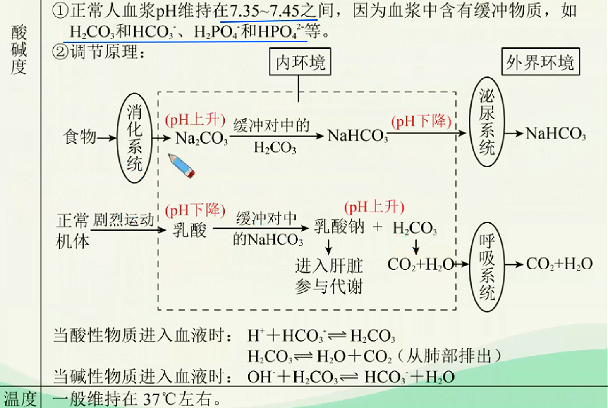
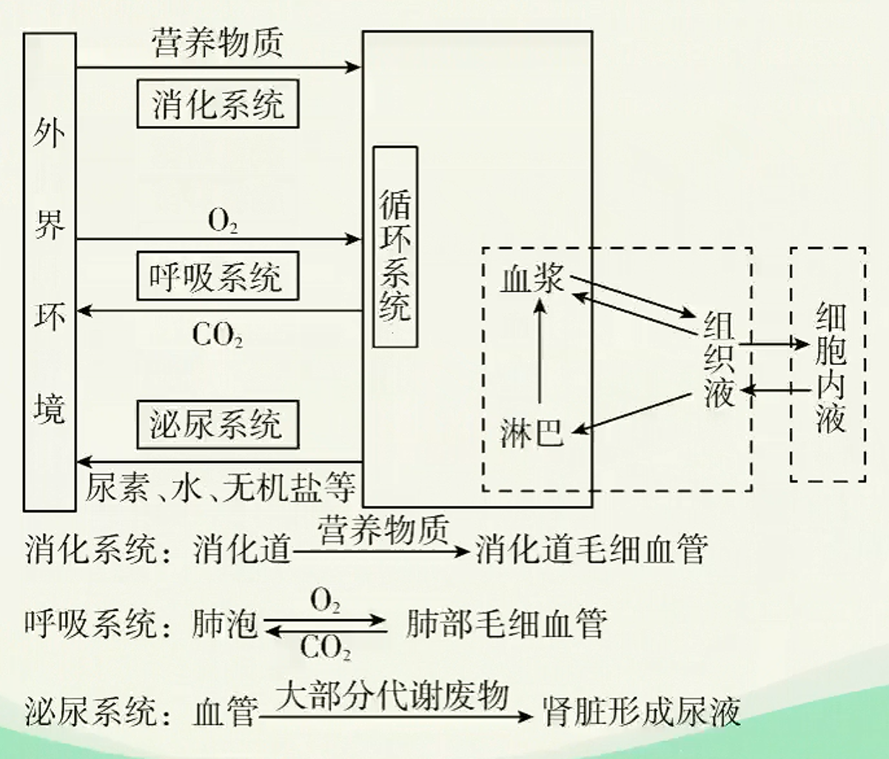
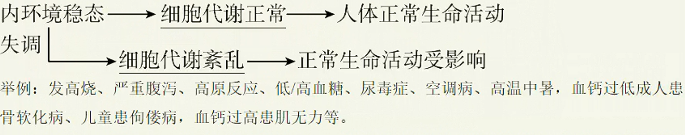
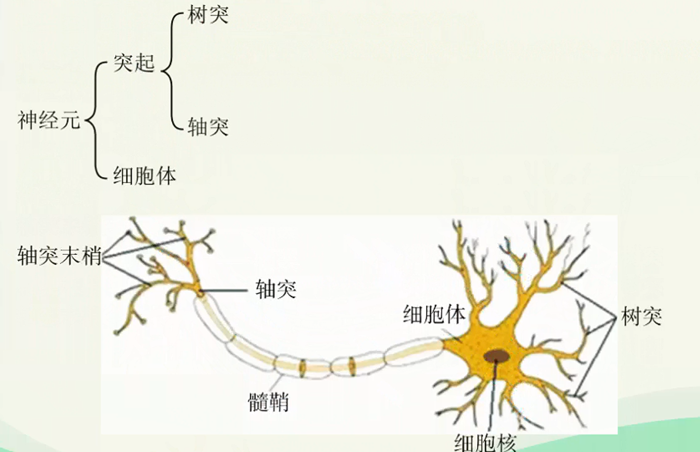
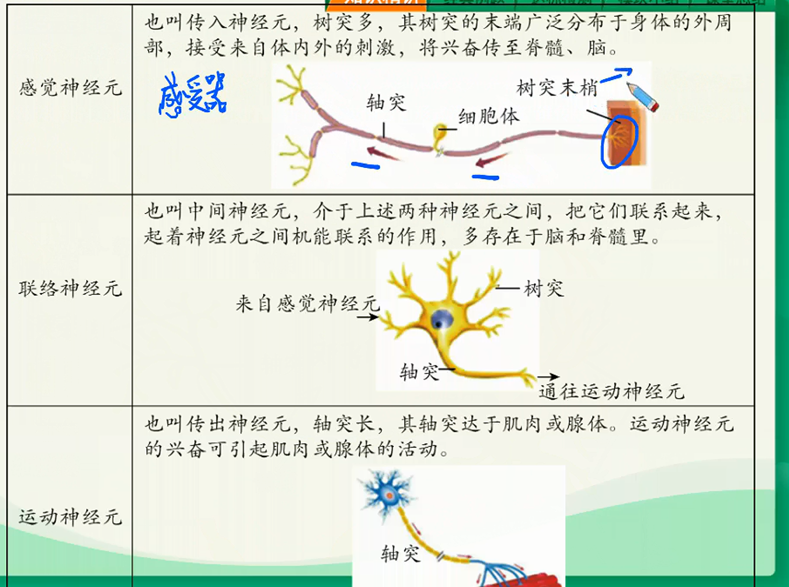
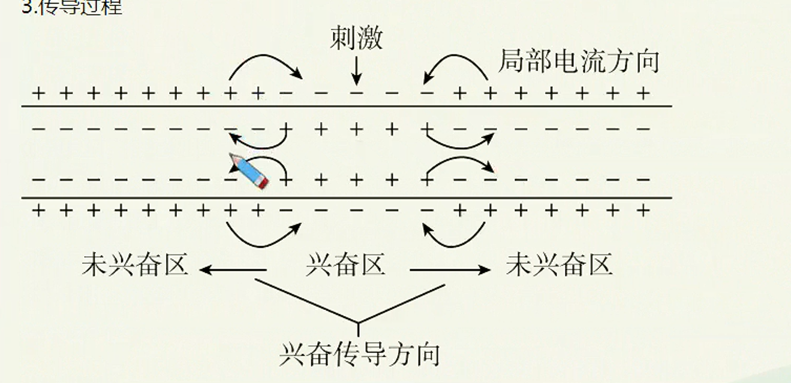
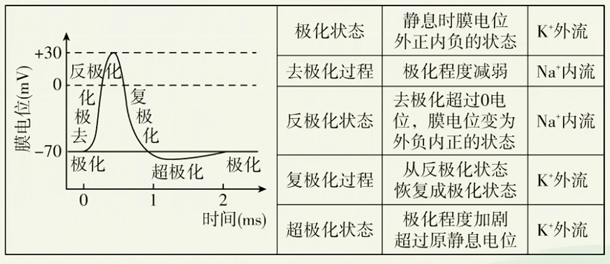
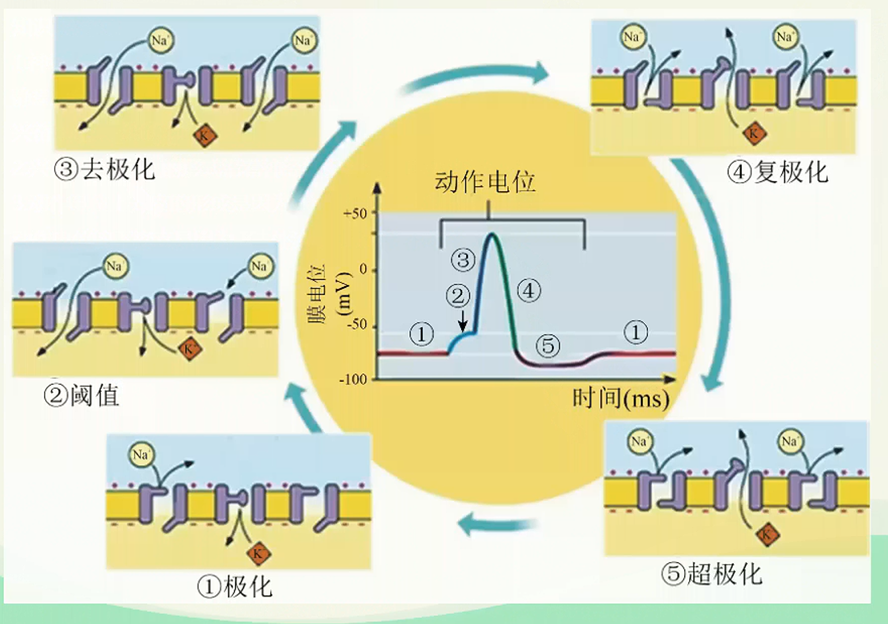

# 神经调节深化进阶（一）

## 稳态

### 内环境稳态

1. 定义：正常机体通过调节作用，使各个器官、系统协调活动，共同维持内环境
的相对稳定状态叫做稳态。

2. 实质：化学成分及其含量和理化性质的动态平衡。
   1. 化学成分的动态平衡
      1. 含量：如血糖浓度一般维持在80~120mg/dL。
      2. 种类：机体能识别内环境中“自己”和“异己”的成分，异物如病原体、毒素等不是内环境的正常成分。
   2. 渗透压：
      1. 定义：指溶液中溶质微粒对水的吸引力。溶液渗透压的大小取决于单位体积溶液中溶质微粒的数目。
      2. 影响血浆渗透压大小的因素：主要与无机盐、蛋白质的含量有关。
      3. 来源：细胞外液渗透压的90%以上来源于Na、CI。
      4. 人体细胞外液正常的渗透压为770kPae
   

3. 调节机制：神经一体液一免疫调节网络。
   1. 在内环境稳态的维持中，直接参与物质交换的器官和系统包括：消化系统、呼吸系统、循环系统、泌尿系统和皮肤。
   
   2. 循环系统：血液是所有生命活动的中转站，血浆是内环境中最活跃的部分，它的成分能充分反映机体的健康状况。

4. 内环境稳态的重要意义：为体内细胞提供了一个相对稳定的环境，是机体进行正常生命活动的必要条件。
5. 内环境稳态失调
   1. 直接原因：外界环境变化过于剧烈，或人体自身调节功能出现障碍。
   2. 根本原因：人体维持稳态的调节能力有一定的限度。
   

## 神经元与反射

### 神经调节的结构基础

1. 神经系统
如图，人的神经系统由中枢神经系统和周围神经系统两部分组成。中枢神经系统由位于颅腔内的脑和位于脊椎管内的脊髓组成，是信息集成处理器；周围神经系统分布于全身，包括与脑相连的脑神经和与脊髓相连的脊神经。

### 神经元

神经元是神经系统基本的结构和功能单位。

1. 神经元的一般结构
   
2. 神经元的功能：感受刺激产生兴奋传导兴奋。
   兴奋指动物或人体内的某些组织（如神经组织）或细胞感受外界刺激后，由相对静止状态变为显著活跃状态的过程。在神经系统中，兴奋是以电信号的形式沿着神经纤维传导的，这种电信号也叫神经冲动。
   

### 神经调节的基本方式一反射

1. 反射的定义：在中枢神经系统参与下，动物体或人体对体内外环境变化作出的规律性应答。
2. 反射弧的基本结构
   反射弧是从接受刺激到发生反应，兴奋在神经系统内循行的路径。
   | 结构名称 | 结构组成 | 分布部位 | 功能 |
   | --- | --- | --- | --- |
   | 感受器 | 感觉神经末梢（树突） | 周围神经系统 | 接受体内外的刺激，将其转化为兴奋 |
   | 传入神经 | 感觉神经纤维 | 周围神经系统 | 将感受器产生的兴奋传至神经中枢 |
   | 神经中枢 | 中间神经元和突触 | 神经中枢系统 | 对传入的信息进行分析和综合 |
   | 传出神经 | 运动神经纤维 | 周围神经系统 | 将神经中枢的兴奋传至效应器 |
   | 效应器 | 运动神经末梢（轴突）和它所支配的肌肉或腺体等 | 周围神经系统 | 对刺激作出应答反应 |

3. 反射的神经过程

   ```mermaid
   graph TD;
       A[刺激] --> B[感受器：接受体内外的刺激，将之转化为兴奋];
       B --> C[兴奋];
       C --> D[传入神经：沿着传入神经向神经中枢传导];
       D --> E[神经中枢：对传入的信息进行分析和综合];
       E --> F[兴奋];
       F --> G[传出神经：把神经中枢的兴奋传到效应器];
       G --> H[效应器：对刺激作出应答反应];
       H --> I[反应];
   ```

4. 反射发生的条件
   1. 一定强度的刺激
   2. 反射弧结构和功能完好

5. 类型
   1. 非条件反射：先天的、没有大脑皮层参与
   2. 条件反射：后天的、有大脑皮层参与

## 电信号

### 神经冲动的产生

正常生理状态下，由于细胞膜的选择透过性（N一K泵的主动运输作用）导致细胞膜内K浓度高于膜外，Na浓度低于膜外。

   1. 静息时，神经细胞膜主要对$K^+$有通透性，$K^+$顺浓度梯度扩散至细胞外，形成外正内负的静息电位。细胞内的负离子无法通过细胞膜，聚集于膜内表面，这样（跨膜电场）使$K^+$不会扩散太远，而是局限于膜外表面，所以静息电位仅存在于膜内外两侧很小的范围内。
   2. 静息时$K^+$的外流不会导致神经细胞内液中$K^+$浓度明显下降，因为$Na^+-K^+$泵耗能持续将$K^+$主动运输至细胞内，始终维持细胞内液中$K^+$浓度高于细胞外。
   3. 兴奋电位：受刺激时，细胞膜对$Na^+$的通透性（$Na通道的协助扩散作用）增加，Na内流，使兴奋部位膜内阳离子浓度高于膜外。兴奋部位膜两侧电位变为：外负内正。相邻未兴奋部位仍是：外正内负。

### 神经冲动的传导

1. 传导方式：局部电流（电信号）
2. 传导方向：双向。即刺激神经纤维上任何一点，所产生的神经冲动可沿神经纤维同时向两侧传导。
3. 传导过程
   
   1. 未受刺激时，神经纤维处于静息状态，细胞膜两侧电位为：外正内负。
   2. 神经纤维某部位受刺激，该部位兴奋，细胞膜两侧电位变为：外负内正。
   3. 由于兴奋和未兴奋部位存在电位差，发生电荷移动，（在膜的同侧）形成局部电流。
   4. 这种局部电流又刺激相邻的未兴奋部位发生相同电位变化，兴奋向前传导下去，后方又恢复为静息电位。
4. 动作电位
动作电位是指细胞受到一个有效刺激时膜电位在静息电位的基础上发生的一次快速的、可向远端传播的电位波动。

> 兴奋是指产生动作电位的过程或动作电位的同义词。
> 细胞膜上某一处的动作电位的产生
> 
> 
> 