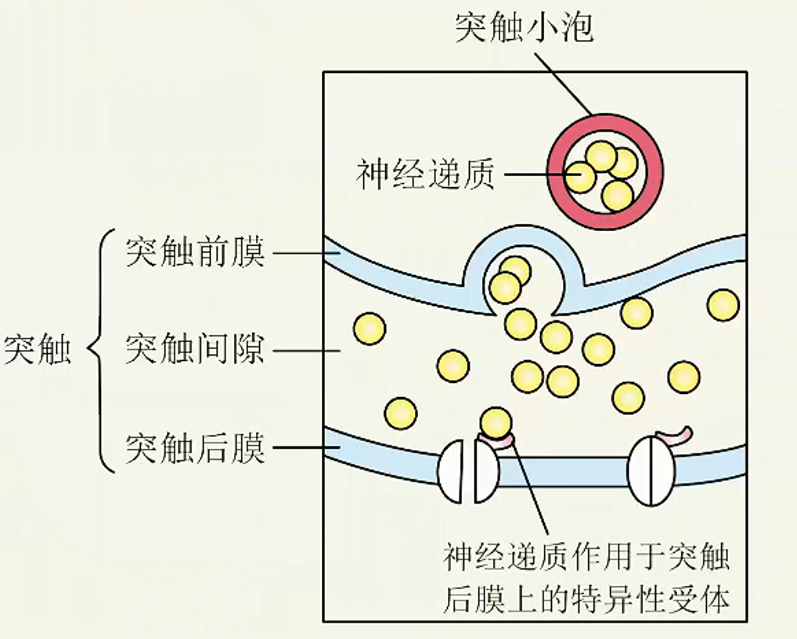
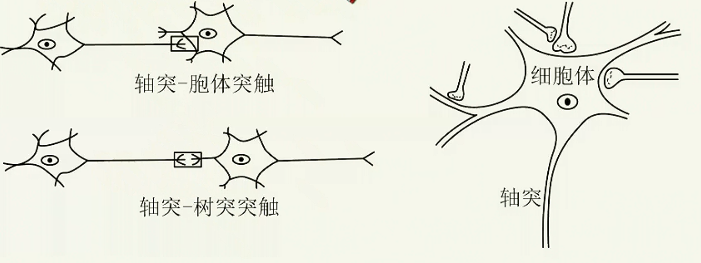
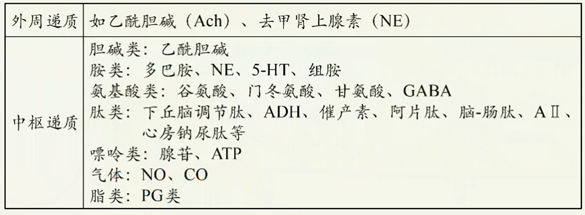
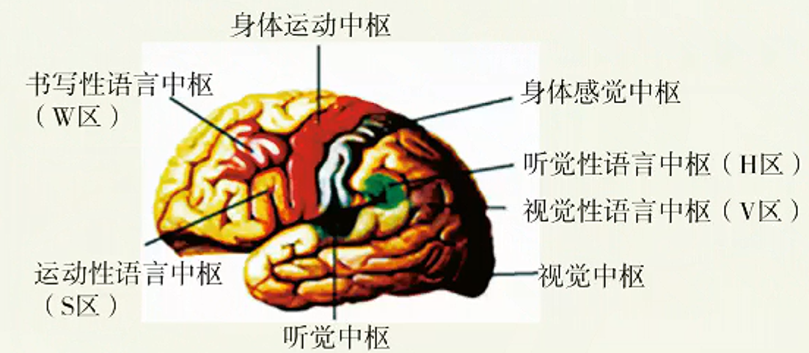

# 神经调节深化进阶（二）

## 神经递质的传递

1. 结构基础：突触
   
2. 传递方式：神经递质的传递（化学信号）
3. 突触传递的特点
   1. 单向传递：神经递质只能由突触前膜释放，作用于突触后膜。
   2. 突触延搁：兴奋在突触处的传递比在神经纤维上的传导慢。因此，一次反射活动完成的时间长短主要取决于相应反射弧中突触数目的多少。
   3. 突触疲劳：高频率的神经冲动持续通过突触，可以使突触前神经末梢内的递质释放速度大于合成速度，导致神经递质耗竭，使信息通过突触的效率下降。
   4. 总和：在兴奋性突触传递时，一般单个突触小体的兴奋不足以引起下一神经元的兴奋，只有当与下一神经元连接的多个突触小体同时兴奋（空间总和），或一个突触小体以适当快的速度连续兴奋（时间总和）时，才能引起下一神经元兴奋。在抑制性突触传递时，抑制也可以总和，使后神经元不易兴奋。
   5. 对内环境变化敏感：在反射活动中，突触是最易受内环境变化影响的环境。例如，离子浓度的改变、神经递质失活障碍以及神经递质与受体结合障碍等等。基于这一点，人们可以设计药物影响突触的传递过程。
   > **【知识点落实】**
   >
   > 1. 突触处信号转换的方式为：电信号→化学信号→电信号。
   > 2. 神经递质作用于突触后膜，引起突触后膜去极化，发生动作电位，突触后神经元兴奋。
4. 突触的种类
   1. 按接触部位分类
      可分为轴突-树突突触、轴突-胞体突触。运动神经末梢和它控制的肌肉、腺体细胞间也通过突触连接。
      
   2. 按功能分类
      1. 兴奋性突触：使突触后膜去极化，引起突触后神经元或效应细胞（如骨骼肌）兴奋。
      2. 抑制性突触：使突触后膜超极化（主要是$Cl^-$内流导致），引起突触后神经元抑制。
5. 神经递质的种类
   
6. 兴奋在完整反射弧上的传导和传递
   在整个反射弧中，沿神经纤维传导的兴奋是电信号（局部电流）的形式；当兴奋经过突时以化学信号（神经递质）的形式传递。

## 神经中枢间的关系；大脑的高级功能

1. 各反射弧神经中枢的分布位置
   脊椎动物和人的中枢神经系统包括脑和脊髓，它们含有大量的神经元，组合成许多不同的神经中枢，分别调控某一特定的生理功能。
   | 部 位 | 神经中枢 |
   | --- | --- |
   | 大脑 | 躯体感觉中枢、躯体运动中枢、听觉中枢、视觉中枢等；语言、学习、记忆和大脑思维等高级功能中枢 |
   | 小脑 | 维持身体平衡的中枢 |
   | 脑干 | 维持生命必要活动的中枢，如呼吸中枢、内脏活动中枢 |
   | 下丘脑 | 体温调节中枢、水平衡调节中枢、血糖平衡调节中枢、生物节律的调节中枢 |
   | 脊髓 | 调节躯体运动的低级中枢，如膝跳反射、肌缩反射、眨眼反射、排尿反射等 |
2. 神经系统的分级调节
   1. 一般来说，位于脊髓的低级中枢受脑中相应高级中枢的调控。
   2. 大脑皮层对低级中枢的控制
   - 实例1：排尿反射
     - 尿在肾脏不断生成，经输尿管流入膀胱暂时贮存。当膀胱储尿量达到一定程度时，兴奋传至大脑皮层相应感觉区引致。控制排尿的初级中枢在脊髓。一般成年人可以有意识地控制排尿，即可以“憋尿”，在适宜的环境下才排尿；但婴儿经常尿床。有些人由于外伤等使意识丧失，出现小便失禁现象。
   - 实例2：缩手反射
     - 平时，不小心手被刺扎了一下，会迅速缩回，这是机体的自我保护机制，防止机体受到外界刺激的伤害，缩手反射的低级中枢在脊髓。但在体检抽血时，人们却能够忍痛不缩手，这要受到大脑皮层相应区域的控制。
   - 实例3：肺的牵张反射
     - 呼吸中枢位于脑干，大脑皮层可以一定程度上调控呼吸，如屏住呼吸。
3. 大脑的高级功能
   1. 大脑皮层是整个神经系统最高级的部位，它除了对外部世界的感知以及控制机体的反射活动外，还有言语、学习、记忆和思维等方面的高级功能。
   2. 大脑的高级功能包括语言中枢（言语区）。语言功能是人脑特有的高级功能，包括与语言、文字相关的全部智力活动，涉及听、说、读、写。
      > 人脑的语言区是后天逐渐建立的，研究显示，使用不同母语的人，其大脑语言区的分布有区别。
      >
      > 
   3. 条件反射与非条件反射
      非条件反射：只要反射弧完整，在相应的刺激下，不需要后天的训练就能引起的反射。
      条件反射：在一定条件下，外界条件刺激与生物体之间建立起来的暂时神经联系，是后天形成的反射。
