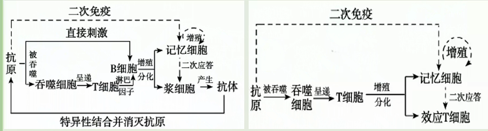

# 免疫调节深化进阶（一）

## 人体的三道防线

1. 免疫系统的组成
   
2. 免疫细胞的分化
   

### 免疫的定义

免疫是机体免疫系统生理功能的表现，其作用是识别“自己”和“异己”成分，并对“异己”成分产生排斥。人体依靠免疫系统消灭入侵的病原体或清除体内衰老、破损以及异常的细胞，维持机体的生理平衡。

### 免疫系统的功能

1. 防卫功能：防止外界病原体的入侵及抵抗已入侵的病原体和有害的分子。这部分功能由人体的三道防线完成。
2. 监控和清除功能：免疫系统监督机体内环境出现的衰老细胞、突变细胞及早期肿瘤，并予以清除。免疫功能过弱可导致肿瘤的发生。这部分功能主要依靠细胞免疫完成。

### 人体三道防线

1. 第一道防线
| 组成和防御机制 | 体表的物理屏障、皮肤和黏膜以及其分泌物的化学防御。                                                                                                                                                                                              |
|:---------:|:------------------------------------------------------------------------------------------------------------------------------------------------------------------------------------------------------------------------|
| 举例      | 皮肤的角质层使病原体难以在此入侵和生存； 寄居皮肤的正常菌群一般不致病，而是对病原菌有抑制作用； 汗液、泪液和唾液中都含有溶菌酶，能破坏一些细菌的细胞壁： 呼吸道纤毛的摆动能把吸附在黏液中的微生物、颗粒物等排出体外，或通过吞咽经消化道排出； 血脑屏障：阻挡病原体及其毒性物质从血流进入脑组织和脑脊液保护中枢神经系统 胎盘屏障：不妨碍母体与胎儿间的物质交换，但能阻止母体可能存在的病菌通过。 |

2. 第二道防线

如果病原体突破第一道防线进入了内环境，被侵害局部往往汇集大量的吞噬细胞和杀菌物质（如溶
菌酶、白细胞介素等），这些构成人体的第二道防线，阻止病原体继续入侵。

| 组成和防御机制 | 吞噬细胞的吞噬作用以及体液中的杀菌物质（如溶菌酶） |
|:---------:|:---------------------------|
| 举例      | 局部炎症反应。                   |

3.第三道防线

| 组成和防御机制 | 由免疫器官和免疫细胞借助血液循环和淋巴循环而组成， 包括体液免疫和细胞免疫作用 |
|---------|---------------------------------------------|
| 举例      | 患流感后一般7天左右痊愈 被SARS病毒侵染后患严重急性呼吸综合症。       |

### 非特异性免疫与特异性免疫

1. 非特异性免疫：又称先天性免疫，是生物体在长期进化中形成的一系列防卫机制。这种免疫先天就有，对各种病原体都有一定程度的防御作用，没有特殊的针对性。非特异性免疫由机体的第一、二道防线完成。
2. 特异性免疫：又称获得性免疫，是当机体与外来侵染物接触之后才获得的免疫作用。这种获得的免疫性由外来侵染物诱发，且对侵染物具有特异性。特异性免疫由机体的第三道防线完成。

## 特异性免疫

### 抗原和抗体

1. 抗原
   1. 定义：指能够引起机体产生特异性免疫反应的物质。如病毒、细菌等病原体表面的蛋白质等物质都可以作为抗原，外原细胞、组织、器官以及自身癌变的细胞，衰老、死亡、损伤的细胞等也可以成为抗原。
   2. 特性：异物性、大分子性、特异性
      | 异物性  | 一般是进入人体的外来物质，如：细菌、病毒、花粉等。而体内的正常细胞则不具有抗原性。体内细胞发生变异也能成为抗原，如癌细胞、衰老的细胞                      |
      |:------|:-----------------------------------------------------------------------------------------|
      | 大分子性 | 通常都是相对分子质量大于一万的物质。如：蛋白质、核酸和多糖等。小分子物质单独不能诱导产生免疫应答，但当它们与大分子物质连接后，就能诱导机体产生免疫应答，并能与相应的抗体结合。 |
      | 特异性  | 一种抗原只能与相应的抗体或效应T细胞发生免疫反应                                                                |

      > $MHC$:
      >
      > 人体所有细胞的细胞膜上都有一种叫做主要组织相容性复合体的分子标志，这是一种特异的糖蛋白分子。这种主要组织相容性复合体在胚胎发育中产生，所有的身体细胞上都存在。这个标志是每一个人特有的身份标签。每一个人的白细胞都认识这些自身的身份标签，在正常情况下不会攻击带有这些标签的自身的细胞。$MHC$可绑定由病原体衍生的肽链，在细胞表面显示出病原体，以便于$T$-细胞的识别，并执行一系列免疫功能，人类的$MHC$通常被称为$HLA$，即人类白细胞抗原。
      >
      > $MHC \  Ⅰ$:位于一般细胞表面
      >
      > $MHC \  Ⅱ$：只位于抗原提呈细胞（$APC$）上，如巨噬细胞等

   

2. 抗体
   1. 定义：指机体的免疫系统在抗原的刺激下，由B淋巴细胞或记忆细胞增殖分化成的浆细胞所产生的、可与相应抗原发生特异性结合的免疫球蛋白。
   2. 分布：主要分布在血清中，也分布于组织液及外分泌液中。包括凝集素和抗毒素两类。

### 特异性免疫的过程

1. 体液免疫
   1. 大多数种类的病原体（如非胞内寄生菌、毒素分子等）经过吞噬细胞等的摄取和处理，暴露出这种病原体所特有的抗原，将抗原传递给辅助性T细胞（$Th$）。$Th$膜表面的特异性受体识别抗原后，$Th$活化，在膜表面表达特定的信号分子，并释放淋巴因子。已经接触过该抗原的$B$细胞膜表面的特异性受体识别$T$膜信号分子，同时接受淋巴因子的刺激，$B$细胞活化，开始一系列的增殖分化。
   2. 大部分$B$细胞分化为浆细胞，产生抗体（浆细胞寿命很短，经过几天产生大量抗体后就死去，每个浆细胞每秒能产生$2000$个抗体）。小部分形成记忆细胞。
   3. 浆细胞分泌的抗体与抗原特异性结合，发挥免疫作用。

   > 效应$T$细胞通过释放穿孔素、颗粒酶等物质，改变靶细胞膜的通透性；并通过膜分子信号使靶细胞的凋亡机制启动，双管齐下，使靶细胞裂解死亡。效应$T$细胞能释放淋巴因子（白细胞介素、干扰素等）。淋巴因子通过加强各种有关细胞的作用来发挥免疫效应，其中白细胞介素-$2$能诱导产生更多的效应$T$细胞，增强效应$T$细胞的杀伤力，干扰素可干扰病毒在靶细胞内的复制，增强吞噬细胞的活性。
   注意：
   > 老课本
   >
   > 不具有识别能力的细胞：$T$细胞、浆细胞、吞噬细胞
   > 不具有特殊识别能力的细胞：浆细胞、吞噬细胞
   > 能够增殖分化的细胞：$T$细胞、$B$细胞、记忆$B$细胞、记忆$T$细胞
   >
   > 新课本
   >
   > 抗原提呈细胞（$APC$）在老课本中指吞噬细胞。

2. 细胞免疫
   

3. 体液免疫和细胞免疫的关系
   体液免疫和细胞免疫各有其独特的作用，又相互配合，共同发挥免疫效应。
   当细菌、病毒等病原体侵入人体后，首先诱发体液免疫。$Tc$细胞不能直接识别入侵的抗原，只有当病原体侵入宿主细胞，细胞表面出现了$抗原-MHC-Ⅰ$复合物时，$Tc$细胞才能识别，进而引发细胞免疫反应，效应$T$细胞使靶细胞裂解，暴露隐藏其中的病原体，再通过体液免疫将其清除。对于外毒素，发挥作用的主要是体液免疫；对于胞内寄生菌和衰老病变的细胞，则主要由细胞免疫发挥作用。
