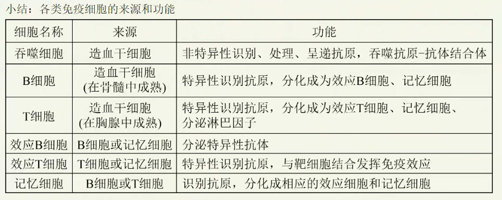
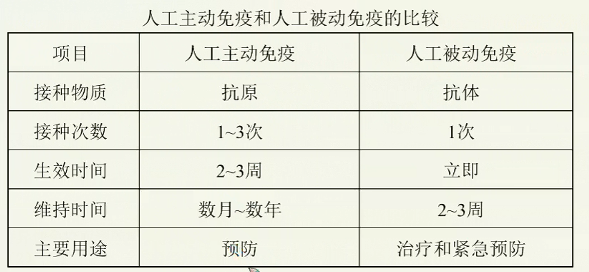
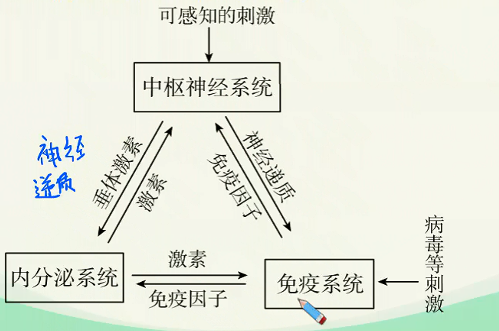

# 免疫调节深化进阶（二）

## 二次免疫与应用

### 二次免疫

1. 记忆细胞
   在初次免疫的过程中，一部分$B$细胞、$T$细胞在分化成效应细胞前就中途停留下来，由于这部分细胞曾经受过抗原刺激，留下了“免疫记忆”，把这部分细胞叫做记忆细胞。
   记忆细胞通过血液和淋巴循环随时“监察”，数月乃至数年之后如有同种抗原再次侵入机体细胞，记忆$B/T$细胞就会迅速增殖分化形成浆细胞/效应$T$细胞，参与更强的二次免疫反应，同时形成部分新的记忆$B/T$细胞。
   记忆细胞寿命较长，某些抗原诱发产生的记忆细胞可对该抗原记忆终生，因而使动物或人体对该抗原具有终生免疫能力。如天花、麻疹、伤寒、百日咳等疾病，患者痊愈后终生不再感染。
2. 二次免疫反应的特点
   二次免疫时记忆细胞比$B/T$细胞更快做出反应，快速生成大量效应细胞和产生大量抗体（抗体量可达初次反应的$100 \sim 1000$倍），因此二次免疫反应的特点是：更快、更强。
   初次和二次免疫反应过程中抗体的浓度变化和患病情况如下图：
   

   > 机体初次接触抗原后，在一段时期内体内查不到抗体或抗体产生很少，这一时期称为潜伏期，又称为诱导期。潜伏期的长短视抗原的种类而异，如细菌抗原一般经$5\sim7$血液中才出现抗体，病毒抗原为$3 \sim 4d$,而毒素抗原则需$2 \sim 3$周才出现抗体。潜伏期之后为抗体的对数上升期，抗体含量直线上升，抗体达到高峰需$7 \sim 10d$,然后为高峰持续期，抗体产生和排出相对平衡，最后为下降期。
   >
   > 二次免疫有以下特点：潜伏期显著缩短，抗体水平很快上升，$3 \sim 5d$抗体水平即可达到高峰；抗体含量高，而且维持时间长。
   >
   > 

### 应用：免疫预防

特异性免疫的获得方式有自然免疫和人工免疫。

$$
\begin{cases}
   自然免疫
   \begin{cases}
      自然被动免疫：婴儿经胎盘或乳汁从母体获得抗体\\
      自然自动免疫：机体感染病原体后获得的特异性免疫
   \end{cases}\\
   人工免疫
   \begin{cases}
      人工主动免疫：接种抗原使机体获得特异性免疫。\\
      人工被动免疫：注射含抗体的血清或细胞因子等制剂。
   \end{cases}
\end{cases}
$$

1. 人工主动免疫
   1. 定义：人工主动免疫也称人工自动免疫，是利用抗原刺激，使机体自身产生抗体，获得特异性免疫而预防感染的措施。
   2. 特点：接种后需要经过较长时间才能获得，但能长久甚至终生保持，对随后的感染有高度抵抗的能力，且通过注射所需抗原很容易再活化。
   3. 疫苗种类：灭活疫苗、减毒疫苗、类毒素。
2. 人工被动免疫
   1. 定义：机体被动接受抗体、致敏淋巴细胞或其产物所获得的特异性免疫能力。机体中的抗体不是自己产生而是从外界获得的。
   2. 特点：效应快，一经输入立即可获得免疫力，但由于免疫物质并非接种者自己产生，缺乏补充来源，且易被清除，故维持时间较短，约2~3周。
   3. 疫苗种类：抗毒素、人免疫球蛋白制剂、细胞因子制剂。

## 免疫失调

### 过敏反应

1. 定义：已免疫的机体，在再次接受相同的抗原时所发生的组织损伤或功能紊乱。常见过敏原有：花粉、室内尘土、鱼、虾、牛奶、蛋类、青霉素等。
2. 反应特点：发作迅速、反应强烈、消退较快；一般不会破坏组织细胞，也不会引起组织严重损伤；有明显的遗传倾向和个体差异。
   
3. 预防措施：找出过敏原，尽量避免接触过敏原。

### 自身免疫病

1. 定义：免疫系统异常敏感、反应过度，“敌我不分”地将自身物质当做外来异物进行攻击而引起的疾病。
2. 实例：系统性红斑狼疮、风湿性心脏病、类风湿性关节炎、重症肌无力等。
   > 1. 酿脓链球菌可以引发咽炎、扁桃体炎，但由于该菌的表面结构与心脏瓣膜上的一种物质的结构非常相似，因此，当人体产生抗体消灭该菌时，也会攻击心脏瓣膜，从而导致风湿性心脏病。实际上，自身免疫病也是一种过敏反应。
   > 2. 重症肌无力是一种慢性自身免疫性疾病，主要原因是机体产生乙酰胆碱受体抗体与乙酰胆碱受体结合，使神经-肌肉接头处兴奋的传递受阻，不能将信号指令正常传递到肌肉，使肌肉丧失了收缩功能。

### 免疫缺陷病

1. 定义：由于免疫器官、免疫细胞或免疫活性物质（抗体、淋巴因子和细胞膜表面分子等）发生缺陷引起的免疫功能失常、缺失或降低，导致机体防御能力普遍或部分下降的一组临床综合征。
2. 类型
   1. 先天性免疫缺陷病：又称原发性免疫缺陷病。与遗传因素有关多发生在婴幼儿，症状为出现反复感染，严重时威胁生命。常见的有先天性胸腺发育不全等。
   2. 获得性免疫缺陷病：又称继发性免疫缺陷病。可发生在任何年龄，多因严重感染，尤其是直接侵犯免疫系统的感染、恶性肿瘤、应用免疫抑制剂、放射治疗和化疗等原因引起。比原发性免疫缺陷病多见。常见的有艾滋病。

## 利用

### 免疫预防

1. 定义：根据特异性免疫产生的原理，运用人工接种的方法使机体产生获得性免疫能力，达到防治疾病的目的。
2. 举例：接种牛痘预防天花，卡介苗、脊髓灰质炎疫苗、麻疹疫苗等。

### 免疫检测

1. 定义：在各种疾病的临床检测和科学研究中，根据抗原和特异性抗体相结合的特性，用人工标记的抗体对组织内的抗原进行检测，可以帮助人们发现体内组织中的抗原。
   > 1. $HIV$检测试纸
   > 2. 免疫荧光技术

### 免疫治疗

1. 定义：通过对人体输入抗体、胸腺素、淋巴因子或某些药物，调节病人的免疫功能，从而达到治疗疾病的目的。
   | 抗体缺陷患者    | 注射抗体（从健康人血清中分离出来）  |
   |-----------|--------------------|
   | 细胞免疫缺陷或低下 | 注射胸腺素（艾滋病、系统性红斑狼疮） |

2. 举例
   1. 胸腺素：从牛、羊等的胸腺中提取出的多肽。能促进T细胞的分化、成熟，增强$T$细胞的功能。用于治疗细胞免疫缺陷或低下的患者（如艾滋病患者）。
   2. 器官移植：器官移植的成败关键取决于供者与受者的HLA（人的主要组织相容性抗原、即$MHC$,通常称为$HLA$，每个人的细胞表面都有一组与别人不同的$HLA$,同卵双胞胎的$HLA$是完全一致的）是否一致或相近。同时，在进行器官移植时，要长期使用免疫抑制药物（但必须控制剂量），使免疫系统迟钝以减轻排斥反应，使器官能长期存留。当前器官移植还面临供体缺少的问题。

## 神经-体液-免疫调节

神经调节、体液调节和免疫调节共同调节维持稳态。神经、内分泌与免疫系统之间存在着双向调节作用，它们之间通过信息分子构成了复杂的一个网络。神经、内分泌系统通过释放神经递质、邀素作用于免疫系统，调节免疫系统的功能；而免疫系统则通过释放多种免疫因子作用于神经、内分泌系统，三大系统之间通过神经递质、激素、免疫因子等信息分子相联系，从而使机体的调节系统间形成完整的调节网络，使机体的稳态得以保持。

神经-体液-免疫调节的具体表现：

1. 神经系统的损伤、精神因素以及神经递质（如乙酰胆碱等）对免疫功能有调节作用，焦虑、紧张等心理因素，过冷、过热、创伤、疼痛等应激刺激都可抑制免疫功能。
2. 激素对免疫功能具有调节作用，其中糖皮质激素是已确认的免疫功能抑制剂，在治疗过敏反应、自身免疫病和器官移植中得到了广泛的应用。
3. 淋巴因子能够作用于下丘脑、垂体而影响神经内分泌，如白细胞介素，淋巴因子在中枢神经系统的损伤修复、生长发育及生理功能中起重要作用，还可以影响神经递质的释放等。
