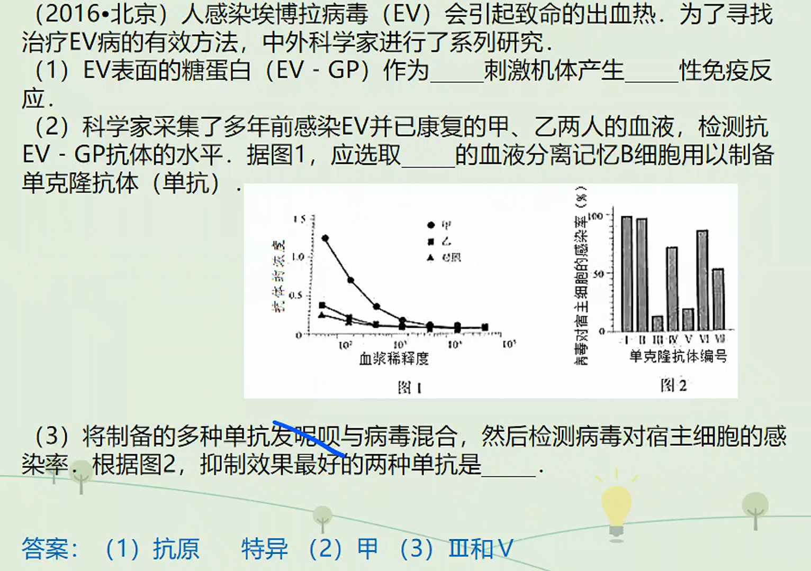
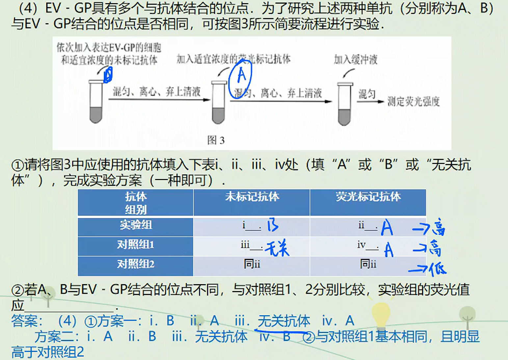
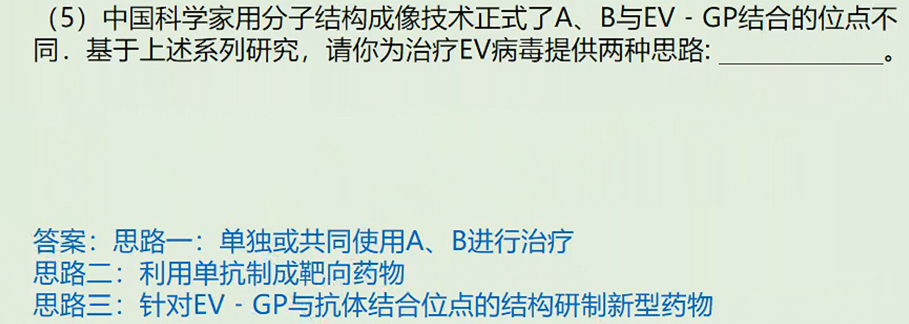
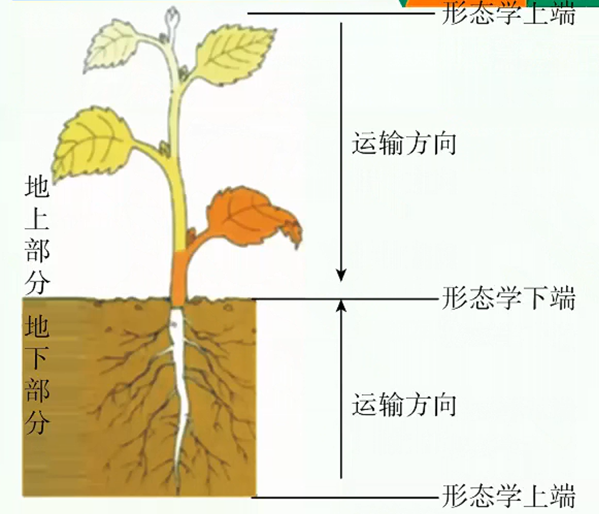
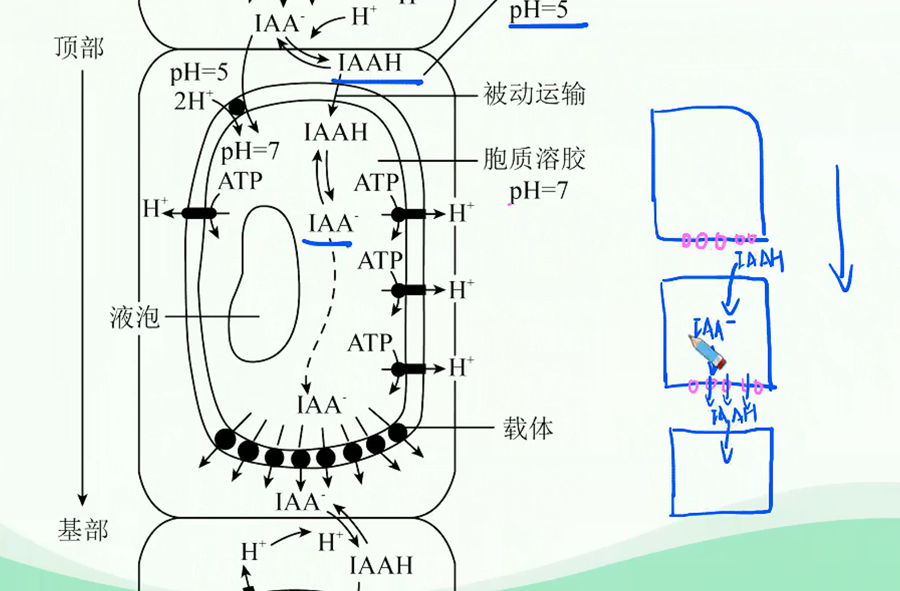
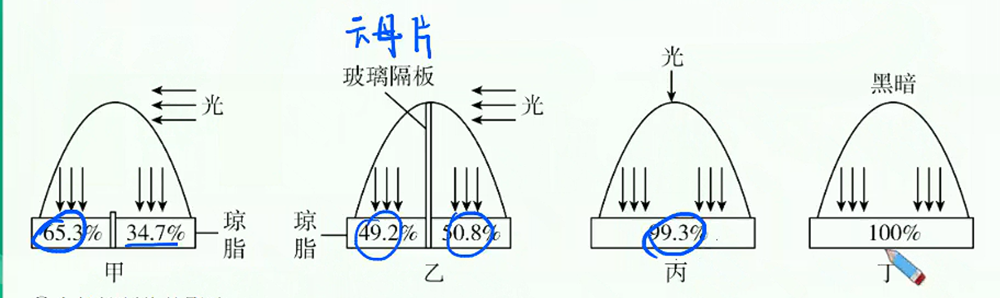

# 植物激素调节深化进阶（一）

> 书接上回……
>
> 
> 
> 

## 植物激素的定义：生长素的极性运输与非极性运输

### 植物激素的定义

由植物体内产生，能从产生部位运送到作用部位，在植物的生长发育和适应环境的过程中有显著调节作用的一类微量有机物，称作植物激素。

### 生长素的合成、分布和运输

### 生长素的合成部位

1. 主要部位：幼敕的芽、叶和发育中的种子。在这些部位，色氨酸经一系列反应转变成生长素。
   > $IAA$（吲哚乙酸）
   > 类似物质：$2,4-D$、$NAA$
2. 其他部位：成熟的叶片和根尖虽然也合成生长素，但数量很少。

### 生长素的分布部位

各器官均有，但相对集中地分布在生长旺盛的部位，如胚芽鞘、芽和根顶端的分生组织、形成层、发育中的种子和果实等。

### 生长素的运输

#### 极性运输

1. 含义
   在胚芽鞘、芽、幼叶和幼根中，生长素只能从植物形态学上端运输到形态学下端，而不能反过来运输。这种极性运输是细胞的主动运输。
   
2. 极性运输的机理
   生长素（IAA）主要在植物的顶端分生组织中合成，随后被运输到植株各部位。
   IAA分子在薄壁组织中顺序穿过一个个细胞而向植株下部运输，由于各细胞只有底部细胞膜上有IAA的载体蛋白，而顶端细胞膜上没有，所以虹AA只能从细胞底部由载体蛋白运出，这一过程需要消耗能量，故是主动运输。
   生长素极性运输的化学渗透假说如下：
   

#### 非极性运输

在成熟组织中，生长素可以通过韧皮部（筛管，成熟细胞，无细胞核和细胞器）进行非极性运输。
> 与之对应的：木质部：导管：细胞壁构成。
成熟叶子合成的生长素可能就是通过韧皮部进行非极性的被动运输。这己经能够通过实验得到证实，即在叶面施加外源性的生长素，在根的基部能够检测得到：在根部施用外源性的生长素，在叶子上能够检测得到。

## 生长素的横向运输与植物的向性运动

1. 引起生长素横向运输的原因
   | 影响因素 | 生长素运输方向 |
   | :---: | :---: |
   | 单侧光 | 向光侧$\rightarrow$背光侧|
   | 地心引力 | 远地侧$\rightarrow$近地侧 |
   | 离心力 | 远离圆心方向 |
2. 横向运输的意义：应对外界刺激，使植物体更好地适应环境。
3. 植物的向性运动
   1. 高等植物不能像动物一样自由移动，但植物体的器官可以在空间产生移动，以适应环境的变化。植物体受到单一方向的外界刺激而引起的定向运动，称为向性运动，主要包括向光性、向重力性、向肥性和向水性等等。
      > $$
      > 植物的运动
      > \begin{cases}
      >    向性运动\\
      >    感性运动
      > \end{cases}
      > $$
   2. 植物向光性的解释
      1. 胚芽鞘中与向光弯曲生长以及生长素的作用有关的部位
         | 部位 | 位置 |
         | :---: | :---: |
         | 合成部位 | 胚芽鞘尖端 |
         | 感光部位 | 胚芽鞘尖端 |
         | 作用部位 | 胚芽鞘尖端以下部位 |
      2. 导致生长素分布不均的原因：
         胚芽鞘尖端感受单侧光刺激，生长素从向光一侧往背光一侧发生了横向运输。
         实验验证：
         
      3. 生长抑制物的影响
         20世纪80年代，有学者根据一些实验结果提出，植物的向光性生长，是由于单侧光照射引起某些抑制生长的物质分布不均匀造成的。他们用向日葵、萝卜等作实验材料进行实验，结果发现，实验材料因单侧光照射而弯曲生长时，向光一侧和背光一侧的生长素含量基本相同，而向光面的生长抑制物质却多于背光一侧。
