# 植物激素调节深化进阶（二)

## 生长素作用的两重性及其现象

### 生长素作用的两重性

#### 生长素的生理作用特点—两重性

生长素既能促进生长，也能抑制生长；既能促进发芽，又能抑制发芽；既能防止落花落果，也能疏花疏果。生长素所发挥的作用，因浓度、植物细胞的成熟情况和器官的种类不同而有较大的差异，表现为两重性。

1. 一般来说，生长素在低浓度时促进生长，在浓度过高时抑制生长甚至杀死植物。
   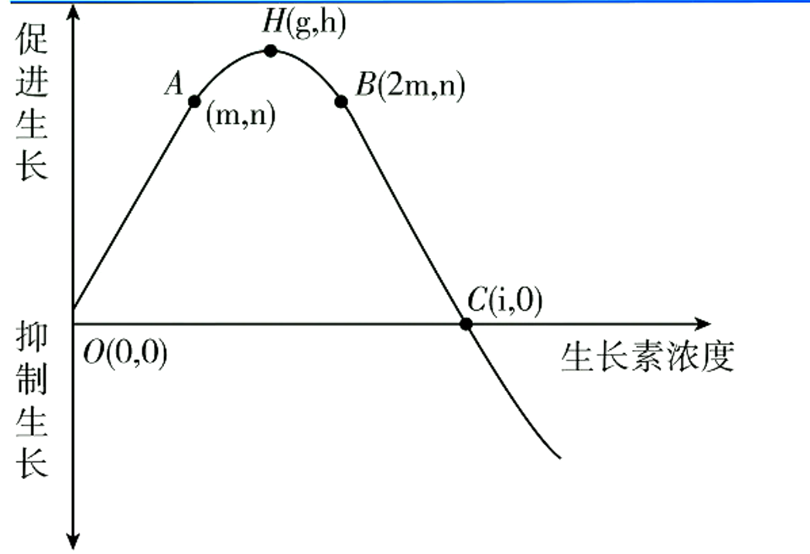
   > 1. $C$点表示促进生长的“阈值”，即大于$C$处的生长素浓度，将会使生长受到抑制。当生长素浓度小于时均为“低浓度”，高于时才会抑制植物生长，称为“高浓度”，生长素浓度为$i$时既不促进，也不抑制。
   > 2. 曲线中$H$点表示促进生长的最适浓度为$g$,在$OH$段随生长素浓度的增高，促进作用增强；而$HC$段随生长素浓度的增高，促进作用减弱（但仍为促进作用）
   > 3. 若植物幼苗出现向光性，且测得向光侧生长素浓度为$m$，测其背光侧生长素浓度范围应为：大于$m$,小于$2m$.
2. 不同的细胞对生长素浓度的敏感性不同
   1. 幼嫩的细胞对生长素敏感，老细胞则比较迟钝。
   2. 不同器官对生长素的反应敏感度不同：根>芽>茎
   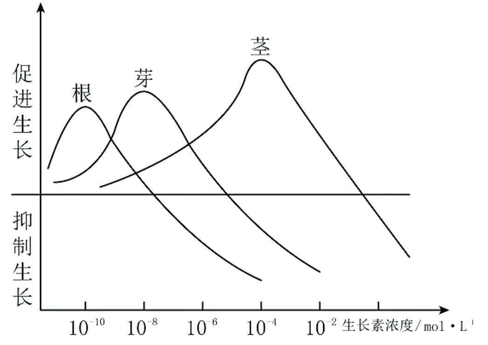
3. 不同植物对生长素的反应不同
   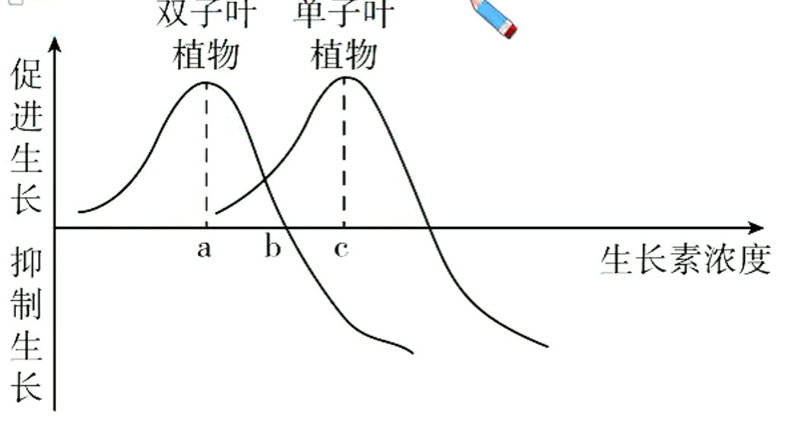

> 拓展：双子叶&单子叶植物
> 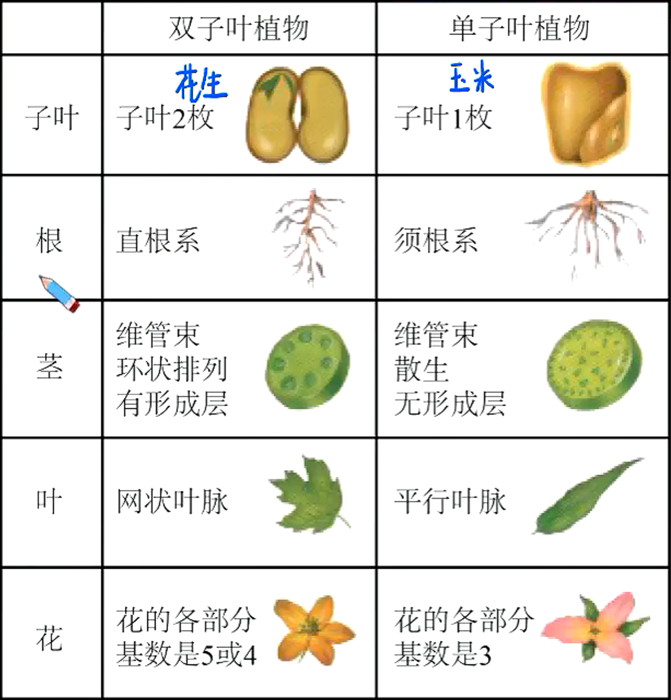

## 体现生长素作用两重性的具体实例

1. 顶端优势
   1. 定义：植物的顶芽优先生长而侧芽受到抑制的现象
   2. 机理：顶芽产生的生长素向下运输，大量地积累在侧芽部位。由于侧芽对生长素浓度比较敏感，因此侧芽的生长受到抑制。距离顶芽越近的侧芽抑制越显著。生长素浓度和顶芽距离的关系如下图：
   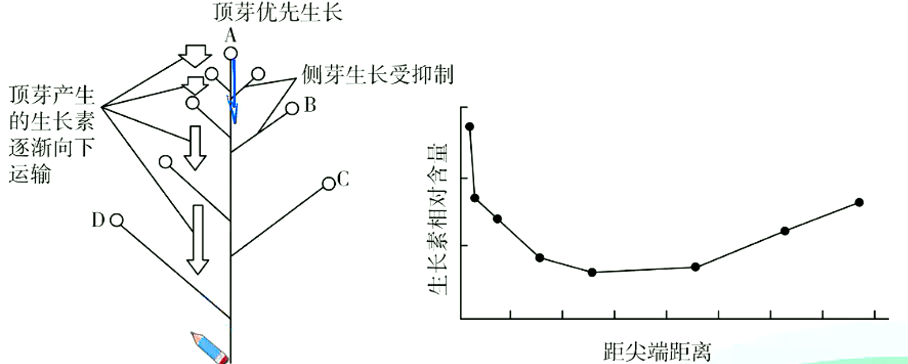
   3. 应用
      1. 果树修剪及某些农作物的生产上：通过打顶摘心，破坏顶瑞优势，以达到增产的目的。
      2. 盆景、花卉的栽培上：通过打顶摘心，破坏顶端优势，使侧芽萌发形成枝条，再对新生的枝条加以取舍，就可以造成一定形状的树冠。
      3. 木材生产上：要保护好顶芽，充分利用顶端优势。

> 根的向地性机理探究
> 实验表明，$Ca^{2+}$在向重力性反应中起着重要的作用。均匀地外施$Ca^{2+}$于根上，水平放置，发现$Ca^{2+}$向根的下侧移动。将含有钙离子螯合剂（如EDTA）的琼脂块放在横放玉米根的根冠上，无向重力性反应，如改用含$Ca^{2+}$的琼脂块，则恢复向重力性反应。进一步研究发现，玉米根内有钙调素，根冠中的钙调素浓度是伸长区的$4$倍。外施钙调素的抑制剂于根冠，则根丧失向重力性反应。现在一般认为，感受重力的是平衡石。植物的平衡石是指淀粉体，一个细胞内有$4\~12$个淀粉体，每个淀粉体外有一层膜，内有$1\~8$个淀粉粒。根部的平衡石在根冠中，当根水平生长时，平衡石受重力影响下，下沉在细胞底部，刺激内质网释放出$Ca^{2+}$,内质网释放的$Ca^{2+}$也主要分布于细胞底部。研究得知$Ca^{2+}$可能吸引$IAA$到根的下侧；$Ca^{2+}$也可能使组织对$IAA$敏感，增加细胞对$IAA$的反应强度，因此根冠底部的$IAA$就较多或生理反应加强。导致$IAA$分布于根近地侧的量多于根远地侧的，过多的$IAA$就抑制根近地侧细胞的伸长，最终使根向地弯曲生长。
> 有人综合提出向重力性的机理：根横放时，平衡石沉降到细胞下侧的内质网上，产生压力，诱发内质网释放$Ca^{2+}$到细胞质内，$Ca^{2+}$和钙调素结合，激活细胞下侧的钙泵和生长素泵，于是细胞下侧积累过多钙和生长素，影响该侧细胞的生长。现在一般认为，植物根系向地性包括重力感受、信号转导、生长素非对称分布及弯曲生长反应等几个步骤。
> 由于植物体内的生长素含量非常少，提取困难，人们在多年的研究和实践中，发现一些人工合成的化学物质，如$\alpha$萘乙酸（$NAA$）、$2,4-D$等，具有与$IAA$相似的生理效应。并且不像$IAA$那样在体内会受吲哚乙酸氧化酶的破坏，因而效果稳定。因此，生长素类似物在生产上得到了广泛的推广使用。

## 生长素的应用与相关实验

1. 促进扦插枝条生根

   **实验：探究生长素类似物促进扦插枝条生根的最适浓度**

   1. 实验原理
      生长素可影响植物插条的生根。不同浓度的生长素、不同时间处理其影响程度亦不同。使植物插条的生根数量最多，生长最快的浓度称为最适浓度。
   2. 方法步骤
      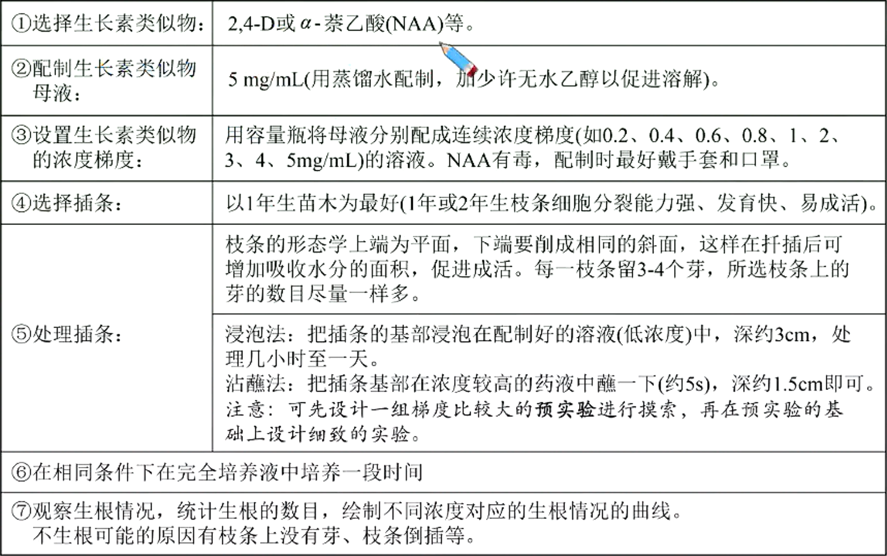
2. 促进果实发育一培育无子果实
   利用一定浓度的生长素类似物溶液处理未授粉的堆蕊柱头，可以获得无子果实，提高果实的质量和产量，如无子番茄、无子黄瓜、无子辣椒。
   > 生长素促进果实发育的机理
   >
   > 生长素具有很强的吸引与调运养分的效应。从天竺葵叶片进行的试验中可以看出，$^{14}C$标记的葡萄糖向着$IAA$浓度高的地方移动。利用这一特性，用$IAA$处理雌蕊柱头，可促使子房及其周围组织膨大而获得无子果实。
3. 防止落花落果
   例如，农业生产上常用一定浓度的生长素类似物溶液喷洒棉株，这样可以达到保蕾保铃的效果。
   用高浓度生长素类似物进行疏花疏果后，可以使存在的花芽成为代谢中心，营养供给充足，防止落花落果。
4. 除草剂
   例如，在农业生产上常常用高浓度的2,4-D(生长素类似物)作为双子叶植物杂草的除草剂。

## 植物向光性探究实验

1. 实验材料：胚芽鞘
   胚芽鞘是单子叶植物，特别是禾本科植物胚芽外的锥形套状物，能进行光合作用。注：胚芽鞘不是植物的叶片。
   
   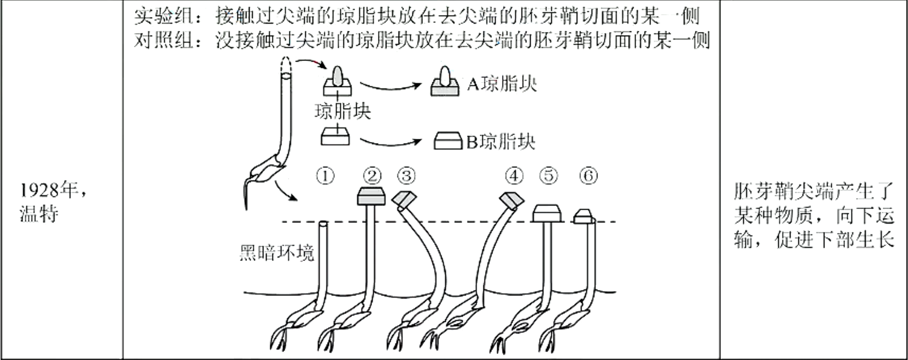
   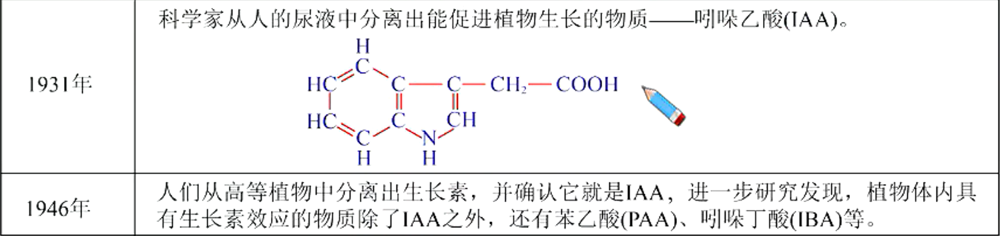

### 胚芽鞘弯曲生长判断

1. 实验材料
   云母片和玻璃片可以阻断生长素的运输；琼脂可以运输生长素，且生长素在琼脂中的运输方式为扩散；锡箔可以遮光，不会影响胚芽鞘的生长和弯曲。
2. 向性运动的原因
   向性运动的主要原因是植物在单向刺激（如单侧光、离心力、重力）下，生长素发生横向运输，导致生长素分布不均，产生定向运动。
3. 匀速旋转器上植物向性生长方向的分析
   1. 旋转器水平旋转：旋转产生的离心力与地心引力同时影响植物生长素的分布，又由于根对生长素的敏感度高，根将向着受到的离心力和地心引力的合力方向生长，而茎将向着该合力的相反方向生长。
   2. 旋转器垂直旋转（植物横置）：可抵消地心引力引起的植物向地侧生长素分布多，根向地生长、茎背地生长的效应，而是使生长素在向地侧与背地侧均匀分布，植物水平生长。
   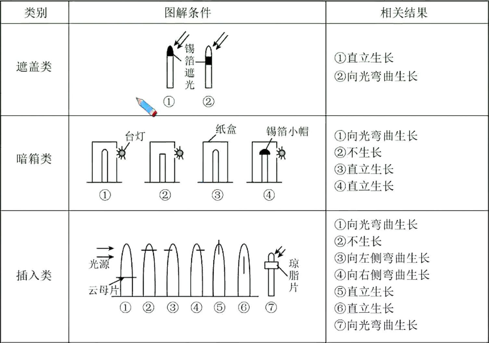
   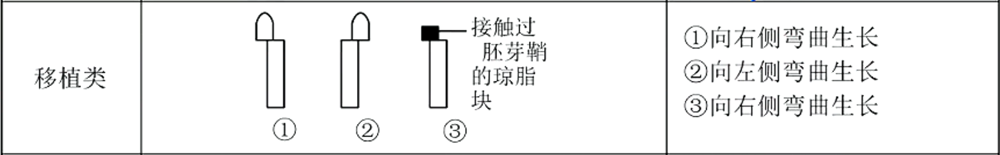
   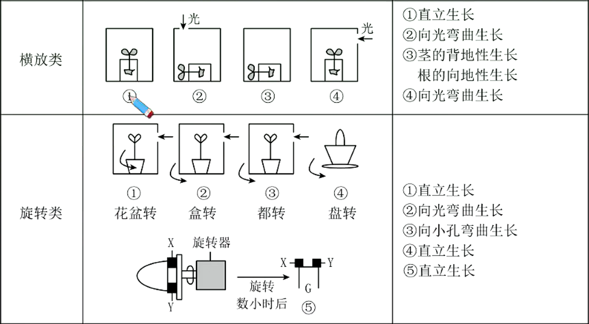
